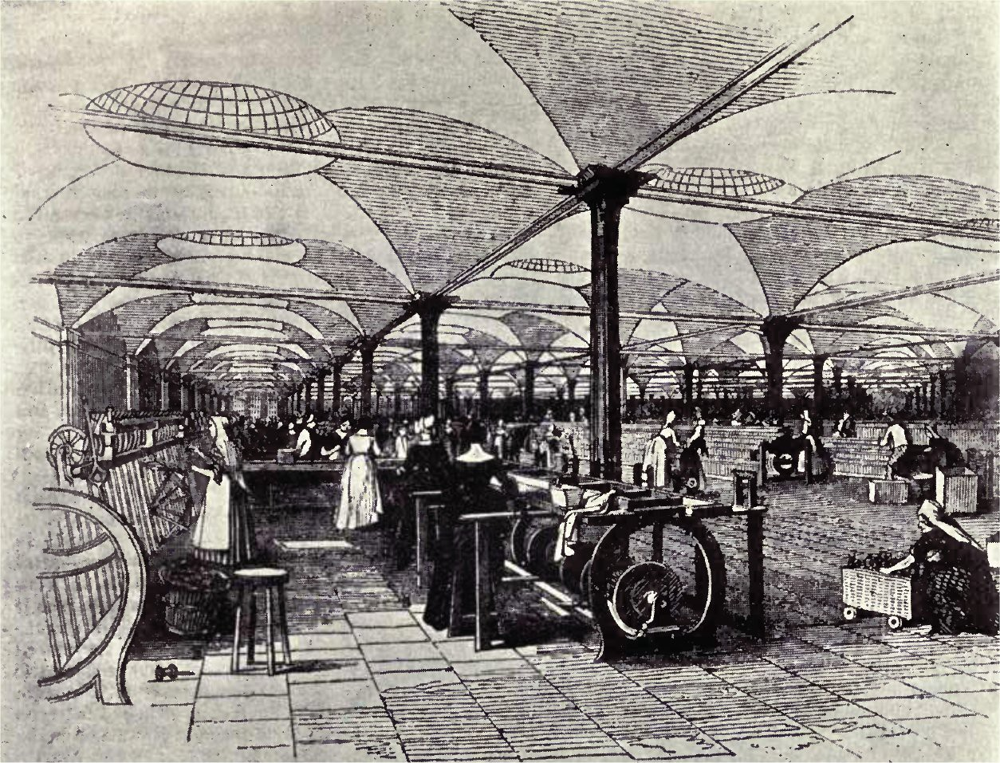

# Bitcoin vs The Anti-Capitalistic Mentality

Bitcoin has been created as a libertarian form of money. Unfortunately, many of the people currently attracted to it have a bent towards socialism or anarchism. The primary feature of modern capitalism has derived from the mass production of goods and services destined for consumption by the masses.

Bitcoin creates a system that allows any person to challenge any millionaire or billionaire. Taken to its conclusion, it allows a market not sabotaged through government mandated controls and restrictions. The problem for many with this sort of system is that it leaves fault exclusively on the individual. If you fail to succeed, there is no one but yourself to blame. In the bitcoin economy, you need to develop systems that satisfy the public in order to be made wealthier. This lack of monopoly control through the international distribution and geographic dispersion of the bitcoin network means that companies and individuals who seek to profit through mining need to do so competitively.

Each of these organisations would know and understand that they cannot rest on their laurels. To do so would be consuming the very capital that they need to prosper and advance in the future and would open wide the door for further competition.

Any individual can decide at any point that they wish to become a miner on the bitcoin network. In the unseen fallacy, the argument against this comes down to profitability. On one hand, the anti-capitalist states emphatically that the greed of the miners is taking control away from the people. This greed is an overwhelming desire for profit. Perversely, at the same time the same individuals try and tell us that we cannot mine because it is no longer profitable to do so. They argue on one hand the need for profitability and on the other the need to give away services altruistically. Both diametrically opposed arguments cannot be true. This is the nature of the contradiction. Anyone can mine. The choice is one of profitability.

Miners serve the masses. This is not some nebulous economic majority or other form of demagoguery. It is very simple; any person can vote with hash power. Bitcoin solves the byzantine general problem by creating peer nodes that signal a level of economic intent.

As Adam Smith said: It is not from the benevolence of the butcher, the brewer, or the baker that we expect our dinner, but from their regard to their own interest.

Bitcoin does not allow for fashionable doctrines. **It does not promote either the right nor the left in politics**. It acts purely as a source of measurement. In this, it takes measure of the amount of wealth that people are willing to value within society. It is a form of wealth that is not easily manipulated. At the limit, in a scenario where bitcoin became the predominant form of international currency, it leads to a common measurement that cannot be altered or manipulated easily by government. This does not say manipulation cannot occur, rather any manipulation would come at a great cost.

# A golden age

As a result of capitalism we have entered an era of unprecedented prosperity. We live in an age of amenities that are beyond the comprehension of even the richest of individuals throughout most of history and we are far from the end of history. This cry of utopians that we have an ultimate goal is one that cannot even be imagined and is one that we are not even close to for all our growth. In the long run, wealth is accumulating at greater and greater rates. The growth of capital is accumulated faster than the growth of population. At the same time, we are in a system that is attacked through people who loathe the concept of capitalism. They seek to revert as to the good old days, days of toil, days of despair and days of poverty.

Attacks against capitalists, especially those operating mining facilities point out the greed of the miner or other capitalist. They liken these entrepreneurs to the aristocrats and oligarchs of times past and other societies.

The wealth obtained entrepreneurially cannot be compared with the wealth of an aristocrat. The bitcoin miner derives wealth through a market-based process. In securing the network they are supplying the consumers with a valuable good. The aristocrat does not serve the market and is immune to the displeasure.

Capitalism makes no pretence of rewarding people to their true merits or any moral judgements, the prosperity that one accrues is simply the result of providing services that one’s fellow man desires and is willing to pay for. In this system, the consumers are supreme. It is extremely simple. In a world of distributed mining pools the capitalist owner of any individual corporation seeks to attract others to their system. The motives for this are profit. In the event that consumers are unhappy they can at any time change allegiance and moved to an alternative pool. In the bitcoin economy, it is not academic judgements or vocal demagoguery but rather the valuations that manifest through choice.

Any system that does not abide within these conditions is set to fail.

It is not for the centralized whims of a few that the path of the network must be decided. It is for those who are willing to pay that the network has been provisioned.

The hierarchy of experts and the priesthood of knowledge

As with all systems, hierarchies will exist. The expert rails at the consumer who fails to perceive the worth of the expert opinion. The expert has knowledge and they believe others should be made to listen to them. In a market economy, expertise is a marketable commodity and it is only when you deliver what the consumer requires, what they ask for, and what they are willing to expend their money on that you will succeed.

