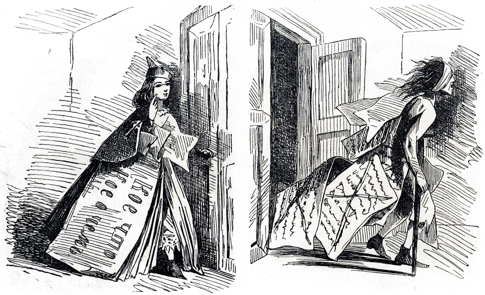
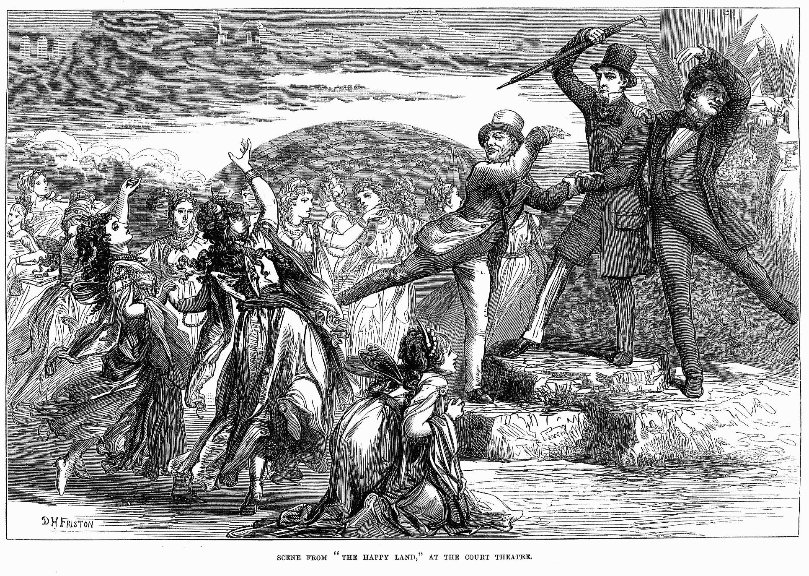

# Attacks, Slander, and Censorship

Those who live in a society where each cannot be equal and whose ambitions fail to be satisfied look to others and blame them for what they have not achieved.

The fool releases these repressed feelings in slander. It is simple to defame another and it requires little proof. Many will listen without any evidence and be drawn in but none of these people matter. It is those of us who can look above and beyond that can check and validate and accept more than the lies, those of us who can do this are the future of bitcoin.

It is the fool and the idiot that needs to reside in a world that offers little more than attacks and persecution and it is the fool that makes themselves happy in this endeavour. For those who can look past this, for those who can ignore the slanders and deformation and move forth there is opportunity. This is a hard and tragic world and for those who can work beyond it and its associated problems there is much to be gained.

The problem is never the fool. It is the sophisticated fool. These individuals do not denigrate themselves to a level where they will publicly degrade another that lead others to that position. They don’t lie but mislead. Either is a deception. The worst of these create a philosophy that opposes capitalism. This anger when focused inwards helps to silence their own inner voice, that small niggling voice that tells them of their own faults and failures. As they see those more successful than themselves they bundle this anger into a ball that goes deep within themselves and they say how they could have been better and could have done more if only for a better society and that it would be so if not for capitalism

They become fanatics. Their opposition and attacks against capitalism focus wherever they see it most and in many cases that subvert the system that they hate. We see this in bitcoin. They critique the capitalist mentality and call that evil. They do this in order to feel better in themselves and to assuage that gnawing doubt telling them how they are not as good as another.

In the West, we live in a society that has grown through equality under the law. This is not equality of genetics and nor is it equality of birth. It is the right to have and own property and to do with that as we wish and even that is being eroded. Bitcoin has been developed not for a fairer more altruistic world but for a world where people will strive to make the world better in an endless search for profit. This is simple because it is profit and profit alone that is that saved capital that society is built upon.

We live in a society equal under the law that is populated with people who are not equal in ability. People with different intellects and physical capabilities.

In the world of bitcoin, everyone no matter what their origins can become a millionaire. This is the problem that many see. This creates a divide, a gulf between us as some of us see what others have achieved. We do not admire those who do more but rather back and think of our own failings. We daydream and imagine a fair world. This fair world is not one where we truly seek equality but one where we all wish to equally be treated based on our perceived “real worth.” The capitalism of bitcoin is one that is fair.

**To each his own from his own ability.**

This is not a call to need, is a call to achieve. Those who attack and denigrate the system hide in refuge from reality. They are plagued by their own inability and the self-loathing that they failed to admit. It gnaws at them, it grates inside for they know not only did they not create bitcoin but they cannot save it.

Bitcoin does not need saving. Once the cap is removed bitcoin will scale and it will scale even if they attempt to keep it down for the market will respond and they will be removed.

