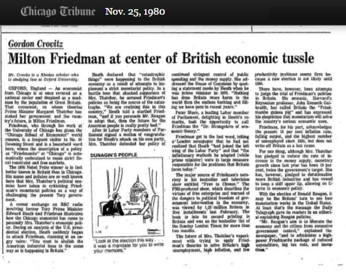

# Genesis

It seems that many people within the bitcoin community are willing to accept whatever they’re told blindly without validation. Others have been subdued through the repeated attacks and character assassinations. We have seen this format used in many totalitarian governments. As core say with one voice we offer you freedom, the changes and enslave us in the shackles of artificial restrictions.

Too many of us have been “Sheeple” too long. It is time that we started to take back what is ours. Today we are going to investigate some of the origins of bitcoin. Many of these have been subverted and even quotes by Satoshi himself are being deleted and censored from those who seek a different and more controlling path. In this, we will start at the beginning. This is not the first time that bitcoin was mentioned online, but it was when any of us took notice.

To do this we need to start with a fact that you likely did not know.

In 2009, the headlines from a UK newspaper sector is a marker to demonstrate that bitcoin could not have been pre-mined more than a few days. It was the initial statement that has been subverted into an attack on banks and others for all reasons. It is something that has become a socialist and anarchist cry for the dissolution of many of the systems that we have in place. Today we will investigate not that scenario that they wanted to believe, but something that says more about bitcoin than any anarchist utopia could.

If we pull back the veil on the message, we see Satoshi quoting The Times. The date is an interesting point in itself. Satoshi used 3 January 2009 and this was written into the Blockchain directly in the format “03/Jan/2009”.

This format is a standard used within the Commonwealth. The UK, Australia, Canada and other countries with the Commonwealth use this format. In the US it is more common as month, day, year. So this in itself tells us a little. The mixed writing style favouring British English but occasionally reverting to the US style demonstrates that Satoshi is more likely Canadian or Australian. Both of these countries mix grammatical standards.

Most importantly, let’s start by opening up and investigating the article.

In this article, we see reported the government’s concern with banks not simply throwing money out there for anyone to take. They actively sought to incentivise bad behaviour and push in typical Keynesian style the problem down the road. It would be a bigger problem, but it would be someone else’s problem. Chancellor Alistair Darling considered actively buying bad debts and assigning them to the taxpayer:

“Under one option, a “bad bank” would be created to dispose of bad debts. The Treasury would take bad loans off the hands of troubled banks, perhaps swapping them for government bonds. The toxic assets, blamed for poisoning the financial system, would be parked in a state vehicle or “bad bank” that would manage them and attempt to dispose of them while “detoxifying” the main-stream banking system.”

Many people comment on the headline but it seems very very few have taken the time to read the article. The article wrote about the erosion of markets through government intervention. Following a £37 billion nationalisation, the government was considering devaluing the currency further. After having set conditions that required the banks to be more aggressive, to offer home loans to people they knew could never repay them, and to expand and heat up the economy, the banks reacted by trying to protect the little profit that they still had. The government responded by saying they needed to take more risk:

“They are close to cutting off their noses to spite their faces”

Lord Mandelson, Business Secretary, accuses the banks of being too conservative, Nov 30

It is interesting that we remember the concocted tales of how banks play with our money and risk our futures. What seems to be forgotten is that when the banks try to act responsibly, the central banks and government officials step in and change the game. They see this as something that cannot be left to a market. It is political because it is about their being re-elected. In the election process in any democracy the integration of the economy into the government’s sphere leads to market manipulation.

In a well-managed market, that is one without interference and external government incentives to act against the profit motive we see a balance of conservatism and risk within banking. This changes radically when organisations are incentivised poorly. In this case, the policy of kicking the can down the road only reintroduced risk. The inflationary process driven by government policy led to artificially lowered home loan rates and lending standards. This spiralling trap of artificial value manipulation pushes/drives the price of housing up. The price of housing that year fell by 16.2% on average. This sounds great if you’re buying, but that neglects the cost and the other losses in society.

The fact, Bitcoin was never anti-banking. It was opposed to anti-free-market intervention.

This was far from the first time that the British government had to bail out the banks and even its own currency. There is an earlier link to the creation of the Chicago Board of exchange. I will discuss this in the next post.

Links to Friedman and Chicago

In 1963 Milton Friedman released a book, "Capitalism and Freedom". In the 60s, there were many who supported socialist and anarchist ideas. This is more widespread than ever now. The result was that only the Times of London would review this book. The Times reprinted a review that was originally published in the Economist of London (this was not favourable) and ran a small but positive review of Milton Friedman’s masterful work. What is really unfortunate is that every other paper on Earth rejected this book - and it was on the best-selling list as number 1 for over a month.

For those of us born in the late 60s and 70s and who learnt enough to reject the ill-conceived ideas of the time we were able to grow up listening to and watching the series "Free to Choose". The show aired in the 80's and we can see ideas expressed by Satoshi in this book. In the end, Milton Friedman even admitted the problem of working with government. Satoshi was a libertarian. This is someone who follows an Austrian / Rothbardian School of economic thought and it comes clear in the response he had to the government’s actions in 2009.

Dushi reviewed the later book in China with a title called "Not so free to choose" by author Nan Shizhong. The book inspired Wu Xiaoying and and Zhang Weipang who did a good deal to open up China to capitalism (although slowly).

Free to Choose sold over 200,000 copies in Japan.

After the 60's, the Times was one of the first newspapers to change. This paper called "Capitalism and Freedom" one of the "hundred most influential books since the war" and started to promote Milton Friedman. We can compare this to the New York Times was promoting Krugman. The following was later in the year, but it gives us the flavour of the writing:

http://www.nytimes.com/2009/09/06/magazine/06Economic-t.html

The Guardian... Nothing good to say.

https://www.theguardian.com/commentisfree/2006/nov/16/post650

The Times promoted Dr Freidman in the UK where he was taken seriously. The US, well they rejected him:

http://archives.chicagotribune.com/1980/11/25/page/24/article/milton-friedman-at-center-of-british-economic-tussle

Thatcher for all her flaws was a remarkable woman and took what Friedman had said and make the UK a far better place, So, it is simple to see why a libertarian such as Satoshi would have chosen The Times. It was a paper that did a good deal to promote both Friedman and Sowell.

So, before we start making assumptions about a utopian anarchist or socialist reality we need to think. Satoshi was not a socialist and he was not an anarchist, bitcoin was never designed for either of these philosophies. So, although many seem to want to subvert it to their own ends, the simple truth of the matter is that bitcoin is libertarian and this is a free market approach to capitalism. The free market embraces everything that allows people to trade openly. That has value in people’s rights and property. It does not dictate to others what they should and should not believe but encourages them through profit and incentivises behaviour based on what the majority are willing to pay for.

I do not see a call to tear down the banks and the message inscribed upon the foundation of bitcoin, I see a free market money, one without central controls and one without manipulation. This is what people want to subvert. This is why they leave the cap on bitcoin and refuse to raise it. They introduced an artificial scarcity that the protocol was not designed to have and use this to drive bitcoin towards a different system one that they can control and one that bitcoin was never designed to be.

