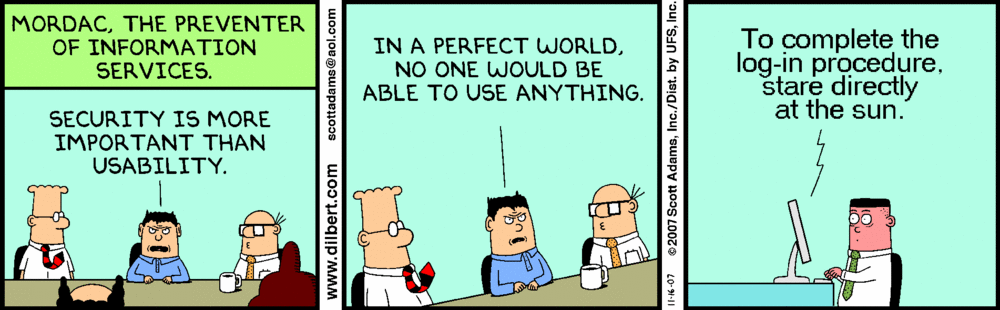
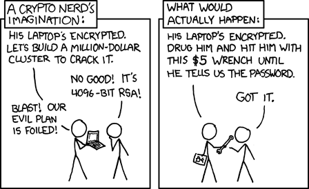

# Myth and Reality, Security is Really About Economics

Many people, likely the majority, who work within the information security industry hold a misconceived notion that information security is about technology and tools. They believe that cryptography is the answer to all problems associated with risk and trust. Unfortunately, the same attitude has crept into bitcoin. It is insidious and it is wrong.

Security is more about economics than it is about technical tools. Yes, it is nice to play with the new technical toys and used wisely these can aid in securing a network, but no technical tool alone is effective. They all require management and maintenance and monitoring or they were little more than expensive toys. I’m hammering home this point having seen many organisations spend lots on implementing the latest tool only to leave it and neglect between audits. Computer security is an oxymoron. It is a contradictory term. It does not matter how good the encryption is if people do not implement it wisely and monitor its use.

The merger of Yahoo and Verizon was valued at over US$4.8 billion. This merger was nearly derailed following a series of data breaches that exposed customer information. We have recently seen black-market extortion schemes, hacking the hire and Internet piracy is as rampant as ever. This is not going to stop any time soon. Our entire model is broken. We move security into centralised systems that become more and more tempting to attackers. This is not a cyber flaw, it is a flaw in the economics of the model. Peer models do not make anything inherently secure. What they do is distribute the risk.

An attacker seeking to breach a credit card company can make massive gains attacking a single system and stealing a single database. Conversely, attacking a distributed database such as the one used by bitcoin is infeasible. The reason for this is that none of the keys that control access to the ledger are stored within the Blockchain itself. These are distributed across a myriad of diverse systems. An attacker can target any one of these systems and at best will gain access to the funds held by an individual. If that individual has a lot of funds, they can distribute these on multiple systems.

Using a combination of tools and techniques, this individual can hold keys in multiple locations. The cryptography involved in bitcoin is not particularly special EcDSA has been around a long time and is widely implemented. It is the economics of the system that make it particularly special. And this is the aspect that most people don’t understand.

People believe that you need to validate your own transactions, this could not be further from the truth. It is not whether you have a valid transaction, it is whether the entire network recognises your transaction. In fact, even if you should find a discrepancy in your transaction, if it is accepted into the majority of the nodes that mine bitcoin, then your transaction will be accepted in the way that the miners agree. Any node votes on the acceptance of a transaction purely through mining. Any wallet that disagrees with this process is simply isolated. No matter how many wallets disagree, they can never form a consensus.

The reason for this is that the miners on the network create blocks as transactions are propagated and updated within the ledger inside blocks. So, contrary to popular wisdom, there is absolutely no advantage in running a full node unless you are a merchant monitoring the double spends or a miner. In fact, even were 90% of the nodes to initially reject the transaction in favour of a double spend, as the majority of miners will have worked on the initial transaction, the transaction in a wallet will be reorganised when the new block comes.

Because wallets failed to create blocks at all, they have no say on the network. At present, they are not needed for propagation of transactions and their removal would actually make the network more efficient. There is a reason that Satoshi called these non-mining wallets SPV wallets.

It is extremely simple. As a wallet can only veto its own transactions and its own blocks, it has two options:

Isolate itself from the network, or

Accept the transaction and new block.

In order to form consensus, the system requires a majority of mining nodes to accept a block. It’s a very simple concept. If you’re not creating a block through mining, you cannot engage in the consensus process. At best large well-connected wallets could interfere with propagation, but as the network is so densely connected, this matters little at all even for the largest connected wallets. We can use an analogy of voting with the people going into the poll and casting a ballot as the miners. The wallets of those people who do not vote but picket outside, the best that they can hope for is to slow down the propagation of a transaction.

At worst, the wallet who decides to ignore the transaction rules that are agreed in consensus through the distribution of blocks is simply isolated. No transaction that they send outside of the ledger will have any use or meaning.

The benefits of bitcoin include decentralising control of our money. This does not mean running a full node, it means the ability to hold our own keys. Any individual can create a raw transaction and send it onto the network from any machine connected to any part of the Internet. If they can validly sign that transaction and it meets the consensus rules on the network, it does not matter if they created the transaction by hand.

The truest check of your transaction being accepted is other machines having accepted. Not your machine, the other machines on the network. We have to rely on the former trust models to understand how bitcoin has truly changed our environment, our money and eventually our entire system. It is not running a node that is important, it is ensuring that our transaction reaches a node. This requires highly interconnected mining systems that link to exchanges and online wallets. There are zero benefits in running your own wallet if you don’t mine. Anyone who does not see this fails to understand bitcoin.

# **The Economics**

The most overlooked aspect of bitcoin is the use of economic incentives. Many in the industry consider this the weakest part of the system, the reality is this is the true strength. Attackers are more rational than many others [1, 2]. As much as we like to deny this fact, cyber criminals and other economic criminals are generally more rational than the average person and exhibit a higher risk tolerance than a more law-abiding citizen. In [1], Wright expressed the economic truth;

*More security costs = higher costs to the consumer.*

*Higher expected loss from risk = higher costs to the consumer.*

It is astounding that most people do not understand this. The notion that “Criminal groups act as profit seeking enterprises, and the ability to shift the economic returns away from this activity results in a lower amount of crime” [2] this simple to understand when you think about it even though it seems counter-intuitive at first.

Bitcoin works in the same manner. The more we delve into the system and truly understand it, the more we can start to see that this is a system created through economic incentives. It does not use the most modern cryptography, it doesn’t use the coolest security technologies, what it does is truly remarkable because it is simple. It creates economic incentives.

These incentives are aligned to the securing of the network [5]. The larger the network grows, the more secure it becomes. This begs the question, why are people seeking to limit its growth? It is the on chain growth that makes bitcoin secure. It is the distributed consensus mechanism and the shared nature of the ledger, so the question is why are people trying to remove this key aspect of the protocol. Why are they trying to move to off chain solutions that mirror the traditional security models and require secure nodes and permissioned systems?

Do they not understand the benefits of economic controls or scarcity or is there something else at play here?

# **Problems of Software**

There is no way to make any computer or software completely secure. Every version of code will have bugs in some of these will end up resulting in a compromise of a system. Even if an application is written with no flaws (and this is only possible for the simplest of systems) we need to remember that it is running on an operating system and that operating system will have numerous bugs.

More, not less is better. The key aspects of bitcoin is competition. What we need is a central protocol that all agree on. From this protocol, many versions of software can divulge. If we have many developers working on new front ends, new mining systems, new exchanges and new platforms, then the chances that any one of these will be compromised in a way that impacts a large number of users will be lowered. No matter how many bugs impact Microsoft Windows [3], it would be rare to see these impacting a Linux or Mac implementation and vice versa.

It is about time that we stepped back and started looking at the system we purport to know. To start understanding these controls we want to change and what impact that change will have. The core of bitcoin is not cryptography, that is just a tool, the core of bitcoin is economic incentives.

Attacking the network costs money. There are many ways of attacking the bitcoin network. All of these involve trade-offs in all of these trade-offs are economic in nature. Do you buy more hash power and try to increase your control, do you buy other systems and try and inject packets, do you hire people to attack Routers? There are many other attacks. The issue is not whether a computer system can be attacked but whether it can be attacked efficiently. There is no such thing as perfect security and security is always an economic trade-off [4]. None of us choose to live in a perfectly secure environment, people living in California live in an earthquake zone, yet few of them choose to leave. All decisions and security are risk trade-offs and the fact of the matter is that all of these are economic.

Any change of a protocol has an economic impact. Leaving the block has an economic impact as it limits the size of the network. This was discussed before; the security of the network is directly related to the investment in the network and the investment in the network is related to how many people use it. Not how many people run wallets acting as non-mining nodes, but how many people invest in creating mining systems to secure those transactions that we wish to run. Right now, we are artificially capping the growth of the network and the result is that we are limiting the security of the network.

I will say it again, the core of bitcoin is not cryptography, that is just a tool, the core of bitcoin is economic incentives.

# References

[1] Wright C.S., Zia T.A. (2011) “Rationally Opting for the Insecure Alternative: Negative Externalities and the Selection of Security Controls”. In: Herrero Á., Corchado E. (eds) Computational Intelligence in Security for Information Systems. Lecture Notes in Computer Science, vol 6694. Springer, Berlin, Heidelberg, [https://link.springer.com/chapter/10.1007%2F978-3-642-21323-6_26](https://link.springer.com/chapter/10.1007%2F978-3-642-21323-6_26)

[2] Wright, Craig S, (2012). “Criminal Specialization as a Corollary of Rational Choice,” International Conference on Electronics, Information and Communication Engineering (EICE 2012), Garry Lee, ASME, New York, 6 pp. [http://ebooks.asmedigitalcollection.asme.org/content.aspx?bookid=408&sectionid=38787998](http://ebooks.asmedigitalcollection.asme.org/content.aspx?bookid=408&sectionid=38787998)

[3] Ari Takanen, Jared D. Demott, Charles Miller (2008) “Fuzzing for Software Security Testing and Quality Assurance” Artech House information security and privacy series, IT Pro, Artech House, 2008 ISBN 1596932155, 9781596932159

[4] Andreas Gregoriades, Jae-Eun Shin, Alistair Sutcliffe (2004) “Human-Centred Requirements Engineering” In 12th IEEE International Requirements Engineering Conference, pp. 154–163, doi:10.1109/re.2004.28

[5] Andreas Gregoriades, Alistair Sutcliffe, Jae-Eun Shin (2003) “Assessing the reliability of socio-technical systems”, Systems Engineering, Vol. 6, №3. (16 June 2003), pp. 210–223, doi:10.1002/sys.10044

