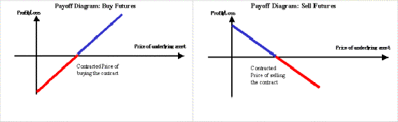
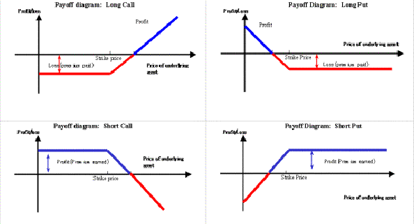
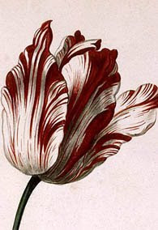
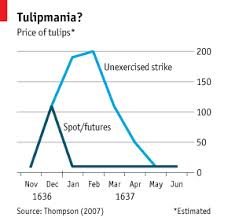
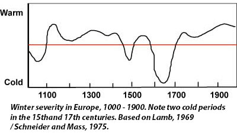

# Tulips and Other Myths

Dr. Craig Wright has given me permission to repost and extend one of his blog posts from 2015. Prior to this, I will add a little that I feel is missing. Dr. Wright talks about the changes from a futures contract to an option contract and seems to assume that we will all understand this concept and why this matter is important. Some of us, such as myself, do see this.

Having studied financial law, this was immediately clear to me.

Futures and options are both considered advanced financial topics and are generally taught at a Masters level. It is not simple to understand their characteristics fully nor the legal consequences or financial differences in valuation without experience. In both instances, it is typical that a futures or options contract will be used as a short-term speculative instrument. Producers use these to manage and hedge risk whilst speculators add a valuable component to a market providing liquidity. There are some similarities between futures and options contracts in that they both involve creating a speculative investment on a subsequent event.

**A futures contract involves an obligation.**

Any holder of the futures contract is required to buy or sell the asset or commodity at a price specified in the contract on a specified date that occurs in the future. For manufacturers and primary producers, a futures contract limits the uncertainty associated with market cycles and fluctuations in growing seasons, or even demand. For instance, a grower of soy beans can sell their crop in advance of growing it, the producer will then gain immediate access to funds without needing to go to a lending market. This is important, there is a time value to money. For a set value, the producer can enter into arrangements to provide a set quantity of goods at a set date. Speculators provide liquidity in this market and are crucial to the overall success of any futures contract.

Options differ from futures in that an options holder has the right but not an obligation to buy or sell the specified quantity of the good or commodity at the particular time or even over a particular period.

[Investopedia has a simplified post here.](http://www.investopedia.com/terms/o/options-on-futures.asp)

We see in the images below the payoff diagrams for a Futures Contract:

When you have a Futures contract, the potential risk and return are symmetric. The loss or the gain is unlimited and can easily exceed what you have planned.

It is a contractual obligation to settle a futures contract. It does not matter what the price moves to, you still need to complete the sale or purchase. The risk in a futures contract is far greater.

Options differ greatly from futures.

The seller of an option is passive and has given away a right, they are obliged to comply with the decisions of the buyer. This makes the payoff asymmetrical. The gain in purchasing an option is unlimited, but the purchaser’s risk is limited to the premium paid.

Dr. Wright correctly called the issue with the Tulip “bubble” below in his post.

The government’s decision to alter these contracts from Forwards to Options was designed to protect certain members of parliament in the Dutch provinces. These parties made a bad investment decision in the form of a futures contract. The buyer of that futures agreement had the contract changed in court into an options contract limited the risk exposure they faced.

We can thus conclude that the Dutch Tulip bubble was not a market failure, rather it was a government intervention, this is what we consider to be corruption in modern democracies.

![[1] different exchanges may require different rules](./assets/1*kGsN8mYDxSgHE4P8iCIR9Q.png)

# Dr Wright’s Post

History has given us many stories. One relatively recent story that has gained traction is the belief that [carrots are good for our eyes](http://www.snopes.com/food/ingredient/carrots.asp). This [World War II propaganda](http://www.smithsonianmag.com/arts-culture/a-wwii-propaganda-campaign-popularized-the-myth-that-carrots-help-you-see-in-the-dark-28812484/?utm_campaign=20130813&utm_medium=socialmedia&utm_source=twitter.com&utm_content=foodandthinkcarrotswwii) from the UK has led generations of children to eat excessive quantities of carrots in the mistaken belief that they will improve their eyesight.

Another apocryphal story is how tulips entered Europe from the Middle East in the 16th century leading to an [economic bubble and collapse](https://en.wikipedia.org/wiki/Tulip_mania). This story has become so widely touted in the couple of centuries since it formed that few people even question the truth of the story. Like any other means, it is simpler to propagate the idea than to check the facts.

For those promoting the idea it can be extremely rational. It is efficient to use a meme that is well-known when propagating misinformation. After all, once something has become accepted as fact it takes a lot of effort to [challenge authority](https://en.wikipedia.org/wiki/Argument_from_authority). Even those who do not believe in the on-premise often accept the meme’s themselves leading to logical inconsistencies in their arguments. This is one of the concerns with market bubbles. Those who wish to attack markets do so on the false premise that markets are not perfect. And no point in economic literature have markets been *(seriously)* stated to be perfect, they are identified as being more optimally efficient than the other possibilities.

In analysing an alternative to a market-based solution, the proponent of that solution would need to demonstrate that their solution is more optimally efficient than the market. Being that they are unable to do this the solution is to attack the market itself. Markets are not efficient nor are they perfect. This is a catchphrase that is touted over and over. No evidence is offered that the alternative is economically more efficient, rather the attack is made against a [strawman](https://en.wikipedia.org/wiki/Straw_man).

The economic fable of a failed market did not begin in the 17th century, it started with an invented tale produced by Charles Mackay [1] in the mid-19th century.

It was not important whether the anecdote was true or not, what mattered was the impact. No evidence was provided by Mackay that could withstand scrutiny but the truth of the matter is that few of us actually take the time to validate the facts. Stating how people act wildly when they act together makes for a good story and it is a thesis that we instinctually enjoy listening to. The only problem is that it wasn’t true.

There are several problems with ***Tulipmania*** [4]. Most importantly, the effects of the so-called Tulip crash were not as widespread as was touted. Some of the problems with these forms of bubble theory derived from a misplaced understanding of a [Broken Window fallacy](https://www.youtube.com/watch?v=gG3AKoL0vEs). The belief that we can make more money from destruction and capital creation is widespread but flawed. Foremost in this is the fact that we have a growing society and capital creation. At all points, we have more capital than we started with. The simple consequence of this is that destruction is not the source of creation. If it was, rational businessmen would tear down old factories and replace them with new equipment before their depreciation dates. The simple fact that this does not happen demonstrates a flaw in the argument.

There are many errors that have propagated around the Dutch Tulip crash and little to counter these false arguments. The contracts used to buy tulip bulbs one of the first forms of the futures contract. These were similar to over-the-counter derivatives in some ways as exchanged-based contracts did not exist. Tulip bulbs are seasonal and are only sold between June and September.

Merchants would trade in these bulbs throughout the year. It can be argued that this is risky speculation with no purpose. The reality is far from that. In the same way that modern exchanges sell grain futures, the early guilds of the 1630s initiated a futures trading scheme. These early futures contracts allowed farmers to select what they would grow and hedge against the risk associated with everything from the weather to the vagaries of fashion. Like a modern futures contract, early Dutch merchants traded contracts to buy and sell goods at a future time.

Many times merchants would decide not to honour a contract, just like a modern breach the court would award the [monetary difference](http://www.hartpub.co.uk/BookDetails.aspx?ISBN=9781849464574) and not enforce compliance with the contract.

This system was working well throughout the early 1630s. The problem came towards 1636 when, seeing the profit to be made in the international Tulip trade, [a group of government officials](http://www.dklevine.com/archive/thompson-tulips.pdf) (Nobles) decided to get involved. Unfortunately, these officials were less effective than the merchant class and did not buy well. The end result was that they were set to lose on their investment.

For seeing some of the changes in the market these officials petitioned and worked with the Guild of florists. This intercession led to a formally supported announcement that all of the contracts were now only options to buy [6]. The penalty on this was limited and would be similar to an option price in a modern futures exchange. Luckily, this process had been anticipated and the losses that were purported were actually far less than those that are quoted in the media.

Futures contracts at that time were deemed to be gambling debts. Due to long-standing problems with the nobility wagering their family estates it had been no long-term practice of the courts to refuse to enforce gambling debts *(The Court of Holland judged the tulip sales to be bets under Roman law [7]).*

All futures contracts exhibit power law distributions, for this reason, they are counter intuitive. We instinctively understand Gaussian on normal distributions but fail in an understanding of power law processes. It is intuitive to understand that we will see people who are slightly shorter or taller than an average and that these will be distributed across a bell curve. But this is not the case with prices or incomes.

The consequence is that it is simple to quote the maximum and falsely imply a means for the distribution. At the peak in 1635, there was one particular tulip bulb that sold for an immense amount, this bulb was known as the “[Semper Augustus”.](http://gardenofeaden.blogspot.co.uk/2009/11/tulip-semper-augustus-does-it-still.html) A flower that was the most prized in all of Europe. With its spectacular red “flames” on its white petals, it was a remarkably beautiful flower that was in wide demand from royalty across Europe.

The 12 Semper Augustus bulbs that were sold for this value were also the only ones that existed. We do know that at its peak this particular flower sold in the Haarlem markets for 6,000 guilders. This was a phenomenally large amount of money and would be the equivalent of 16 fat pigs and eight fat oxen or 100 tonnes of wheat. Of course prices are extremely different than they are now and comparisons of this type are difficult, but there are means to equate some of the differences. For instance, 100 tonnes of wheat would have [traded for £10,000 in 2014](http://www.agrimoney.com/news/wheat-gloom-takes-uk-prices-below-%C2%A3100-a-tonne--7549.html). The effect of the trade was that the purchaser was purchasing the entire rights for this particular type of flower and all derivatives that would immediately come from it.

To some people this may seem a phenomenally large amount to pay for a single flower bulb, the reality is that it is nowhere near as bad as it would seem.

We have seen what some would consider excessively large purchases even in my lifetime. In the flower world, black is a particularly elusive and highly sought-after colour. Whenever something is rare and in demand we can expect it to command astonishingly high prices. In 1997 [Thompson & Morgan](http://www.thompson-morgan.com/) purchased three hyacinth bulbs from the yearly show in Holland for £150,000. This is more than five times the rate obtained through the peak sale of any tulip bulb.

After eight years of cultivation, the progeny of these bulbs went on sale to the public under the marketing name of *‘Midnight Mystic’* in 2005. The company sells these bulbs for £7.99 each.

This may seem excessive to many people, but the company Thompson and Morgan maintain rights to sell and market this flower. In Europe of the 17th century, before genetic engineering, propagation of slow bulbs such as tulips could not be reliably done on a large-scale. More importantly, financial records of Thompson and Morgan demonstrate that they are profitable. As large as the value of the purchase was, they have managed to propagate more flowers to more people and still create a profit.

It is easy to call foul and blame the market for one’s losses but there is more honour in validating the facts and standing by the truth.

# Power Laws

[Power law](http://pages.stern.nyu.edu/~xgabaix/papers/pl-ar.pdf) systems are skewed to [form a long tail](https://en.wikipedia.org/wiki/Power_law), this is actually the same as most commodity markets. In particular, where there is a range of goods of various quality levels or grades and a strong desire for limited products, certain aspects of the market lead to long tail prices such as we saw above.

This is not the same as the traded price however. The individual exercised strike price for a single (exceptional) sale of 12 bulbs that did not reflect the entire market. The figure on the left demonstrates the difference between [spot futures pricing](https://en.wikipedia.org/wiki/Spot_contract) and the traded but an [exercised](http://www.investopedia.com/terms/e/exerciseprice.asp) [strike price](http://www.investopedia.com/terms/s/strikeprice.asp) of tulips. The first thing to note is that the mean price of tulips traded at the time was far lower than the maximum. More importantly, what is not reported is that the price of tulips had stabilised and returned to the 1635 price level by 1638.

The fallacy in the argument of using an exercised strike prices for exceptional goods in a power law system to demonstrate excessive spot prices should be obvious. They are not the same. Unfortunately, there is a common but widely held set of misunderstandings that surround the futures and derivatives market. It is easy to mislead people when they do not know the difference between a spot price and an unexercised strike price. I can place a contract on my house saying I want $100 million when it is only worth a small fraction of that, but this is not the price that it will obtain and to use that as a measurement is a way of misleading people. The irrationality is not in the market.

# The Plague

A little-reported side note needs to be added to this discussion. In 1636 and 1637 the plague had ravaged parts of Europe. In particular, Haarlem was hard-hit, as many as one in four people in the city died during this period [2]. On top of that many of the wealthy nobility and merchants left Haarlem.

This level of disruption changes people’s perspectives [3].

Most importantly, in times of great crisis and upheaval when where we’re worried whether we will actually survive the decade people are [more likely to take a risk](http://www.economist.com/blogs/freeexchange/2013/10/economic-history). In this instance, trade in early futures contracts was widely adopted. In modern futures trading, exchange-based futures contracts require that margin accounts be kept to lower the risk of fault [5]. This innovation had not yet been created in the 17th century.

# More Adversity

As if the plague was not bad enough, the early to mid-17th century marked a period known as the [Little Ice age](https://www.eh-resources.org/timeline-middle-ages/). During this time, winters were believed to be in the order of 2°C colder than they are now. Winters were reported as being bitterly cold and the time for growing crops was extremely limited. In a time when food was already scarce, a significant drop in productivity led to widespread starvation. For many people, [gambling on life or death](https://en.wikipedia.org/wiki/Western_Attitudes_Toward_Death_from_the_Middle_Ages_to_the_Present) became common practice. In many ways this was a rational action. If you do not expect to have a high probability of living into old age, and you do not expect your family to survive there is little reason to maintain a long time preference. In this scenario short-term thinking is a rational response to the environment. In a scenario such as the world experienced in the early 17th century it was better to make a risky profit now then to slowly build a business over time.

# Why Tulips?

We can understand that any rare item that is beautiful and in demand will sell for large profits. But how did a tulip market even begin?

For a long time, it was believed but the Tulip entered into Holland in the late 16th and early 17th century. It is commonly reported in the myth that this new flower became a craze as it was introduced. Thanks to modern science and in particular further analysis and DNA testing this fallacy has been debunked.

Research, such as that published in the [Journal of Economic Botany](https://www.sciencedaily.com/releases/2009/04/090416105353.htm) and summarised in the journal Science shown interesting history to flowers such as the Tulip. This research definitively documented the path of the tulip as it came into Europe. It turned out that this occurred 500 years before the Holland bubble incident, the 19th-century bubble theory of tulip bubbles was concocted as we noted above to sell a meme.

It has been widely believed for a long time that the Tulip was a 17th-century introduction into Europe, but this was a means to support the false economic theory.

As is often the case, truth is so much stranger than fiction.

It turns out that the Tulip was widely available throughout Europe from the 11th century on and potentially earlier. At this point the early yellow petalled simple Tulip was known as the [Macedonian onion](http://www.plataformasinc.es/), variations had not been cultivated at this time. Many people do not know that even now it is a [common practice](http://www.theargus.co.uk/news/14096185.72_000_spring_bulbs_planted_at_Arundel_Castle_/?ref=rss) to plant bulbs around Castle grounds, even now, festivals are held celebrating the [planting of bulbs](http://www.express.co.uk/life-style/garden/625918/enjoy-tulips-at-Arundel-Castle).

Much like the practices such as [Morris dancing](https://en.wikipedia.org/wiki/Morris_dance), many of the traditions that we currently undertake our continued without knowledge of why they initiated. Planting bulbs around Castle grounds remains a common practice in many areas even today, yet for villagers and peasants of the 13th the 15th century this would not have been an activity that leads to increased food production. At the time, the amount of food available could become critical during the spring. So any means of increasing yields could mean the difference between life and death.

So why would people plant flowering bulbs around Castle grounds? What we experience in what becomes the main problem in answering this today is an inability to see the world through the eyes of those in the past. For the feudal villager, the castle was a source of society and safety. It was required for security purposes that a wide area surrounding the castle was maintained as clear land. The reason for this was so that the guards would be alerted of attack well before anything occurred. If trees were to grow right up into the castle grounds or to the wall of the castle than an attacker armed with a bow would gain an advantage in being able to hide close to the castle wall undercover.

We consider that grass would have been easy to plant and maintain, in a world nearly 1000 years ago there were no weed killers. The ride on mower was many centuries from being invented.

When tulips die down, [thick mats of bulbs](http://www.ipm.ucdavis.edu/PMG/PESTNOTES/pn7441.html) cover the ground in a way that limits the growth of woody weeds and trees.

# Conclusion

A contract is a legal promise. In modern futures systems traded over an exchange, margin accounts are used to minimise risk. This does not preclude over-the-counter exchanges and contracts. For these, the risk of default always needs to be incorporated into the price. It is always important to take account of the risk associated with any deal and include this within an expected profit from the exchange. There is never a scenario where a counter party cannot collapse or facilitate a negative deal in another way, to the other party, so the risk of default may be small. For this reason, where a contract is important it is necessary to ensure that the other party’s commitment is made more tangible. This is not just through money but also includes time and reputation.

MacKay [1] greatly overstated the losses that were associated with the collapse of the Tulip market following the interventions of the court and guilds. When it is believed the trades will not be enforced it is more likely that people will take excessively reckless risks, reckless from the point of view of one outside looking in. We cannot say that it is reckless behaviour when due to unforeseen circumstances it can be considered likely that one of the parties to the exchange may die prior to fulfilment. For those people in 17th century Europe, this was a real possibility, the plague was a daily occurrence.

The people who lose out in high-risk exchanges will often complain and state that the exchange was unfair. When they make large profits they are happy; but the other side of any exchange is the potential for loss. Many times, the losses associated with so-called bubbles result from a perceived belief that the aggrieved party will be bailed out. That their losses will somehow be magically recovered and that they can gain from the risk when it is positive but not suffer in the negative. This scenario incentivises greed. When we reward people and companies by bailing them out of losses we encourage them to take bigger risks and to make larger losses.

Bubbles are not the result of a free market; they are the result of interventions into the market.

# References

[1] M*ackay, Charles (1841). [Memoirs of Extraordinary Popular Delusions and the Madness of Crowds](https://books.google.bg/books?id=ufoLAAAAYAAJ&dq=inauthor%3A%22Charles%20Mackay%22&hl=bg&pg=PR1#v=onepage&q&f=false) 
**I** (1 ed.). London: Richard Bentley. Retrieved 29 April 2015.Mackay, Charles (1841). [Memoirs of Extraordinary Popular Delusions and the Madness of Crowds](https://books.google.bg/books?id=hiMOAAAAYAAJ&dq=editions%3AUDOphQOmg4cC&hl=bg&pg=PP13#v=onepage&q&f=false) 
**II** (1 ed.). London: Richard Bentley. Retrieved 29 April 2015.Mackay, Charles (1841). [Memoirs of Extraordinary Popular Delusions and the Madness of Crowds](https://books.google.bg/books?id=J2JXTONN3O4C&dq=editions%3AUDOphQOmg4cC&hl=bg&pg=PP11#v=onepage&q&f=false) 
**III** (1 ed.). London: Richard Bentley.*

[2] *Terence Ranger and Paul Slack, eds., Epidemics and ideas. Essays on the historical perception of pestilence. (Cambridge: Cambridge University Press, 1992.)*

[3] A. C. DeSerpa, A Theory of the Economics of Time, The Economic Journal, Vol. 81, №324 (Dec., 1971), pp. 828–846, Published by: [Wiley](http://www.jstor.org/publisher/black) on behalf of the [Royal Economic Society](http://www.jstor.org/publisher/res), [http://www.jstor.org/stable/2230320](http://www.jstor.org/stable/2230320)

[4] Calvo, Guillermo A. 1987. “Tulipmania” in *The New Palgrave: A Dictionary of Economics*. John Eatwell, Murray Milgate, and Peter Newman, eds. 4 vols. New York: Stockton Press.

[5] Garber, P. M. (1989). ‘[Tulipmania](http://ms.mcmaster.ca/~grasselli/Garber89.pdf)’. *Journal of Political Economy*, 535–560.

[6] Thompson, Earl A., The tulipmania: Fact or artifact?, Journal of Public Choice, Vol. 130, №1, Pp 99–114, [http://dx.doi.org/10.1007/s11127-006-9074-4](http://dx.doi.org/10.1007/s11127-006-9074-4)

[7] Gelderblom, Oscar, and Jonker, Joost. n.d. “Amsterdam as the cradle of modern futures and options trading, 1550–1650.” Unpublished paper. Utrecht University.

[8] Hull, John. 2006. Options, futures, and other derivatives. Upper Saddle River, N.J.: Pearson/Prentice Hall.

