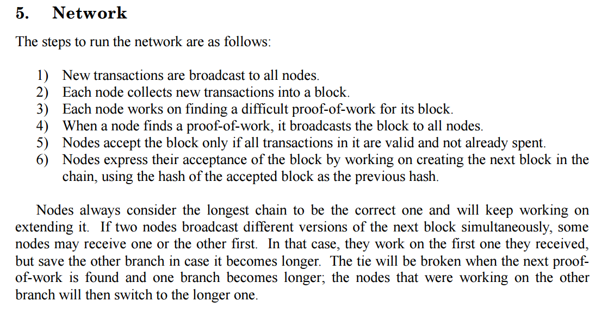

# Nodes

It’s become quite clear to me that the terminology within bitcoin has been hijacked.

The paper is extremely clear about what a node happens to be:

The thing people really don’t understand is that what matters in bitcoin comes from block consensus. The idea that you need to check your own node to know that a transaction is going through is ludicrous and it doesn’t matter anyway, your transaction goes through because it is incorporated into a block. The only way that you can get a transaction into a block is for it to be received by a node. That is the system that is mining your transactions.

Sitting and watching your own system means nothing. If you are not creating blocks you are doing nothing for the network, you are not helping it propagate. You are not helping it validate.

There is never been a single time in the history of bitcoin when any transaction or any block has been rejected other than as a result of miners rejecting it.

The point is, if you’re not creating blocks, you’re only following the nodes. At this point I will emphasise once again that a node is a system controlled by a mining server. It creates blocks. If you look at the early code it was documented very clearly. [1]

And this is detailed in the code comments [2]:

Personally, the comment stating that nodes collect transactions into a block 
et cetera is rather clear. If you are not mining you are not a node.

This should be intuitive. There are few hops between getting your transaction from your machine and into a mining node. There are rarely ever two hops in the bitcoin network other than regarding systems that have nothing to do with mining.

*Let’s do a little thought exercise.*

Imagine you have a computer that has nothing to do with mining, it’s running a wallet. You receive a transaction that you consider invalid, what happens? Basically, you don’t forward this to any other system.

In effect, you do nothing.

What if you receive an invalid block? Again, you simply don’t propagate it, you do not tell other nodes that that is a bad block, all you do is ignore it. Now, and this is the bit that people seem to have real difficulty in understanding, **doing nothing changes nothing**. If you’re mining and you reject a block it means you don’t mine on top of it and you select an alternate fork. If you’re not mining you don’t select an alternate fork. You don’t create blocks so you don’t propagate anything other than what you been told about.

This is the simple flaw in this half-baked reasoning about the need to have people running raspberry pi’s, they do nothing.

It doesn’t matter if you don’t accept the transaction unless you mine, you don’t have any say in the structure of the Blockchain unless you mine. This idea of a validator, unless you’re mining does not exist. You can audit the Blockchain if you so desire, but for that there is no reason to ever keep a copy. Once you have validated to a certain point, if you write down the hash of the last block and prune from there, you are gaining no security at all through the process of keeping all the old transactions and validating them over and over.

All that matters are machines that mine.

Now, the first thing we need to understand is that all encryption systems are probabilistic. Password systems and any modern information security system works on probabilistic information. The so-called experts who talk about the probabilistic system of bitcoin fail to comprehend that strong encryption is probabilistic.

To me, it seems very clear. You can download block headers invalidated transaction has been received without needing to be a miner. The current terminology where block stream has been trying to tell us how we should run “*running a full network node*”s runs directly in contradiction of what it says in Satoshi’s White Paper.

I think that it is about time we start looking at all these changes and what people are seeking in their attempts to hijack the network.

[1] See the following:
 [https://github.com/trottier/original-bitcoin/blob/92ee8d9a994391d148733da77e2bbc2f4acc43cd/readme.txt#L34](https://github.com/trottier/original-bitcoin/blob/92ee8d9a994391d148733da77e2bbc2f4acc43cd/readme.txt#L34)
 
 And note that all the checks are within the “Miner” function for block validation:
 [https://github.com/trottier/original-bitcoin/blob/92ee8d9a994391d148733da77e2bbc2f4acc43cd/src/main.cpp#L2133](https://github.com/trottier/original-bitcoin/blob/92ee8d9a994391d148733da77e2bbc2f4acc43cd/src/main.cpp#L2133)

[https://github.com/trottier/original-bitcoin/blob/92ee8d9a994391d148733da77e2bbc2f4acc43cd/src/main.cpp#L2333](https://github.com/trottier/original-bitcoin/blob/92ee8d9a994391d148733da77e2bbc2f4acc43cd/src/main.cpp#L2333)

[2] [https://github.com/trottier/original-bitcoin/blob/92ee8d9a994391d148733da77e2bbc2f4acc43cd/src/main.h#L795](https://github.com/trottier/original-bitcoin/blob/92ee8d9a994391d148733da77e2bbc2f4acc43cd/src/main.h#L795)

So… only miners are nodes

