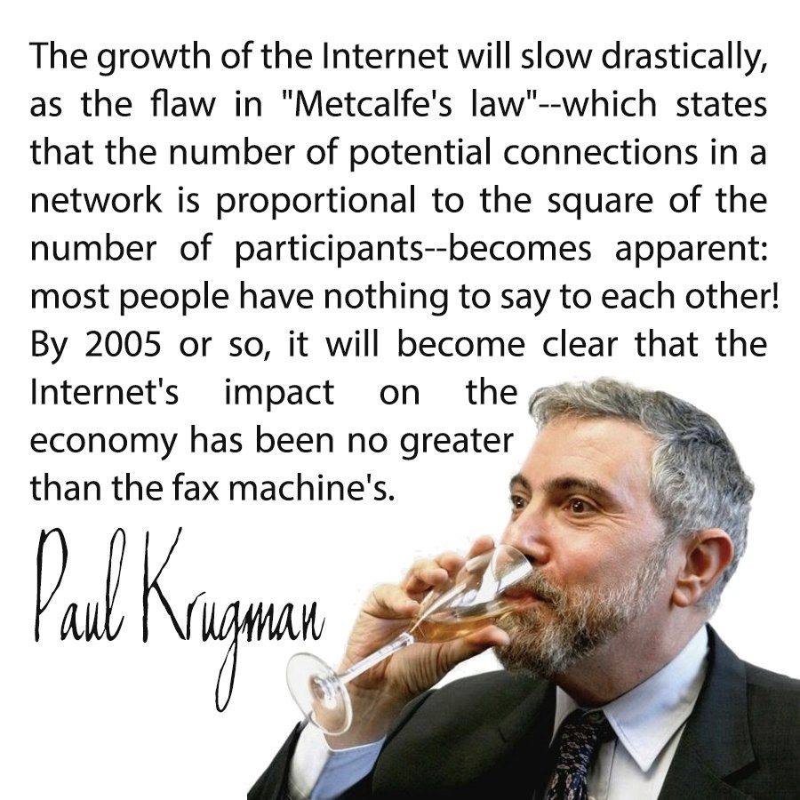
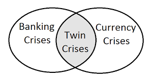

# The Asian Currency Crisis

It has been argued that the currency crisis in Asia in the late 90's differed in significant ways to many of the previous crises (Cogman & Dobbs, 2008) and that the countries involved, Thailand, Malaysia and others expressed solid fundamentals (Lacovone et. Al., 2009). For many years before the crisis, these economies had been growing at impressive rates leading to these countries being defined as the Asian Tigers. This quickly changed when taken on an economic timescale. Radelet and Sachs (1998) have designated a definition of a financial crisis as the sudden shift between capital inflow and capital outflow in preceding years.

Kaminsky &Reinhart (1996) introduced the terminology of a twin crisis to designate the simultaneous calamities in banking and balance of payments that was occurring across the Asian countries.

The joint existence of both banking and currency crisis conditions (the Twin Crises) is only one of many explanations. Other explanations have been proposed including herd behaviour [[1]](#_ftn1) (Calvo &Mendoza, 1998 and Devenow & Welch, 1996), moral hazard in banking (Krugman, 1998) and even the right of deregulation in the Asian sector. Some researchers (Rodrik, 1998) have criticised the IMF and argued that the capital accounts in these countries should have been liberalised over a more extended period.

Whilst some authors (Krugman, 1998 & Corsetti, et al., 1998) promote the concept of moral hazard in explaining the source of currency crises (especially the 1997 Asian crisis) as a reason for access and speculation and market failure, the bailouts created by the IMF provide more case for moral hazard when associated with government. Foreign investors provided capital for the belief that they would have profitable returns, not that they would be bailed out. Researchers, Radelet and Sachs (1998), note that only state-owned enterprises were bailed out in a currency crisis. They show how the spread on bonds did not increase and that investors understand the ineffectiveness of judicial systems within Asia and the lack of effective bankruptcy laws.

# Investigating the use of capital controls

To explore the possible impacts of capital controls, we can focus on either a particular crisis or the interaction between the joint crises. In focusing on an aspect of the crisis, whether related to the balance of payments or banking problem. We can investigate the individual causes and qualitatively eliminate issues related to government policies, in doing so we can begin to match differences between countries. This could be extended further if we incorporated an analysis of other similar crises such as those in Latin America, this research is outside the scope of this paper. One can further investigate the differences in similarity between government policies with an aim to determining the effects that could diminish the probability of a crisis occurring because of those policies. The problem with this approach is that many distinct policies can lead to the same results.

It is noted that all the countries experienced similarities in the twin crises. Primarily, these can be expressed as:

1. A policy of fixed exchange rates,

2. Large-scale capital flight and speculative attacks.

To address these dual problems, two responses have been proposed:

1. Abandon policy of using a fixed exchange rate,

2. The introduction of capital controls.

The introduction of capital controls involves the strict control of the inflow and the related outflow of capitals coming into and out of the country. Krugman (1979) reasoned that any fixed exchange rate policy could not withstand speculation once a minimal amount of reserve is held by the central bank.

Several economists (Krugman, 1979; Flood & Garber, 1984; Salant & Henderson, 1978) have reasoned that excessive fiscal deficits from government have led to many of the currency crises. The inflationary pressure that results in an increase in the money supply that comes about with liberal domestic credit being offered by central banks is proposed as a possible cause. This is stated to lead to an inconsistency between deficit financing and the use of the fixed exchange rate policy. In this model, the money supply has an extra genius equilibrium with the money market. The result is as the central bank increases domestic credit, foreign reserves correspondingly diminish. The key hypothesis to this theory is that as the volume of farm reserve held by a central bank is finite, any fixed exchange rate regime must eventually fail.

The Mundell-Fleming models (Mundell, 1963; Flemming, 1962) consist of an extension of the IS-LM Model. These models describe the short-run relationship amongst an economy’s designated exchange rate, the interest rate, and yield, that is a significant feature of a minor but open economy that has incorporated a fixed exchange rate and which experiences unhampered capital mobility. This contrasts with a closed-economy IS-LM model.

Krugman’s argument was to state that a crisis needed to occur whenever the central bank’s foreign reserve crosses a minimal threshold. Once the threshold has been crossed it would be necessary for the government to either devalue the currency or to abandon a fixed exchange rate policy.

# Speculation and the concept of a self-fulfilling crisis

Obstfeld (1994) had investigated earlier crises in European countries with a focus on the breakdown of the exchange rate mechanism (ERM). Some of the suggested reasons for why a government would choose to abandon a fixed rate included desire to inflate away debt burden nominated in domestic currency or to implement an expansionary monetary policy to reduce unemployment or other domestic problems. Conversely, the government might also desire to maintain a fixed exchange rate to better facilitate international trade and investment, or even as a source of national pride and perceived political competency. [Multiple equilibria](http://www.encyclopedia.com/social-sciences/applied-and-social-sciences-magazines/multiple-equilibria) can result because of these conflicting goals. As individuals and investors begin to speculate that the fixed peg could be abandoned, the cost of maintaining a fixed exchange rate will rise. This anticipation of a devaluation event can come about as a trigger resulting from the expectation of the people investing in a country both from within and externally. This expectation of devaluation leads to pressure on the central bank as investors convert the domestic currency to foreign currency ahead of what they see as a devaluation.

Once a threshold event occurs, the central bank could run low on foreign reserves which would necessitate a currency devaluation. *In a manner like bank runs, this form of crisis is self-fulfilling.

Obstfeld (1996) proposes three separate scenarios.

1. The resources of the speculators are less than that of the reserve held by the central bank,

2. The resources of each of the speculators exceeds the reserve of the central bank, or

3. No individual speculator has reserves grade of more than the central bank, but combined pools of speculators can exceed this reserve.

In these three cases, the evaluation will only occur in the second and third instances.

In the second case, the actions of anyone speculator will lead to a run on the currency resulting in devaluation. Each speculator will compete to be the first to unload the positions. In the third case, where a threshold of speculators hold the belief that devaluation is inevitable, this belief becomes a self-fulfilling prophecy. Here, each of the speculators rushes to close positions causing the devaluation to occur. Without this belief, the fixed rate exchange policy would have been able to survive.

A crisis that results, in this case, has [multiple Nash equilibria](https://www.youtube.com/watch?v=7EvqulZ-1uo) that form based on the actions of speculators and what is reflective of a herd mentality.

# Twin Crises: Banking & Exchange Rate Crises

The notion of a twin crisis comes from newer models that emphasize the importance of both finance and capital flow. By the time that the Asian currency crisis had occurred (1997/8), many other twin crisis events had already been experienced. These include the Scandinavian countries (Early 1990’s), Turkey (1994), Venezuela, Argentina and Mexico (1994) and Bulgaria (1996). Each of these has experienced a banking crisis proceeding the currency crisis. The direct results have been through either an increased monetary supply or through capital flight with the resulting decrease in monetary demand.

Stoker (1995) and Mishkin (1996) independently put forth the argument that the balance of payments crisis leads to the banking crisis. Stoker’s argument is that an external impact to the economy that is coupled to a fixed exchange rate leads to a diminishment of reserves.

Speculators seeing the loss of reserves follow up with an attack on the currency that can result in an abnormally high-interest rate level. As the level of interest rates increments, credit becomes more difficult to obtain at a level affordable by businesses. This, it is reasoned, leads to bankruptcies and financial crises. Mishkin takes the position that the resulting devaluation weakens the national banks. This effect is particularly exaggerated where a large share of their liabilities is denominated in foreign currency accounts which contrasts the perspective held by other researchers (Calvo, 1995; Diaz-Alejandro, 1985; Miller, 1987 & Velasco, 1987) who hold the position that the banking crisis occurs before the balance of payment crisis. It is reasoned that the attempt to bail out failing banks by the nation’s central bank reduces the countries’ ability to maintain a fixed exchange rate.

Other researchers (Reinhart & Vegh, 1996) propose that the twin crisis comes from a common cause. Their thesis comes of the slow convergence of prices to international exchange levels. International financing leads to a glut of money, low-interest rates and an associated flourishing in economic activity. This boom is coupled to increased imports and further international investment and borrowing. As this occurs, the current account deficit expands causing the inevitable result of increased speculation as entrepreneurs perceive the unsustainability of the fixed rate exchange mechanism leading to a speculative attack on the peg. International credit helps to finance the growth of the economy as an increase in bank credit leads to enhanced risk-taking and economic expansion. As the speculative attack on the peg occurs, capital flows reverse and currency leaves the country resulting in an asset market crash. The crash of the asset market undermines the strength of the banking sector leading to banking sector crash.

It has been argued (McKinnon & Pill, 1996) that financial liberalisation magnifies micro-economic distortions. It is reasoned that this results in economic and banking cycles that are more pronounced than they would be in a more regulated system, and that this leads to the collapse of the banking system.

An intensification effect caused by the intermediating nature of banks has been demonstrated (Goldfajn & Valdes, 1997) to magnify the differentials across international interest rates and the level of capital inflow. These oscillations can result in business cycles and bank runs that lead to a financial and currency crash. Kaminsky & Reinhart (1996) demonstrated that:

1. Banking crises are decidedly linked to currency crises.

2. Capital inflows intensify progressively before the crisis and collapse amidst the crisis.

3. Intermediation by banks rises before failure.

Goldfajn & Valdes (1997) model the creation of liquidity through credit allocation by financial intermediaries against capital flows and exchange rate breakdowns. This is conducted under a bi-variate time context.

In the model presented, the intermediaries create liquidity that is consumed by foreign capital. As investors are incentivized for short-term financial investment [[2]](#_ftn2) (including real estate and interest rate derivatives) over the long-term capital creation projects, they aid in increasing capital inflows. When this is coupled with an exogenous shock, international investors seek to withdraw their investments leading to capital flight. The financial intermediaries will have invested in illiquid assets and long-term capital loans. This international run on the bank can result in an enhanced risk of failure. Capital outflows lead to currency collapse. In this model, fractional reserve banking amplifies the negative effects of economic productivity and interest rates.

Most importantly, this model demonstrates:

1. The likelihood of a bank run will be positive and non-decreasing on the international interest rate differentials,

2. The proportion of capital outflow in period one will be greater than later periods,

3. There is a balance between the creation of larger capital inflows and increased risk of capital flight and a run on the country’s banks,

4. Expectations of currency devaluations increase the likelihood of runs on the banks, and

5. Fractional Reserve banking leads to the magnification of minor shocks such that these cause large effects.

# Could Capital Controls have helped?

Vinals (1996) and Eichengreen et al. (1996) have both argued that capital controls are ineffective. These are illustrated to demonstrate the correlated with increased rates of inflation and growing trade deficits. The main use is argued to come in the form of helping governmental expansionary policies. This form policy is associated with detrimental imbalances to the economy in the long term. This line of thinking allows us to see that the long-term effect of capital controls is market disruption and excessive devaluations. “Self-fulfilling” currency attacks through market speculation can be argued to be justified. The increase in capital flows to developing countries has been criticised (Stiglitz, 1998) with the claim that this makes these economies more vulnerable to economic crisis. Stiglitz holds the view that is developing countries express less regulation, that they are more vulnerable to shocks. It is his view that markets do not fully incorporate information due to the dominance of private capital flows.

Friedman (1998) emphatically counters this argument showing how it is a detriment to any emerging economy in the long term. Any developing country needs external capital to grow. The importance of well-managed capital systems is tied closely to the discipline that is imposed through long-term capital allocation and the transfer of knowledge that is associated with this. Friedman suggests that two options are the implementation of a currency board or floating rate system. In the ideal scenario, a currency board would have the discipline to manage the system so that when a balance of payments deficit appears it is tied to a decrease in high-powered money. The more effective system would be to implement a floating rate system where the exchange rate absorbs pressures that would lead to a crisis through a pegged currency. This later system also helps to preserve national monetary freedom.

Many modern economists such as Rodrik (1998) are proponents of capital controls due to a direct distrust of markets. Others such as Friedman and Henderson (1998) hold reasonable views of markets where they see that “*foreign exchange markets are a continuing, minute-by-minute election in which everyone with wealth at stake, including residents of the country, gets to vote, an election in which the winners are those countries whose governments have the most pro-growth policies*”.

# Conclusion

The use of a fully flexible exchange rate results in capital inflows causing an appreciation of the currency. This appreciation is expected to result in the deflation of pricing for international imported goods shifting consumption, and this tends to reduce inflationary pressure within the country. Ceteris paribus, when we compare rigid and flexible exchange rates, we would expect that inflationary pressure would increase the rigidity of the exchange rate system.

Capital controls allow governments to act in the interest of politicians. They increase the ability to cover up the damage to the economy that excessive policies enable and to cover-up the long-term effects of the business cycle that results from their actions. This ability to hide the damage that is being done naturally results in even more damaging policies being selected. Politicians and government officials are incentivised for this type of behaviour. It is outside the scope of this paper, but it is believed that the introduction of effective laws over property and bankruptcy would do far more to alleviate problems in developing economies than can be achieved through the introduction of capital controls.

# References

1. [Calvo, Guillermo, (1995). “Varieties of Capital Market Crises”, mimeo, University of Maryland.](http://econpapers.repec.org/paper/idbwpaper/4008.htm)

2. [Calvo, Guillermo, Leonardo Leiderman &Carmen Reinhart, (1994). “The Capital Inflows Problems: Concepts and Issues”](http://www.academia.edu/18411700/Currency_Crises_and_Capital_Control_A_Survey), Contemporary Economic Policy, Vol.12, Pp. 54–66.

3. [Calvo, Guillermo & Enrique Mendoza, (1998). “Rational Herd Behavior and the Globalization of Securities Markets](https://papers.ssrn.com/sol3/papers.cfm?abstract_id=114723&rec=1&srcabs=302685&alg=1&pos=4)”, mimeo, University of Maryland.

4.[ Cogman, David, and Richard Dobbs. “Financial crises, past and present.”](https://shivanandan.wordpress.com/2011/07/30/financial-crises-past-and-present/) McKinsey Quarterly (2008).

5.[ Corsetti, Giancarlo, Paolo Pesenti & Nouriel Roubini, (1998). “Paper Tigers? A model of the Asian crisis](https://www.newyorkfed.org/medialibrary/media/research/staff_reports/research_papers/9822.pdf)”, mimeo, NYU.

6. [Devenow, Andrea & Ivo Welch, (1996). “Rational herding in financial economics](https://pdfs.semanticscholar.org/80ac/964024324caf735a42ff46a0a5e2f99cf5e9.pdf)”, European Economic Review, Vol. 40, Pp. 603–15.

7. [Diaz-Alejandro, Carlos, (1985). “Good-bye Financial Repression, Hello Financial Crash](https://kellogg.nd.edu/publications/workingpapers/WPS/024.pdf)”, Journal of Development Economics, Vol. 19.

8. [Dornbusch, Rudiger, (1986). “Special Exchange Rates for Capital Account Transactions”, World Bank Economic Review, Vol. 1](http://www.nber.org/papers/w01659), September, Pp. 3–33.

9. [Eichengreen, Barry, Andrew Rose & Charles Wyplosz, (1996). “Is there a safe passage to EMU? Evidence on Capital Controls and a Proposal”](http://econpapers.repec.org/bookchap/nbrnberch/11369.htm), in The Microstructure of Foreign Exchange Markets, edited by Jeffery A. Frankel, Giampaolo Galli, and Alberto Giovannini.

10. [Fleming, J. Marcus (1962). “Domestic financial policies under fixed and floating exchange rates”](http://econpapers.repec.org/article/palimfstp/v_3a9_3ay_3a1962_3ai_3a3_3ap_3a369-380.htm). IMF Staff Papers. 9: Pp. 369–379. Reprinted in Cooper, Richard N., ed. (1969). “International Finance”. NY Penguin Books.

11. [Flood, Robert & Peter Garber, (1984). “Collapsing Exchange Rate Regimes: Some Linear Examples”](http://econpapers.repec.org/article/eeeinecon/v_3a17_3ay_3a1984_3ai_3a1-2_3ap_3a1-13.htm), Journal of International Economics, Vol. 17, Pp. 1–17.

12.[ Flood, Robert & Nancy Marion, (1998). “Perspectives on the Recent Currency Crisis Literature](http://www.nber.org/papers/w6380)”, IMF Working Paper, WP/98/130.

13. [Friedman, Milton, (1998). “Markets to the Rescue](https://www.wsj.com/articles/SB908229279775781500)”, Wall Street Journal, 10/13/98.

14. [Goldfajn, Ilan & Rodrigo Valdes, (1997). “Capital Flows and the Twin Crises: The Role of Liquidity](http://econpapers.repec.org/paper/imfimfwpa/97_2f87.htm)”, IMF Working Paper, WP/97/87.

15. [Haque Nadeem Ul, Donald Mathieson & Sunil Sharma, (1997). “Causes of Capital Inflows ad Policy Responses to them](https://www.imf.org/external/pubs/ft/fandd/1997/03/pdf/ulhaque.pdf)”, Finance and Development, IMF Publication, March 1997, Pp. 3–6.

16. [Henderson, David R., (1998). “Let capital flow freely”](https://www.wsj.com/articles/SB905377260853775000), The Wall Street Journal, 09/10/1998.

17. [Kaminsky, Graciela, Saul Lizondo & Carmen Reinhart, (1997). “Leading Indicators of Currency Crises](https://www.imf.org/external/Pubs/FT/staffp/1998/03-98/pdf/kaminsky.pdf)”, IMF Working Paper, WP/97/79.

18. [Kaminsky, Graciela & Carmen Reinhart, (1996). “The Twin Crises: The Causes of Banking and Balance of Payments Problems](https://www.macroeconomics.tu-berlin.de/fileadmin/fg124/financial_crises/literature/Kaminsky___Reinhart__1999_.pdf)”, mimeo, Board of Governors of the Federal Reserve System, Washington, D.C.

19. [Krugman, Paul, (1979). “A Model of Balance-of-Payments Crises”, Journal of Money, Credit and Banking,](https://www.gc.cuny.edu/CUNY_GC/media/LISCenter/pkrugman/krugman-BPO-crisis.pdf) Vol. 11, №3, August 1979, Pp. 311–325.

20. [Krugman, Paul, (1998). “What happened to Asia?](http://web.mit.edu/krugman/www/DISINTER.html)”, mimeo, MIT

21. [Lacovone, Leonardo & Zavacka, Veronika, (2009) “Banking Crises and Exports: Lessons from the Past](https://openknowledge.worldbank.org/handle/10986/4213)” (August 1, 2009). World Bank Policy Research Working Paper Series, 2009.

22. [McKinnon, Ronald & Huw Pill, (1996). “Credible Liberalization and International Capital Flows: the Overborrowing Syndrome](https://core.ac.uk/download/pdf/6483606.pdf)”, in Financial deregulation and integration in East Asia, Ed. Takatoshi Ito & Anne Krueger, Chicago University Press: 7–42.

23. [Miller, Victoria, (1995). “Central Bank Reaction to Banking Crises in Fixed Exchange Rate Regimes](http://isiarticles.com/bundles/Article/pre/pdf/9055.pdf)”, mimeo, Universite de Quebec a Montreal.

24. [Mishkin, Frederic, (1996). “Understanding Financial Crises: A Developing Country Perspective](http://www.nber.org/papers/w5600)”, in Annual World Bank Conference on Development Economics, World Bank, Washington D.C., Pp. 29–62.

25. [Mundell, Robert A. (1963). “Capital mobility and stabilization policy under fixed and flexible exchange rates](https://www.jstor.org/stable/139336?seq=1#page_scan_tab_contents)”. Canadian Journal of Economic and Political Science. Vol. 29 (4): Pp. 475–485.

26. [Obstfeld, Maurice, (1986). “Rational and Self-Fulfilling Balance of Payments Crises](http://www.kailchan.ca/wp-content/uploads/2010/10/Rational-and-self-fulfilling-balance-of-payment-crises.pdf)”, American Economic Review, 76 (1): 72–81.

27. [Obstfeld, Maurice, (1994). “The Logic of Currency Crises](http://www.nber.org/papers/w4640)”, Banque De France, Cahiers

28. Economiques et Monetaires, №43, pages 189–213.

29. [Obstfeld, Maurice, (1996). “Models of currency crises with self-fulfilling features](https://pdfs.semanticscholar.org/417a/68e3489395499dcef19ae289d47ce67e0c19.pdf)”, European Economic Review, 40: 1037–47.

30. [Radelet, Steven & Jeffery Sachs, (1998). “The East Asian Financial Crisis: Diagnosis, Remedies, Prospects](https://pdfs.semanticscholar.org/23de/fb7b49e57a34f1474c30cd0ab9b8bd4f4810.pdf)”, mimeo, Harvard Institute for International Development.

31. [Reinhart, Carmen M. & Carlos A. Vegh, (1996). “Do Exchange Rate-Based Inflation Stabilizations Sow the Seeds of their Own Destruction?](https://mpra.ub.uni-muenchen.de/8952/)”, mimeo, International Monetary Fund.

32. [Rodrik, Dani, (1998). “Who needs Capital Account Convertibility?](http://www.uvm.edu/~wgibson/PDF/Rodrik%20convertibility.pdf)” in Should the IMF Pursue Capital Account Convertibility? Ed. Peter Kenen, Essays in International Finance, №207 (May), International Finance Section, Department of Economics, Princeton University.

33. [Salant, Stephen & Dale Henderson (1978), “Market Anticipation of Government Policy and the Price of Gold](https://www.federalreserve.gov/pubs/ifdp/1976/81/ifdp81.pdf)”, Journal of Political Economy, 86: 627–48.

34. [Stiglitz, Joseph, (1998). “Boats, Planes and Capital Flows](http://www.geocities.ws/mugajava.geo/riwa/gstigl.htm)”, Financial Times, 03/25/1998.

35. [Stoker, James, (1995). “Intermediation and the Business Cycle under a Specie Standard: The Role of the Gold Standard in English Financial Crises, 1790–1850](http://www.worldcat.org/title/intermediation-and-the-business-cycle-under-a-specie-standard-the-role-of-the-gold-standard-in-english-financial-crises-1790-1850/oclc/799250066)”, mimeo, University of Chicago.

36. [Tobin, James, (1978). “A Proposal for International Monetary Reforms](http://econpapers.repec.org/article/eejeeconj/v_3a4_3ay_3a1978_3ai_3a3-4_3ap_3a153-159.htm)”, Eastern Economic Journal, Vol. 4, Pp. 153–59.

37. [Velasco, Andres, (1987). “Financial and Balance of Payments Crises](http://econpapers.repec.org/article/eeedeveco/v_3a27_3ay_3a1987_3ai_3a1-2_3ap_3a263-283.htm),” Journal of Development Economics, 27: 263–93.

38. Vinals, Jose, (1996). “A Comment: In response to Eichengreen, et al. (1996b),” in The Microstructure of Foreign Exchange Markets, Ed. Jeffery A. Frankel, Giampaolo Galli & Alberto Giovannini.

[Wong, Kar-yiu, (1998). ‘’Housing Market Bubbles and Currency Crisis: The Case of Thailand,](https://faculty.washington.edu/karyiu/papers/bubbles.pdf)” mimeo, University of Washington; available at [http://weber.u.washington.](http://weber.u.washiongton.)

[[1]](#_ftnref1) For an alternative approach to Her Behavior, see Flood & Marion (1998) in the case of partial explanations to the Asian crisis and Wong (1998) in respect to real estate speculation in Thailand.

[[2]](#_ftnref2) This includes real estate and interest rate derivatives.

