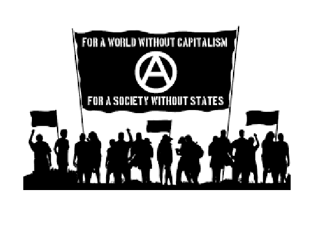
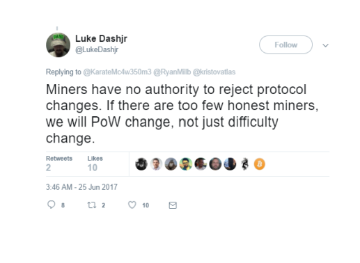
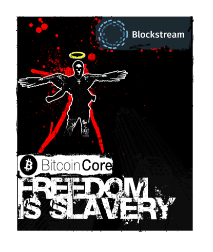

# **Fearing Companies**

The current bitcoin debate has nothing at all to do with centralisation. As I wrote in my piece on the [hijacking of the term ‘node’](https://medium.com/@adam_selene/nodes-e3bb49364b3a) we can easily see that any non-mining node is simply a wallet. It doesn’t help the system propagate, and it doesn’t create blocks.

In a paper by Eli Afram, it is noted that:

*“According to the Satoshi’s whitepaper, nodes were miners. The hijacking of the word seems to have placed unneeded importance on these validating nodes. But what would Bitcoin look like without these ‘nodes’, and how centralized would mining be, with the removal of the blocksize limit?”*

Gregory Maxwell of Blockstream has in the past stated:

“*With gigabyte blocks bitcoin would not be functionally decentralized in any meaningful way: only a small, self-selecting group of some thousands of major banks would have the means and the motive to participate in validation.”*

Craig Wright debunks the centralization myth with a very simple analysis:

“*There are around 15000 banks. Add financial organisations including savings and loans… We are up to 60,000. Then add in all the major merchants and operations that need to have transaction data by law, and that’s around 17 million organisations. That is decentralised do you not think?”*

In that simple conversation between Eli And Dr Wright we see the entire argument made by Blockstream and Core debunked.

The argument is very simple. People ask why a company would need to run a node. This, mind you, can be either a large exchange propagating many transactions, or a merchant seeking to get their transaction included as quickly as possible. These nodes may mine or form partnerships with mining organisations using anyone-can-spend transaction types to arrange payments with miners and to ensure that transactions are included without being malleated. At times, it will not even matter that the transaction is settled within a block. There are times when certain miners will include non-standard transactions and what matters is that these are settled within a reasonable time-frame. Not everything will require 10 minutes and the result is one that may be suited to specialised mining farms.

Satoshi clearly understood and planned for the integration of large companies. He stated succinctly:

*“The current system where every user is a network node is not the intended configuration for large scale. That would be like every Usenet user runs their own NNTP server. The design supports letting users just be users. The more burden it is to run a node, the fewer nodes there will be. Those few nodes will be **big server farms**. The rest will be client nodes that only do transactions and don’t generate [1]”*

Pulling this apart, we clearly see the intention of big server farms that simply stated happens to be a system managed by companies. What we need to create is a simple SPV wallet just like the White Paper mentioned, then we can get back to having zero conf transactions as we always had been promised:

*“See the snack machine thread, I outline how a payment processor could verify payments well enough, actually really well (much lower fraud rate than credit cards), in something like 10 seconds or less. If you don’t believe me or don’t get it, I don’t have time to try to convince you, sorry.”*

When Satoshi talked about generating, he simply meant mining. There is no option here, in all proof of work-based systems the end whether based on ASICs or not is corporatisation. Dr Wright put this clearly in a draft he posted for checking on Slack:

*“In the instance of bitcoin mining, the firm is able to increase in size through the integration of multiple specialist roles. Even given the assumption that any one process can run on but a single CPU, we come to the scenario of high-end data centre servers. The Intel Xeon Phi 7290f implements 72 Atom CPU Cores. Each core runs two threads. Even taking the control system into account, this leaves 142 processes able to run per system. With four cards per RU this allows for data centre implementations of 5,964 mining processes to run on a pure CPU-based proof of work implementation.*

*One person can manage a small number of mining server implementations within a home or small business environment. In large data centre-based organisations such as Facebook, a single administrator can run 20,000 servers. The effect of this would be one individual managing 2,840,000 individual CPU-based mining processes. This alone is outside the scaling capabilities of any individual. This can be further enhanced as cost savings through the creation of large data centres, management savings and integrating multiple network and systems administrators is taken into account. As we start to add additional layers we come to a maxima where it is no longer profitable to grow the firm in size. Right up until that point, the firm will grow…*

*For all proof of work systems, economic efficiencies naturally lead towards larger competing firms. There is no known system that allows for the fair distribution of resources in a distributed manner that does not lead to competing corporations managing the primary system.”*

In a paper that is about to be published, Dr Wright simply proves that all proof of work systems tend towards corporate management and control.

It is clear that Satoshi always intended companies to manage bitcoin.

# The companies that manage bitcoin, they require profit.

There exists an error in the thinking held by many of the anti-capitalist and socialist developers that are strangling bitcoin and limiting its growth. These individuals are not seeking to grow bitcoin, they believe they can take personal control and paternalistically manage the system for everyone else. They talk a big game stating how they wish for everyone’s freedom as they oppress us.

This could take many forms.

In the figure above, we see recent statements from one of the core developers. They are not seeking free competition but control. They don’t want a capitalist society. In a capital society, the people who can best deliver a solution to the most people win. This is the last thing on their mind.

Socialists are not afraid of government, they are afraid that they are not government. It is not that they want you to be free, it is they want you to be dominated by them.

These people in Core try to tell us that they are fighting for our freedom as they oppress it. They are not seeking to grow the bitcoin Blockchain. They are seeking to inject sidechains to devalue it and make it worth less. They’re not seeking our privacy, they seek to create centralised lightning networks that sit on top of bitcoin and steal its ability to allow us to freely trade. and in doing so create centralised platforms they can manage and monitor.

They try to tell us how this is good for our own interests. They say that everyone needs to run a node for if we don’t run a node we will not be able to validate transactions. This lie, this outright blatant deception is the biggest flaw within bitcoin as it is generally taught. At the heart of it we have the anti-capitalistic mentality rearing its ugly head. It is a position of coercion and paternalistic contempt.

One big issue that seems to be overlooked is that it is the merchant that is going to care about payments, and not the consumer.

When we go into a store, we do not care if the merchant validates our transaction. We care that we receive the goods and that we have paid. It is the merchant and not the consumer that desires validation. Then, the issue here once again comes to companies. They try to tell us of some post Utopian wonderland where no companies exist and everyone freely trades settling individually. This ignorance of scarcity is one of the key aspects of the oppression they push upon us.

The unwarranted attack is not against centralisation but against companies in general.

***Mining is how you vote for rule changes. Greg’s comments on BU revealed he has no idea how Bitcoin works. He thought “honest” meant “plays by Core rules.” [But] there is no “honesty” involved. There is only the assumption that the majority of miners are INTELLIGENTLY PROFIT-SEEKING. — ForkiusMaximus***

**Miners are not “Honest”, they are rationally profit seeking!**

Honesty is not required in the protocol. That is the beauty of Bitcoin, it takes the self-interest of each individual and directs it to the creation of something better.

These people do not hate and attack centralisation. They hate and attack companies. They would rather hand bitcoin to government than the state. That is the goal. Not freedom but control. And they use the ignorance of people unversed in economics to create a framework of demagoguery that leads us straight to 1984.

Their error is not understanding that all Proof of Work systems are inherently capitalist!

[1](#sdfootnote1anc) [https://bitcointalk.org/index.php?topic=532.msg6306#msg6306](https://bitcointalk.org/index.php?topic=532.msg6306#msg6306)

