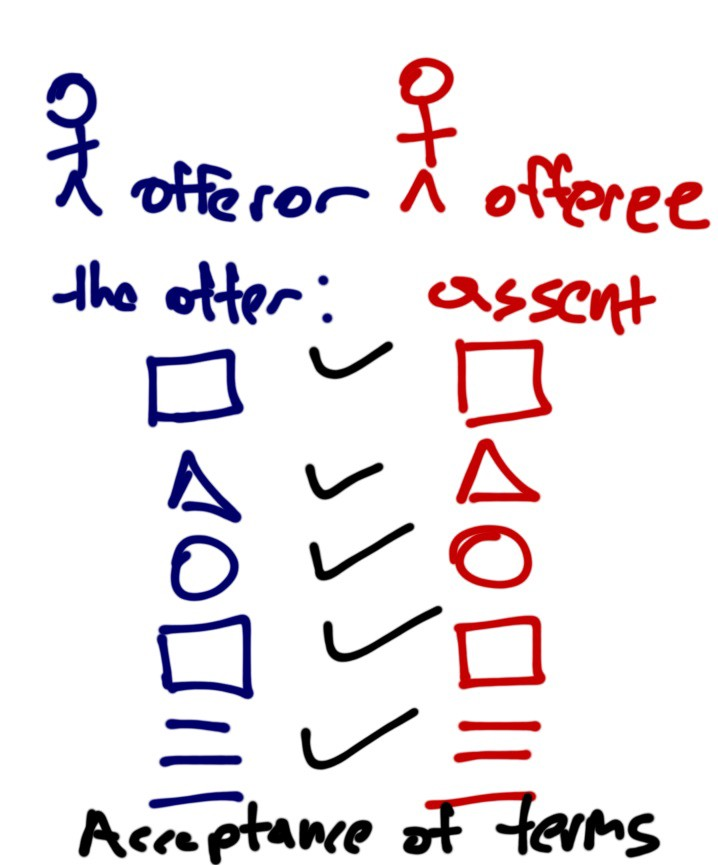

# 2/5 Bitcoin and the connection to Contracting

# Issues with electronic contracting in relation to Bitcoin

The Internet is fundamentally a means of communication. Issues with law that have arisen because of the Internet are thus a result of the differences between communication in the physical world and communication using the Internet. Contractual negotiations are the result of a series of communications that create a legally binding agreement. For this reason, there is little difference between contracts made online than those formed through face-to-face communication. The facts surrounding the form of the communication are the primary difficulty. This has not changed in any way following the development of Peer to Peer electronic cash and contract systems including Bitcoin.

At the most fundamental level, the existence of an offer and an acceptance is one of the primary requirements for the creation of a contract. The set of laws used to determine whether there has been a valid offer and an acceptance created across the Internet or a mere invitation to treat have their lineage in the case law concerning postal and telex communications.

What is important to remember is that the Internet is not a single communications channel. Bitcoin (and other crypto currencies) are also, as a protocol overlayed on the Internet, subject to this position in law. The Internet is a collection of separate protocols used to communicate over the same physical connection.

The result of this collection of protocols is that different legal issues will apply to the individual communication protocols. Protocols such as e-mail correspond to the process of sending a letter by post. A result of this is that we can match the physical world laws to the corresponding situations created by each of the individual Internet protocols. In this manner, we may see that the World Wide Web could be analogous to a mail order catalogue based purchasing system. The same principles govern the process of contractual creation whether the process is faster or not. Analogously, Bitcoin is clearly a means to exchange value or consideration.

As an offeror may stipulate the method of acceptance [(***Eliason v Henshaw [1819] & Manchester Diocesan Council for Education v Commercial and General Investments*** [1970]),](http://casebrief.me/casebriefs/eliason-v-henshaw/) it would be wise for parties to agree to the form of acceptance prior to the conclusion of the contractual negotiations. The recipient does not have to accept a form of payment unless in a form that is defined to be legal tender. As Bitcoin is not considered to be legal tender, the parties engaged in exchange need to come to an agreement to accept Bitcoin as consideration.

A further important issue that surrounds Bitcoin based contracting is the general rule of law that, for an acceptance of an offer, it must be “communicated” to the offeror [(*McKendrick [1], 2005; Pp43–44*).](https://www.sans.org/reading-room/whitepapers/legal/electronic-contracting-in-an-insecure-world-2088?show=20) Under normal circumstances, the offeror must receive the acceptance before a contract will come into existence.

Where a merchant has posted a Bitcoin address and the acceptance includes payment using Bitcoin to the proffered address, we can start to easily apply contract law. In this instance, we have a clear record of the contract where the digital signatures are not pruned. Even without the signature pruned, we need to maintain further evidence. With the incorporation of tagging technologies in Bitcoin (such as OP_Return), this can be simplified further.

