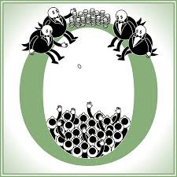
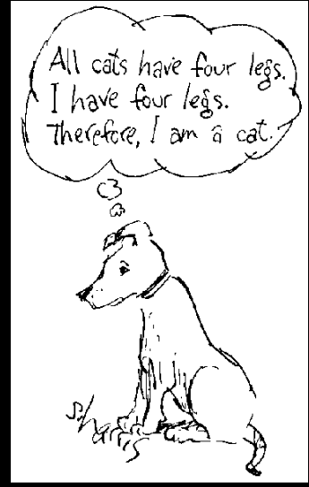

# The Myth of Anti-Competitive Pricing

Posner (1968: 1563–4) Upholds the position where diverse markets act outside the whims of individual players. The distinction comes from an argument that the pricing model of Oligopolists interacts in a manner that shows a level of dependence between the parties. The result is argued to be a collusive pricing model.

Posner’s argument in effect comes down to the assertion that oligopoly can be demonstrated where firms interact based on the pricing expectations of other firms (Goodwin, 2014). In this paper, we demonstrate that the neoclassical model of perfect competition is a strawman argument designed not to further economics but rather political control. We will demonstrate that all firms interact with a level of specialisation towards a product that is differentiated based on the subjective whims of clients and consumers (DiLorenzo, 1992). Further, all firms pre-empt and react on the price expectations of their competitors (Robinson, 1969). The result is perfect competition cannot exist and is created as a strawman needing to be defended through government intervention.

# The Strawman of Perfect Competition

The neoclassical model of perfect competition provides for many firms offering a standard product the consequence of little price control being allowed (Pindyck, 2015). In this model, firms act as price takers and face a horizontal demand curve (Maneschi, 1998). This is a model of extreme competition where products are completely undifferentiated and consumers switch based on price considerations alone. The model is reliant on perfect information and consumers can change providers at will without transaction costs. More importantly, any firm that increases price does so at a loss of customers and market share in this meme (Koller, 1971).

Monopolistic competition contrasts this with an environment of many competing firms that are differentiated through product branding (Yahua & Round, 2011). In this model, the organisation possesses some control over price and faces a downward sloping demand curve. Transactional costs and entry costs in this model are low and it is relatively easy for new organisations to enter and compete. Some consider this model to be inefficient with the consumers choice and subjective taste preferences are being downplayed as an overall economic cost (von Stackelberg, 2011).

In the model of oligopoly competition, we have a few large firms offering standardised or marginally differentiated products (Wallard, 1956). This model is based on mutual interdependence and often extends to collusive behaviour, even where such behaviour is criminal or at least illegal. This model is described as a defacto monopoly. The argument against oligopoly is the existence of overpriced products that are under produced which is deemed to be inefficient. One of the main reasons for the argued existence of an oligopolistic environment comes from the existence of barriers to enter or compete. Such barriers could be government-controlled licensing or access to resources (Sowell, 1998).

The extreme model is known as pure monopoly. A pure monopoly exists in an environment where the organisation can sell a unique product and no substitutes exist (Robinson, 1969). Some reasons that have been touted for the existence of monopolies include ownership of resources, patents, or the requirement for economies of scale to produce efficiently. In a monopoly version of industry and the economy, goods are produced at a higher price relative to perfect competition but lower quantity.

These arguments have been used as a justification for the destruction of many successful industries. Rockefeller with Standard Oil was split up into many small industries not because they managed to increase prices to what would be considered monopoly levels, but rather because of being able to reduce prices beyond what their competitors could offer. Standard Oil grew through competition to a stage where in 1890 it supplied 88% of the refined oil distribution throughout the USA (Folsom, 1988).

[The Sherman Antitrust Act of 1890](https://en.wikipedia.org/wiki/Sherman_Antitrust_Act) was introduced as a response to the increasingly efficient organisations that started to develop around the turn of the late 19th century. Contrary to the standard rhetoric around monopolies, standard oil reduced the cost of petroleum significantly. It was not the ability to increase fees that made enemies and political attacks against these large organisations, rather it was their ability to deliver better quality products to many consumers at a rate far less than the previous industry mean value.

The other problem at the time was that the dividends of these highly successful industries were reinvested into other new industries (Hayek, 1974). The primary families controlling standard oil reinvested most of their dividends into railroads, gas and electric lighting businesses, steel, copper, and corn products. Some of these investments allowed for research that increased the productivity of both the steel and corn industries (Folsom, 1988).

It was not the consumer that lead the attacks that ended with the breakup of industries such as Standard Oil, rather people such as journalist Ida Tarbell whose work against monopolies manipulated reality to create the corrupting influence and control that would lead to higher prices such industry consolidations necessarily resulted in. The truth however was that this journalist’s father was an oil producer who had gone bankrupt when Standard Oil introduced cost saving measures that reduced the price of kerosene from over USD $0.30 to a market rate of under $0.08 in an 18-month period (Folsom, 1988, p8). The reality was not one of predatory pricing or monopolies and oligarchies but rather effective business and the introduction of new technology that allowed for the growth of a large industry whilst opening opportunities to new businesses.

The issue of oligarchy is not one of business collusion, but rather a political sleight of hand designed to undermine the effectiveness of large industries that act along the desires of the consumer (Hayek, 1974). For all the bad press detailing how predatory pricing can be used to collapse businesses and attack competition, econometric studies have demonstrated that there has never been a successful case of a monopoly existing without government intervention, nor has there been any recorded case where predatory pricing has aided in the creation of monopoly or oligarchy power to business (DiLorenzo, 2013; Koller, 1971). It is more likely that the entire realm of oligarchy and monopoly exist only to fuel the anti-trust legislation and the incredibly large payouts associated with this. We see from Goto (2011), it is not an economic feature but rather one of political economy.

# Substitutes

Theories of oligopoly and monopoly pricing derived using identifiable criteria. They argue that a perfectly elastic demand curve is a feature of purely competitive markets, in doing this, they create a strawman. Pure competition is upheld as an ideal to be achieved even at the cost of free competition. This is defined at the state in which the demand curve for each participant in the market reacts perfectly elastically. It is a scenario where no organisation could influence of price of its product allowing a ‘fair price’ to be universally determined. In this idealised system, the strawman of an idealised market where no participant can achieve influence over its market is deemed to be ideal.

This fallacious model allows for the state-based interaction in markets. Any influence on the determination of price by any organisation is a monopoly or oligopolistic intervention requiring the protection of the state in the political rhetoric. It is a fallacy that perfectly elastic demand curves could be seen to exist. The market is not a single product at a single time, any product fills separate roles for any individual consuming it. The consequence of this is that we can see that any market interaction is purely subjective. More importantly, any interaction of the consumer or any decision of the producer leads to differentiations within the demand curve. Small increases in supply lead to a small lowering of price and vice versa. The individual organisation maintains a perceptible influence on the total supply even of that influence is small. Unlike the econometric models that assume infinitely negligible steps and increments, any inclusions within a real market are immeasurable. In the subjective world of human interaction in markets, all inclusions form discrete quantised steps rather than the idealised continuous model.

The assumption of a perfect market is a fallacy. Even in highly competitive markets such as wheat, the ideal is at best almost perfectly elastic and cannot ever be better. Pure competition cannot as a result exist (Robinson, J., p. 21). The Lindt chocolate factory acts in a competitive market where they can individually impact some of their own demand curve. An analysis of these firms demonstrates that all organisations have falling demand curves and hence it is not perfect competition against monopoly but rather the natural state of the market. The entire argument for oligopoly and monopoly stems from the inelastic versus elastic demand curve argument. The dichotomy of monopoly price versus competitive price having been shown to be untenable already and thus is argued to not be an economic factor but rather one of political control (Willard, 1956).

Coming back to (Posner, 1968: 1563–4) we see the argument of artificial differentiation. The creation of differentiated products and branding differs from the inclusion of identical products commonly promoted through the Chamberlin-Robinson monopolistic-competition analysis. This differentiation is argued to be a means for a producer to create a unique industry as a micro monopoly although no rational argument is provided as to the grouping of producers or products. In this model, the consumer is said to be duped. The consumers subjective choice is relegated to the nefarious machinations of scheming capitalists. The effect is that any differentiation is artificial and that there is no real need for a multifarious market that seeks to provide for many consumers.

There is a discussion within the literature as to degrees of oligopoly and monopoly. These forms of strategy analysis go as far as to compare business to warfare in a false dichotomy. The reality is binary, either a firm is independent or it is acting jointly. A firm that is acting jointly whether partially or in full is part of a cartel, whereas a firm that is independent is not part of a cartel. No other alternative can exist. We demonstrate above that perfect elasticity cannot exist and hence any differentiation discussing firm size or differentiation strategies can be demonstrated to be irrelevant. These are questions of economic history not economic scrutiny. The real firm, not the hypothetical has a model of expectations concerning how many of its products it can sell at a set price to a consumer (Golgan, 2011). This real-world client is not interested in what consumer demand may be in hypothetical but non-existent scenarios. These models include expected changes to revenue should alternate prices be set to market and any firm, not just a monopoly or oligopoly will take the reactions of its competitors into account when pricing customer demand for a product. Any firm that ignores such strategic decisions will go out of business.

The argument made by Posner (1968) is hence true for any oligopoly firm that these firms are interdependent in the pricing and part of an anticipated reaction only in the extended case that this is true for the market in general. As we argued above, no perfect competition can exist and this is placed as a strawman not for economic argument, but political. We can hence say that any firms’ estimated demand curve will be built strategically based upon the expected actions that are to be taken by the rival firms of the company. This can be further extended in that all firms offer goods that have substitutes.

The introduction of the terms “consumer sovereignty” and “individual sovereignty” is an example of the slow introduction of little terms into economics (Hutt, 1940). Sovereignty is a quality of political power that one can express and enforce. It is associated with violence through the state. In economic terms, no person can be sovereign over the actions of exchanges completed by other parties. Further, no individual or firm can coerce consumers or producers into trades without state intervention. The maximisation of utility that is subjectively bestowed through a trade based on the individual psychic valuation is subjectively held by each party at a time. The introduction and inclusion of oligarchy and monopoly systems into the general realm of economics excluding state intervention for the existence of such a system is a state justification for intervention.

To treat this as a *reductio ab absurdum*, we can start with the proverbial case of Robinson Crusoe and Friday (Hutt, 1940). Each party is a bilateral monopolist. Without external intervention in this reduced market, we see the concept of consumer sovereignty leading to a scenario where state intervention by force would be necessary. Neither Crusoe nor Friday acts in the interest of the other party in this oligopoly model and yet the Robinson Crusoe economy also acts as the classical microeconomic toy economy. The incorporation of the false dichotomy of an “ethical ideal against which the activities of the free market are to be judged” (Hutt, 1940) with the alternative state of moral treason is simply an untenable position used as a rhetorical device for the political control of industry, not as a means to aid the economy.

There exists only two ways for prices to be set for goods. One is a free market through of process of voluntary exchange, and the other is through intervention involving some form of violence and force designed to manipulate the market into an alternate position (Smith, 1776). This position is clear, any interaction in a free market changes the position from voluntary engagement to one of forced dictates. Robinson Crusoe and Friday are not bilateral monopolists requiring state intervention but the simplest form of trade. Even where either party can provide an overall advantage for every task, they still maintain a comparative advantage specialising in their best effort and leaving the other party to trade (Maneschi, 1998).

In the case study of Standard Oil, the introduction of a synthetic competitive beeswax, Vaseline, plastics, and high-grade fuel products that were used in machines allowed the organisation to increase the profitability. Previously, competing refineries in the production of kerosene created heavy waste dumps and dumped petroleum products into neighbouring rivers. Rockefeller’s introduction of new technologies changed the waste products in the kerosene industry into a more profitable business line than kerosene itself. Not only did this benefit the consumer directly in lowered pricing but it also led to the increased environmental controls that we see today (Schumpter, 1994).

# Conclusion

For the last 150 years, we’ve seen a steady and unrelenting attack against free-market capitalism using the fear-based rhetorical tactics of oligarchy and monopoly control. Authors such as Posner (1968) haven’t embraced this rhetoric in their drive for increased intervention in markets. In this paper, we have demonstrated that no oligopolistic control exists without government intervention and that the large profits generated by firms such as Standard Oil derive through more effective pricing models and consumer demand. The fallacy of perfect competition has been used as a foil on which to skewer the free market allowing governments to grasp additional political power and control. Every organisation, no matter how differentiated anticipates the prices of their competitors and reacts accordingly. The position that this is a measure of oligarchy can thus be seen through the lens of political control that is expressed upon modern markets.

# References

1. [Colgan Jeff (2011) ‘The Emperor has No Clothes: The Limits of OPEC in the Global Oil Market’,](https://www.princeton.edu/~pcglobal/conferences/environment/papers/colgan.pdf) Paper presented at Princeton University Environmental Politics Conference, November 2011.

2. [DiLorenzo, Thomas J. “The Myth of Predatory Pricing.” The Myth of Predatory Pricing.](https://www.questia.com/magazine/1G1-13374737/the-myth-of-predatory-pricing) Cato Institute, 28 Feb. 1992. Web. 12 Mar. 2013.

3. [Folsom, Burton. “John D. Rockefeller and the Oil Industry.” : The Freeman: Foundation for Economic Education. The Freeman, 01 Oct. 1988. Web. 12 Mar. 2013.](http://digitalrepository.trincoll.edu/cgi/viewcontent.cgi?article=1298&context=theses)

4. [Goodwin N, J Harris, JA Nelson, B Roach and M Torras (2014) Microeconomics in Context, Third edition, New York and London: ME Sharpe.](http://www.ase.tufts.edu/gdae/publications/textbooks/microeconomics.html)

5. Goto, Akira, Japan Fair Trade Commissioner (2011) ‘Enforcement of the Anti-Monopoly Act in Recent Years’, speech given at the Asia Competition Association meeting, 16 September 2011.

6. [Hayek, F. “The Meaning of Competition,” in his Individualism and Economic Order](https://mises.org/sites/default/files/Individualism%20and%20Economic%20Order_4.pdf) (Chicago: University of Chicago Press, 1974), p. 94.

7. W.H. Hutt, (1940) “The Concept of Consumers’ Sovereignty,” Economic Journal, March, pp. 66–77

8. Koller, R. H, “The Myth of Predatory Pricing: An Empirical Study,” Antitrust Law and Economics Review 4 (Summer 1971): 110.

9. [Maneschi, Andrea (1998). Comparative Advantage in International Trade: A Historical Perspective.](https://www.cambridge.org/core/journals/journal-of-the-history-of-economic-thought/article/maneschi-andrea-comparative-advantage-in-international-trade-a-historical-perspective-cheltenham-uk-edward-elgar-1998-pp-x-258-isbn-1858983002/A19C0335CFB29103B7CFCD382BDE056E) Cheltenham: Elgar. p. 1

10. [Pindyck Robert S and Daniel L Rubinfeld (2015) Microeconomics, Eighth Edition, London: Pearson.](http://www.pearson.com.au/products/O-R-Pindyck-Robert-Rubinfeld-Daniel/Microeconomics-Global-Edition/9781292081977?R=9781292081977)

11. [Posner, Richard A., (2001) ‘ANTITRUST LAW’, University of Chicago Press.](http://www.press.uchicago.edu/ucp/books/book/chicago/A/bo3628468.html)

12. [Robinson, J. (1969) “Economics of Imperfect Competition”. Palgrave Macmillian](http://www.palgrave.com/la/book/9780333102893)

13. [Smith, Adam (1776). An Inquiry into the Nature and Causes of the Wealth of Nations](https://www.ibiblio.org/ml/libri/s/SmithA_WealthNations_p.pdf). 1 (1 ed.). London: W. Strahan.

14. [Schumpeter, Joseph A. (1994) [1942]. Capitalism, Socialism and Democracy](https://www.amazon.com/Capitalism-Socialism-Democracy-Joseph-Schumpeter/dp/0415107628). London: Routledge. pp. 82–83. ISBN 978–0–415–10762–4. Retrieved 23 November 2011.

15. [Sowell, T (1998). “Conquests and Cultures: An International History”](https://www.amazon.com/Conquests-Cultures-International-Thomas-Sowell/dp/0465014003), ISBN 0–465–01400–3

16. [von Stackelberg, H. (2011) “Market Structure and Equilibrium: 1st Edition Translation into English](http://www.springer.com/gp/book/9783642125850)”, Bazin, Urch & Hill, Springer, XIV, 134 p., ISBN 978–3–642–12585–0

17. [Willard D. Arant, “Competition of the Few Among the Many](https://academic.oup.com/qje/article-abstract/70/3/327/1928830/Competition-of-the-Few-Among-the-Many?redirectedFrom=fulltext),” Quarterly Journal of Economics, August, 1956, pp. 327–45.

18. [Yahua, Zhang & Round, David K., (2011) ‘Price wars and price collusion in China’s airline markets’](https://core.ac.uk/download/pdf/11047290.pdf), in International Journal of Industrial Organisation, 29(4) pp. 361–72.

