# A (brief and incomplete) history of censorship in /r/Bitcoin

**Please do not use the censored /r/bitcoin or Bitcointalk. Use [/r/btc](http://reddit.com/r/btc) instead.**

> The free and open discussions on this forum help individuals and the Bitcoin community achieve Truth. Everyone has some wisdom or knowledge to contribute to a discussion, and everyone who reads the discussion and gains that knowledge gets closer to the Truth. **This is much more effective than having truth dictated by a handful of moderators or voted on by an electorate.**

> *-Theymos, in a [post on Bitcointalk in 2013](https://bitcointalk.org/index.php?topic=296789.msg3184519#msg3184519).*

Anyone who has been following Bitcoin closely over the past couple of years should by now be well aware of the issues being debated and the existence of censorship in some of Bitcoin’s most prominent communities. For the unaware, a primer:

The Bitcoin network is currently at max load, and today is capable of processing approximately three transactions per second. This was not part of the original design of the Bitcoin protocol, and the 1MB block size limit was added in 2010 by Satoshi Nakamoto himself as a temporary anti-spam measure.

Because bitcoins were so cheap at the time, and the number of bitcoin users so few, making transactions on the bitcoin network was effectively free. The concern was that a malicious entity could simply flood the network with transactions, filling up blocks and bogging down transaction speeds for legitimate users. Because transactions were so cheap to make, such an attack would have cost the perpetrator very little to pull off, and could have crippled the entire bitcoin network while it was still in its infancy. Former bitcoin lead maintainer Gavin Andresen addressed this attack [in a blog post](http://gavinandresen.ninja/One-Dollar-Lulz), writing:

> The block reward was 50 BTC back then, so miners could sell a block’s worth of coin for about $1.50. That gives a rough idea of how much it would cost an attacker to produce a ‘poisonous block’ to disrupt the network– a dollar or two. Lots of people are willing to spend a dollar or two “for the lulz” — they enjoy causing trouble, and are willing to spend either lots of time or a modest amount of money to cause trouble.

> Today the block reward is 25 BTC and the price is over $400; miners get over $10,000 for the blocks they produce. An attacker would have to spend close to that amount to produce a ‘poisonous block.’

But even this one megabyte limit was hardly restrictive; at the time the average block size ranged from 200 bytes to occasional peaks of around one kilobyte. The one megabyte limit was meant to handle new user influx and peak period transactions up to several thousand times what the average daily transaction volume was at the time. In October 2010, Satoshi Nakamoto even [laid out his plan for increasing the maximum block size](https://bitcointalk.org/index.php?topic=1347.msg15366#msg15366):

> It can be phased in, like:

> if (blocknumber > 115000)
maxblocksize = largerlimit

> It can start being in versions way ahead, so by the time it reaches that block number and goes into effect, the older versions that don’t have it are already obsolete.

Pretty simple, right?

One would think. Since the limit was introduced in 2010, there have been countless discussions on the necessity as well as the methods that would be used to increase this limit, and Bitcoin’s transaction processing capabilities with it. Those attempts have repeatedly been blocked by a small group of developers, and in recent years discussion of increasing the limit has been censored from some of Bitcoin’s largest discussion forums, all of which are moderated by the same individual, who posts using the handle Theymos. What is forbidden includes any discussion of code changes that propose increasing the limitation.

Some don’t believe the censorship is problematic, or refuse to acknowledge that it is censorship at all. Here’s Blockstream CEO Adam Back:

<iframe src="./assets/a76d713ee7376cf628009cb493dfe1d8.html"></iframe>

<iframe src="./assets/6590ca043912ce2286f40ad60536517a.html"></iframe>

And Blockstream CTO and Bitcoin Core developer, Gregory Maxwell:

> “But [/r/btc](https://www.reddit.com/r/btc) at this moment is smoking hot proof that [/r/bitcoin](https://www.reddit.com/r/bitcoin) is doing something right and that it’s not just a question of moderator punishment.” *([Source](https://www.reddit.com/r/Bitcoin/comments/42u1v8/core_devs_communication_has_improved_thank_you/czdesxq/), [archive](https://archive.is/XDnLC))*

And Blockstream contractor and Bitcoin Core developer Luke-jr:

> “Manipulating public opinion is not censorship” *([Source](https://www.reddit.com/r/technology/comments/48rac0/bitcoins_nightmare_scenario_has_come_to_pass/d0mlwmj/), [archive](https://archive.is/70sWm))*

> “I am not aware of any evidence that [/r/Bitcoin](https://np.reddit.com/r/Bitcoin) engages in censorship.” *([Source](https://np.reddit.com/r/btc/comments/40avc5/hey_bitcoin_core_i_think_that_your_team_should/cyswi1y/), [archive](https://archive.is/yjSxP))*

> “/u/theymos is one of the most anti-censorship people I know” *([Source](https://np.reddit.com/r/Bitcoin/comments/42u1v8/core_devs_communication_has_improved_thank_you/czdetwd/), [archive](https://archive.is/6FPqF))*

And Bitcoin Core developer Peter Todd:

> “Roger [Ver]’s ideas aren’t getting censored, they’re just not getting listened too. [sic]” *([Source](https://www.reddit.com/r/Bitcoin/comments/5brvb8/hes_back_convicted_felon_questions_the_morals_of/d9qz6x7/), [archive](https://archive.is/Abqmi))*

And /r/bitcoin moderator /u/frankenmint:

> “From my perspective we aren’t participating in censorship in any tangible way, for example, me going out of my way to get your content removed from medium.com would be me engaging in censorship…” *([Source](https://www.reddit.com/r/btc/comments/5ahqh1/i_locked_the_article_on_rbitcoin_guysdue_to_a/d9gk2de/), [archive](https://archive.is/SR3Tj))*

Based on this outpouring of support from certain interested parties, it’s almost as if they’d have you believe there were no censorship happening at all! Pay no attention to the fact that /u/theymos [has been shown to have financial dealings with Blockstream](https://forum.bitcoin.com/post32869.html#p32869). Let’s take a look at censorship on /r/bitcoin through the ages:

**May 7th, 2015.** Using a tool called UnReddit, [we can see a large number of deleted comments](https://unreddit.com/r/Bitcoin/comments/354qbm/bitcoin_devs_do_not_have_consensus_on_blocksize/) in a thread on increasing the block size.

**August 9th, 2015.** [A highly upvoted thread](https://www.reddit.com/r/Bitcoin/comments/3gdad5/meta_on_hardforking_if_bitcoin_is_so_vulnerable/) ([archive](https://archive.is/jE3H6))(705 points, 89% upvoted) on /r/bitcoin receives three Reddit gildings for asking:

> Do you believe in an open and permissionless network, or do you think Bitcoin will die because someone published some code and people are allowed to know it?

/r/bitcoin moderator /u/BashCo [posts a response](https://www.reddit.com/r/Bitcoin/comments/3gdad5/meta_on_hardforking_if_bitcoin_is_so_vulnerable/ctx2h9b/) and is heavily downvoted when he says:

> Given the fact that the block size limit debate hasn’t achieved anything even remotely resembling consensus, yet BitcoinXT contains code which could fragment the blockchain and existing ecosystem, the decision to moderate BitcoinXT topics as off-topic is consistent with actions taken towards alternate blockchains like Litecoin, Dogecoin, Ethereum, etc. I suggest we drop the inflammatory rhetoric and get to work on devising a way to scale Bitcoin which will achieve consensus.

Again for the uninitiated: the moderators of /r/bitcoin attempt to classify discussion of Bitcoin code changes (only the ones that attempt to increase the limit) as off-topic on the basis of being “altcoins.” Altcoins are entirely different currencies, with their own ledgers and tokens, and are not inter-operable with Bitcoin. BitcoinXT, on the other hand, runs on the same Bitcoin network as other Bitcoin software, uses the same tokens, and the same ledger, and *is* interoperable*.* A user running the BitcoinXT software is perfectly capable of transacting bitcoins with a user running the Bitcoin Core software.

**August 13th, 2015.** /u/aminok has his [post](https://www.reddit.com/r/Bitcoin/comments/3gxtzb/meta_call_to_rbitcoin_mods_please_dont_try_to/) ([archive](https://archive.is/E75Cx)) deleted, in which he asked the mods: “please don’t try to impose your will on the Bitcoin community.” [He posted about it](https://www.reddit.com/r/bitcoin_uncensored/comments/3gxup6/another_meta_post_deleted_in_rbitcoin_what_can_we/) in an uncensored Bitcoin subreddit.

**August 14th, 2015.** The very next day /u/aminok was then banned for posting a thread asking *“[How is the Bitcoin community supposed to build consensus to do a hard fork when the /r/bitcoin mods ban any discussion of a hard fork proposal that does not have consensus?](https://www.reddit.com/r/Bitcoin/comments/3h01p2/how_is_the_bitcoin_community_supposed_to_build/)”* ([archive](https://archive.is/Ra3pM)). The thread was deleted after reaching the #1 spot on /r/bitcoin.

[Aminok](https://www.reddit.com/r/bitcoin_uncensored/comments/3h0t4u/ive_been_temporarily_banned_from_rbitcoin_for/) [posted about the banning in an uncensored subreddit](https://www.reddit.com/r/bitcoin_uncensored/comments/3h0t4u/ive_been_temporarily_banned_from_rbitcoin_for/). /r/bitcoin moderator /u/StarMaged chimed in to offer this reasoning:

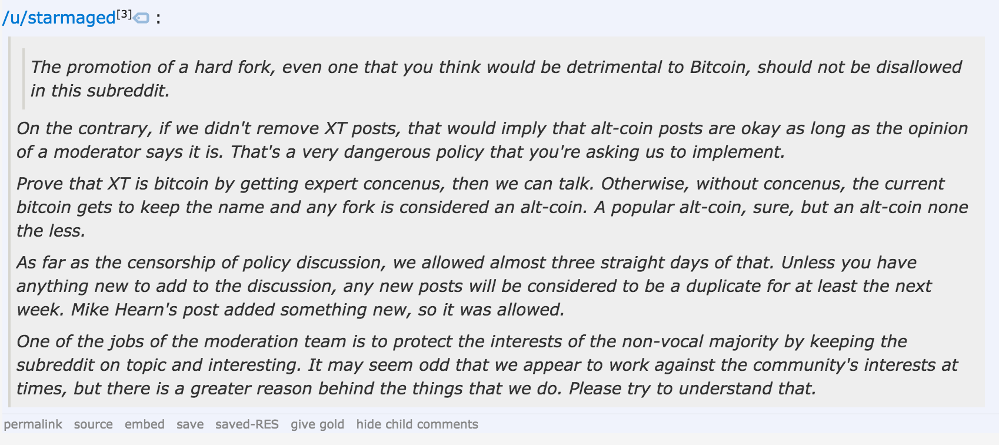

**August 15th, 2015**. A now [deleted] [post](https://www.reddit.com/r/Bitcoin/comments/3h5f90/these_mods_need_to_be_changed_upvote_if_you_agree/) ([archive](https://archive.is/rum9c)) on /r/bitcoin calling for the moderators to step down garnered more than 2,800 upvotes (91% upvoted), making it one of the highest-voted threads of /r/bitcoin history. The community demonstrated *consensus* (heh) that the current /r/bitcoin mod squad was corrupt, participating in censorship, and needed to go.

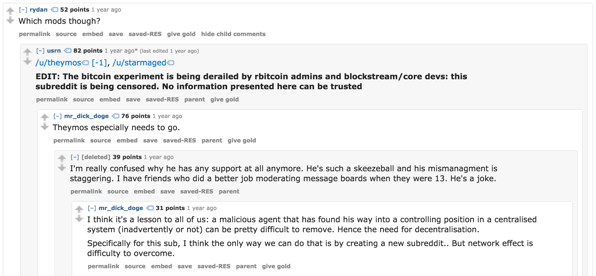

Ironically, in the same thread, /r/bitcoin moderator /u/BashCo says that he supports consensus, before admitting that he is “regrettably” censoring posts.

**August 16th, 2015.** Moderator /u/BashCo [admits](https://www.reddit.com/r/Bitcoin/comments/3h5f90/these_mods_need_to_be_changed_upvote_if_you_agree/cu4t7xr/) that the mods are participating in censorship:

> More accurately, I support consensus. Attempts to moderate BitcoinXT topics based on the lack of consensus has regrettably escalated to censorship. *([archive](https://archive.is/6JGaT))*

The same day, user /u/SatoshisGhost was [banned](https://www.reddit.com/r/bitcoin_uncensored/comments/3h8vkv/rbitcoin_is_now_banning_people_for_mentioning_xt/) for mentioning BitcoinXT.

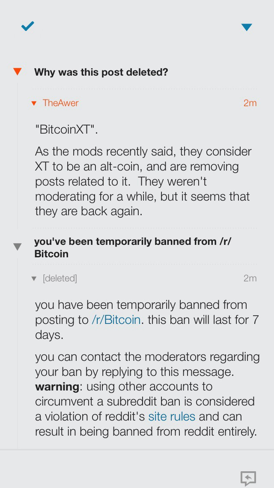

A popular Bitcoin webcomic artist /u/raisethelimit was [given a 30 day ban](https://www.reddit.com/r/bitcoin_uncensored/comments/3h8tf2/uraisethelimit_was_banned_for_30_days_for_posting/) for “trolling” when he tried posting two of his comics there.

/u/Jackten was [given a 7-day ban](https://www.reddit.com/r/bitcoin_uncensored/comments/3h8ofg/rbitcoin_on_lockdown_after_mod_hiatus/) for attempting to discuss Bitcoin-XT. In the comments, user /u/dnivi3 [posts about how none of his posts are getting through](https://www.reddit.com/r/bitcoin_uncensored/comments/3h8ofg/rbitcoin_on_lockdown_after_mod_hiatus/cu58rp2/) either, and then edits his post to say that he has been banned from /r/bitcoin (presumably for his comment in /r/bitcoin_uncensored).

The same day, during this massive purge of users, /r/bitcoin head moderator /u/Theymos posted [a thread](https://www.reddit.com/r/Bitcoin/comments/3h9efn/call_for_more_moderators/) titled, “Call for more moderators” ([archive](https://archive.is/M3bHT)). The thread was heavily downvoted, and sits at 0 points (43% upvoted). His post includes the phrase: *“Don’t apply if you disagree with /r/Bitcoin policy.”*

**August 18th, 2015.** /u/SundoshiNakatoto has [his post](https://www.reddit.com/r/Bitcoin/comments/3hgshv/if_you_feel_like_you_cant_contribute_anything_to/) ([archive](https://archive.is/MlLPX)) deleted for encouraging others to educate themselves on which code they like best (Core or XT) and running a full node. The deletion [was discussed in an uncensored subreddit](https://www.reddit.com/r/bitcoin_uncensored/comments/3hh2xi/this_is_just_ridiculous_rbitcoin_is_still/).

**August 19th, 2015.** /r/bitcoin moderator /u/jratcliff63367 makes a post to Let’s Talk Bitcoin titled “Confessions of an /r/bitcoin moderator.” [He observes](https://letstalkbitcoin.com/blog/post/confessions-of-an-r-bitcoin-moderator):

> **At the minimum we should allow the discussion and let people ‘vote’ their opinion based on which client they choose to run**. If the bitcoin network is so fragile that someone running a different client with a different ruleset is an issue, then we have bigger problems.

> The reality is that people running different versions of the client is no threat at all. It is an opportunity for the community to vote on the direction they want bitcoin to take.

> **Bitcoin-xt is not a ‘threat’ to bitcoin. It it is an option**, a choice, a candidate to be voted on. One where the community can vote on which features they want to see in bitcoin, versus those which they do not.

**August 24th, 2015.** /u/chinawat [is banned](https://www.reddit.com/r/bitcoin_uncensored/comments/3i79vs/banned_from_rbitcoin_for_noticing_bans/) for noticing and pointing out all the recent bans.

**August 25th, 2015.** /u/SwagPokerz [explains how the /r/bitcoin moderators have manipulated the subreddit’s CSS](https://www.reddit.com/r/bitcoin_uncensored/comments/3id1al/moderators_of_rbitcoin_changed_the_stylesheets/) to mask the presence of deleted comments.

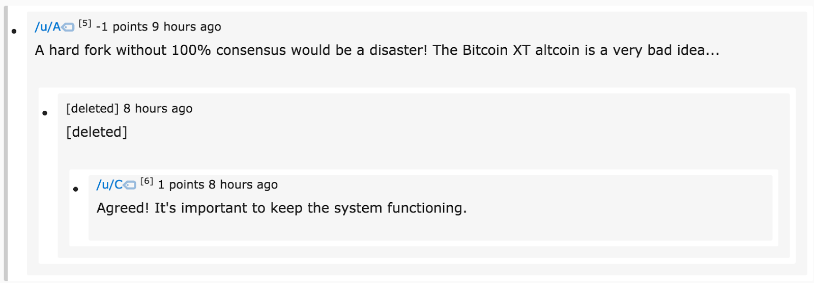

With /r/bitcoin’s custom CSS ([70,000 lines!](http://pastebin.com/MtMJQZ9P)), deleted comments are masked, and the new comment tree will display like this:

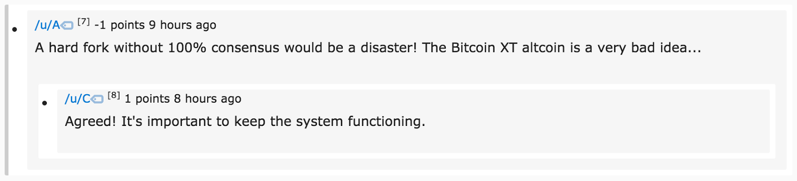

Worth noting here is that Reddit’s [moddiquette guidelines](https://www.reddit.com/wiki/moddiquette) tell moderators not to *“Hide reddit ads or purposely mislead users with custom CSS.”*

**August 29th, 2015.** Ten days after his anti-censorship post on Let’s Talk Bitcoin, former /r/bitcoin moderator /u/jratcliff63367 [announces that he has been removed from his role](https://www.reddit.com/r/bitcoin_uncensored/comments/3iwzmk/so_long_and_thanks_for_all_the_fish/). In the thread, /u/theymos chimes in to explain why he removed jratcliff:

> He was going beyond just expressing a reasonable opinion. He was being particularly disrespectful and nonconstructive for a long period of time. Disagreement (even loud public disagreement) is fine, but we can’t effectively moderate without *some* sort of respect and trust between moderators.

**September 4th, 2015.** /u/hardleft121 [announces that he has been removed as a moderator of /r/bitcoin for “inactivity”](https://www.reddit.com/r/Bitcoin/comments/3jgtjl/i_support_bip101/cuqbwt4/) ([archive](https://archive.is/AVkyO)). /u/hardleft121 is a bit of a legend in the Bitcoin subreddits for his frequent generous tipping of bitcoin users, sometimes even giving away hundreds of dollars at a time.

The same day, [he makes a post to /r/bitcoin](https://www.reddit.com/r/Bitcoin/comments/3k0iji/i_am_no_longer_a_mod_of_rbitcoin_i_didnt_have/) ([archive](https://archive.is/dlyHK)) that garners 403 points and the sympathy and outrage of /r/bitcoin users. In the thread, it is revealed that /u/SeansOutpost was not removed as moderator, despite also being quite inactive as a mod. When asked what he thinks of the censorship, /u/SeansOutpost [wrote](https://www.reddit.com/r/Bitcoin/comments/3k0iji/i_am_no_longer_a_mod_of_rbitcoin_i_didnt_have/cutvyfq/):

> I don’t understand/agree with why we can’t talk about this like adults. I am not qualified to make a judgement on whether or not XT is the way to go. But at this point, it seems obvious blocksize has to go up. I’m not sure why we can’t openly discuss all options. Open discussion would seem to be in the spirit of what Satoshi wanted.

He was shortly thereafter removed as a moderator.

**November 4th, 2015.** /u/Theymos [attempts to explain](https://www.reddit.com/r/Bitcoin/comments/3k0iji/i_am_no_longer_a_mod_of_rbitcoin_i_didnt_have/cutvyfq/) his censorship policies, writing:

> You can promote BIP 101 as an idea. You can’t promote (on [/r/Bitcoin](https://www.reddit.com/r/Bitcoin)) the actual *usage* of BIP 101. When the idea has consensus, *then* it can be rolled out.*([archive](https://archive.is/Epd3A))*

This once again raises the question: how is something supposed to gain community consensus if it is not allowed to be discussed? Theymos also has a strong tendency to play word games. It is very unclear and never explicitly defined what the difference of “promoting as an idea” and “promoting the usage of” is. The main factor seems to be whether it is discussed favorably (not permitted) or unfavorably (permitted).

**November 5th, 2015.** In [a post that was downvoted to -749 points](https://www.reddit.com/r/Bitcoin/comments/3rejl9/coinbase_ceo_brian_armstrong_bip_101_is_the_best/cwpglh6/) ([archive](https://archive.is/ehLJd)), /u/theymos threatens to ban prominent Bitcoin company Coinbase and its CEO Brian Armstrong from /r/bitcoin for supporting block size increase proposal BIP101. Theymos also threatened to remove Coinbase from bitcoin.org (which he controls).

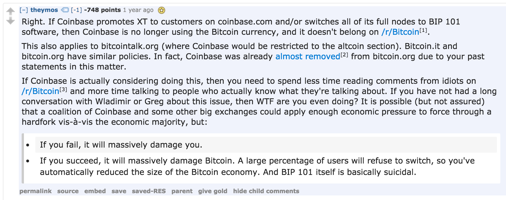

In the same thread, /u/StarMaged [chimes in](https://www.reddit.com/r/Bitcoin/comments/3z9gxt/scaling_bitcoin_the_great_block_size_debate_blog/cykl33c/) and admits how the post being discussed had been deleted by /r/bitcoin mods several times prior to being allowed. StarMaged also says of users commenting on the censorship and the ensuing confusion that

> “That is why repeatedly saying things like that to someone is **so dangerous**.”

Yes, ideas are dangerous.

**December 26th, 2015**. /u/nathan2055 tested /r/bitcoin moderation policies by posting “[a totally innocuous discussion thread](https://www.reddit.com/r/Bitcoin/comments/3yhmjh/what_is_you_guys_opinions_on_bitcoin_xt_and_bip101/)” ([archive](https://archive.is/35ojq)) asking *“What is you guy’s [sic] opinion on BitcoinXT and BIP101?”* Of course, the post was immediately removed from /r/bitcoin. Moderator /u/StarMaged had to venture into /r/Bitcoin_Uncensored to [provide his rationale](https://www.reddit.com/r/bitcoin_uncensored/comments/3ydm5s/yes_coinbase_will_be_censored_from_rbitcoin_if/) for deleting the post:

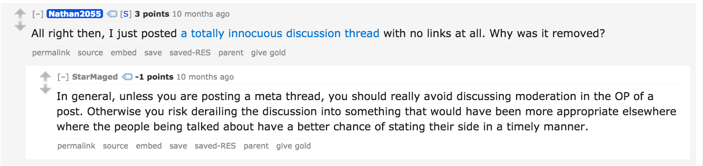

/u/Nathan2055 also posted a screenshot of a private message exchange he had with /r/bitcoin moderator /u/110101002, in which the moderator explains that discussion of Coinbase is now completely forbidden in /r/bitcoin for being off-topic, simply because they run a different backend that is not Bitcoin Core.

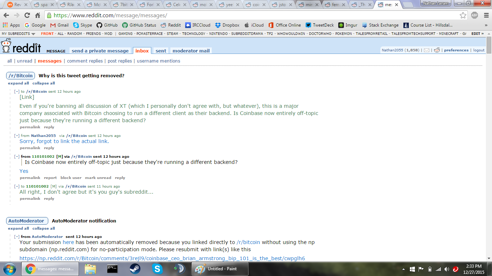

In the same thread, StarMaged [goes on to explain](https://www.reddit.com/r/bitcoin_uncensored/comments/3ydm5s/yes_coinbase_will_be_censored_from_rbitcoin_if/cyddi6l/):

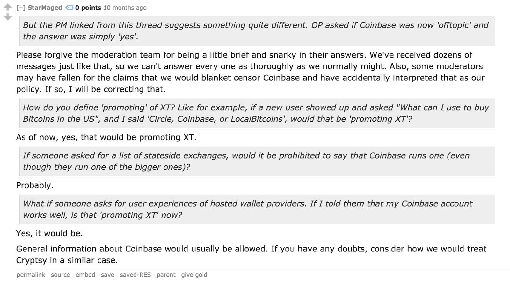

**December 27th, 2015.** Theymos [made good on his earlier threats](https://www.reddit.com/r/Bitcoin/comments/3yeww0/coinbas_was_removed_from_bitcoinorg_wallet_page/) ([archive](https://archive.is/GTIxi)) to remove Coinbase from bitcoin.org, [along with any other company](https://github.com/bitcoin-dot-org/bitcoin.org/pull/1028) that dared to voice an opinion in favor of bigger blocks ([as seen in this Github commit](https://github.com/bitcoin-dot-org/bitcoin.org/pull/1028/commits/0bdfd579b7a688b687493a23d16fe7390bd49938)).

The post calling this behavior out had 419 points (87% upvoted), and the normally polite Erik Voorhees went so far as to say:

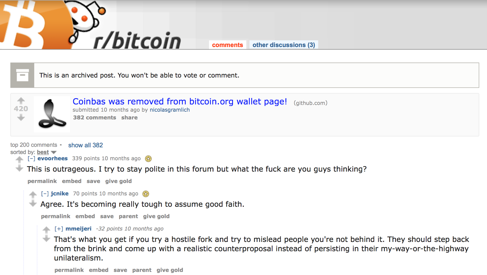

**December 28th, 2015.** A rogue /r/bitcoin mod going by the username /u/CensorshipIsTheWorst [leaked the following conversation](https://www.reddit.com/r/btc/comments/3yj7r0/coinbase_censorship/) from the /r/Bitcoin mod-mail:

> **from Aussiehash [M] to [/r/Bitcoin](https://www.reddit.com/r/Bitcoin) sent 1 day ago** [https://np.reddit.com/r/Bitcoin/comments/3ycayp/brian_armstrong_on_twitter_coinbase_is_now/](https://np.reddit.com/r/Bitcoin/comments/3ycayp/brian_armstrong_on_twitter_coinbase_is_now/) I’ve removed this post for now. I’m happy for other mods to reverse or otherwise.

> **from theymos [M] via [/r/Bitcoin](https://www.reddit.com/r/Bitcoin) to Aussiehash [M] sent 11 hours ago** I agree with removing it because it is mainly about XT. However, AFAICT Coinbase is currently still using Bitcoin and should therefore be allowed on [/r/Bitcoin](https://www.reddit.com/r/Bitcoin)for now in general. coblee said so in the bitcoin.org pull request, and I tend to trust him. (Perhaps Cobra was unaware of coblee’s reliability, or maybe he [IMO reasonably] considered Coinbase too dangerous/incompetent/reckless to list on bitcoin.org even though they are currently using Bitcoin.)

> **from StarMaged [M] via [/r/Bitcoin](https://www.reddit.com/r/Bitcoin) to theymos [M] sent 5 hours ago** Honestly, it seems to me that until the moment of the split, they are still a bitcoin company. They are just buying/selling two currencies at once instead of one. I am really uncomfortable with the idea that this policy would encourage companies to silently support XT and then only tell us at the last moment. Yeah, sure, remove those posts as altcoin promotion, but people outside of this subreddit should be allowed to make an informed decision without us scaring companies into censoring themselves. I feel that this is where that term “censorship” might actually be relevant, since our actions here on this issue would affect the speech of a company elsewhere out of fear of retaliation from this subreddit. Something to ponder.

A few hours later, /u/colsatre had his moderator position revoked, leading some to speculate that he was the rogue mod. /u/CensorshipIsTheWorst never posted again.

**January 9th, 2016.** A Github [pull request](https://github.com/bitcoin-dot-org/bitcoin.org/pull/1180) to revert the removal of Coinbase and others is ignored, despite overwhelming consensus from Github users that the pull request should be merged (only three users “NACKed” the request). [The post discussing this matter](https://www.reddit.com/r/Bitcoin/comments/406s4f/github_request_to_revert_the_removal_of/) ([archive](https://archive.is/mwNYs))had 926 upvotes (89% upvoted).

Of course the “top comment,” with a score of -53, from rabid censorship supporter and JoinMarket developer /u/belcher_ insists that the vote is invalid because the pull request was “brigaded.” You’ll notice a similar refrain from the mods of /r/Bitcoin whenever they delete a post that disagrees with their status quo: *The post was upvoted, ergo it was “brigaded,” ergo we had to remove it.*

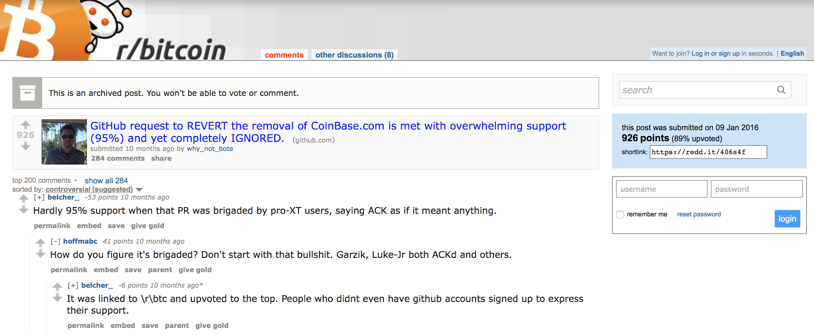

It is interesting to note that a post with a score of negative 53 points would appear at the top of the comments thread. In addition to hiding the scores of new posts for 8-12 hours to obscure voting activity, the moderators of /r/bitcoin will set the default comment sorting behavior in threads they disagree with to “controversial,” so that the most heavily downvoted comments appear at the top of the thread, deceiving users unfamiliar with the practice into thinking that the most unpopular opinions are in fact the most popular.

**March 8th, 2016.** Long-time bitcoin user and inventor of the mining pool /u/slush0 remarks that the /r/bitcoin moderators censored [a video](https://www.youtube.com/watch?v=_i0T-WxayaA) he made explaining how users of his mining pool can vote on which software to run.

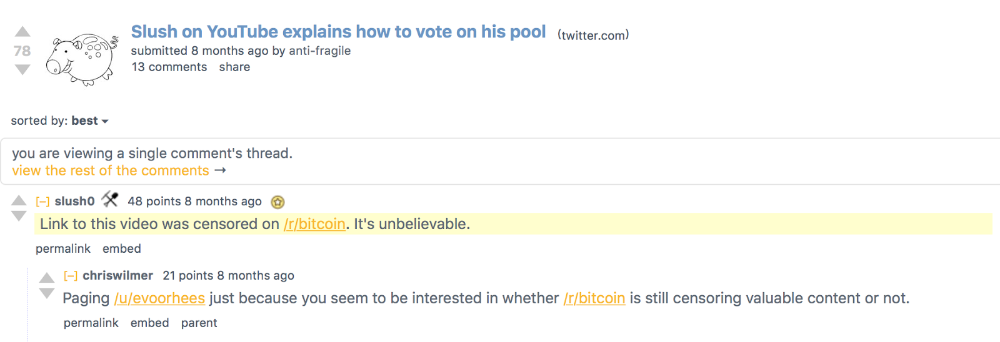

Although a self-described crypto-anarchist, Slush seems to have developed quite the case of Stockholm syndrome. Today he can be found actively participating in discussions on /r/Bitcoin and [calling for the destruction of bitcoin’s security model](https://twitter.com/slushcz/status/797033019303464960).

The same day, /u/BeYourOwnBank [points out](https://www.reddit.com/r/btc/comments/49l4uh/the_moderators_of_rbitcoin_have_now_removed_a/) that /r/bitcoin moderators have been deleting posts of Satoshi Nakamoto quotes. ([Example 1](https://np.reddit.com/r/Bitcoin/comments/49iuf6/the_existing_visa_credit_card_network_processes/), [Example 2](https://np.reddit.com/r/Bitcoin/comments/49ixhj/the_existing_visa_credit_card_network_processes/))

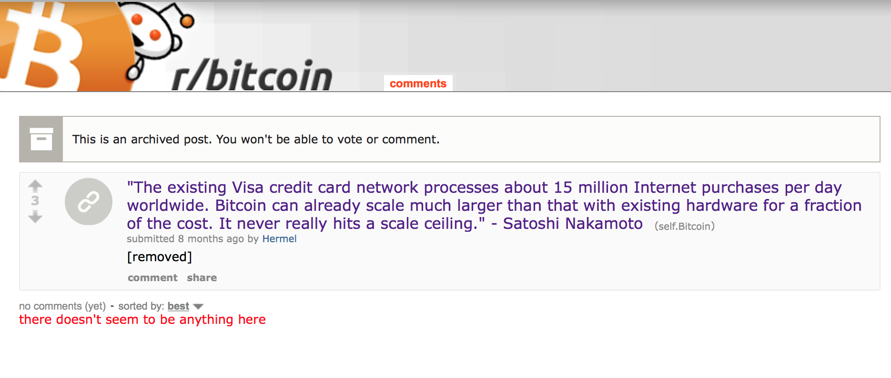

**March 9th, 2016.** /u/alwayswatchyoursix [posts an accusation](https://www.reddit.com/r/bitcoin_censorship/comments/49rhk2/mods_of_rbitcoin_actively_searching_rbtc_for/) that mods of /r/bitcoin are actively searching /r/btc for users to ban. Former /r/bitcoin moderator /u/MineForeman chimes in to confirm that this is exactly what he has been doing, and admits that it is an automated process.

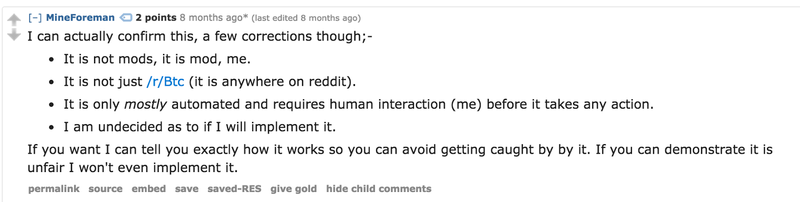

/u/MineForeman [goes on to explain](https://www.reddit.com/r/bitcoin_censorship/comments/49rhk2/mods_of_rbitcoin_actively_searching_rbtc_for/d0v1xrv/) the methodology that his banning bot uses.

**March 27th, 2016.** /u/blockologist makes two posts to /r/bitcoin. One is titled “[Poll — Classic or Core](https://np.reddit.com/r/Bitcoin/comments/4atqlg/poll_classic_or_core/),” (Classic was another attempt at a block size increase, after BitcoinXT was killed through a prolific DDoS attack) and the other is a blog post from Gavin Andresen titled “[Collaboration requires communication](https://np.reddit.com/r/Bitcoin/comments/4ata7n/collaboration_requires_communication_a_post_from/).” Both were deleted. A moderator of /r/bitcoin provided this rationale:

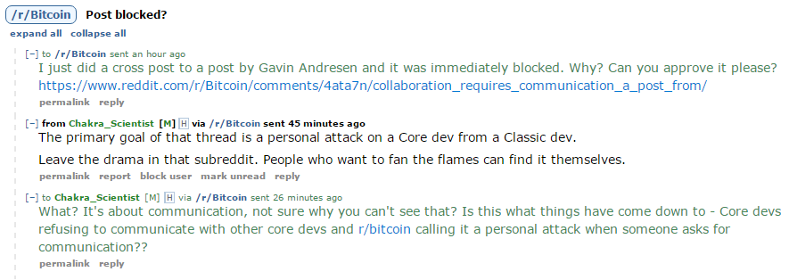

**May 18th, 2016.** /u/Annapurna317 receives a 15-day ban from /r/bitcoin for posting the following comment:

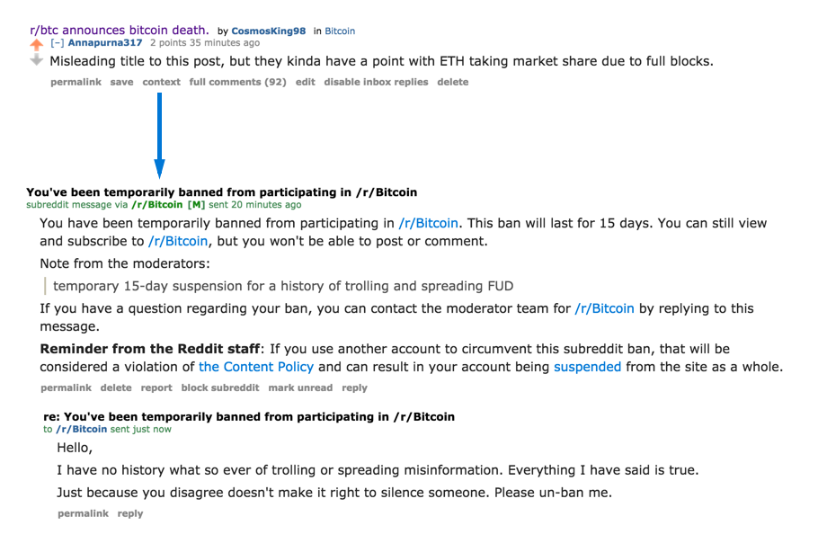

**July 24th, 2016.** Three-year old reddit account and longtime /r/bitcoin poster /u/chinawat demonstrates that his responses to a 1-day old account on /r/bitcoin [are being selectively hidden](https://www.reddit.com/r/btc/comments/4ucmg2/selective_rbitcoin_censorship_continues_oneday/).

**August 29th, 2016.** One can use a tool called “ceddit” to see which comments in a thread have been deleted. Here is one example from this day:

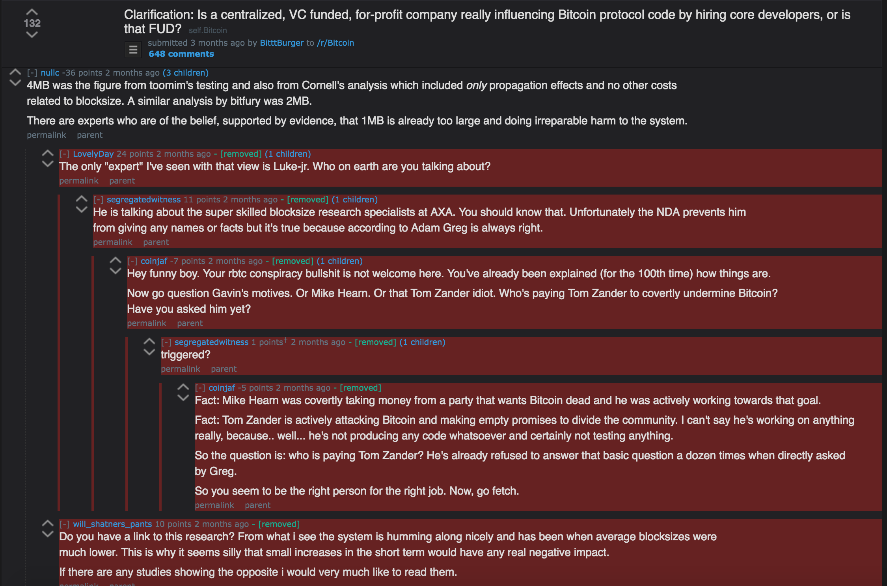

**October 23rd, 2016.** /u/andromedavirus provides proof that one of his comments was censored from /r/bitcoin. What had originally been censored was news of a Bitcoin miner conference held in China, which saw over 300 attendees who were overwhelmingly in favor of a blocksize increase. News of the conference was censored from /r/bitcoin, until a day later [a dismissive and inaccurate tweet](https://twitter.com/Excellion/status/790161590905630722) from prolific troll Samson Mow was permitted to remain:

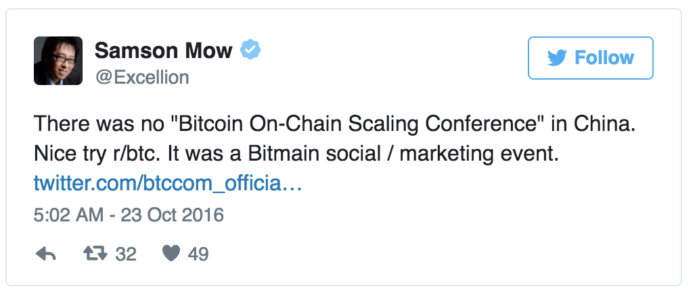

The next day, /u/andromedavirus was [banned from /r/bitcoin](https://www.reddit.com/r/btc/comments/598sz0/banned_from_rbitcoin_during_the_recent_china/) ([archive](https://archive.is/BoGbz)) for being a “lying troll.”

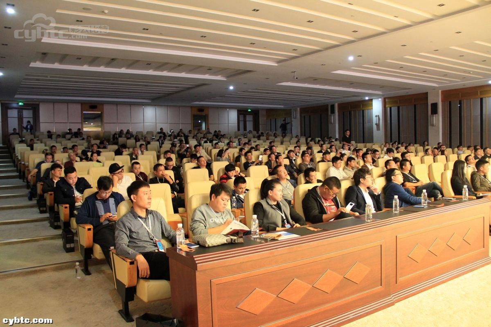

**October 31st, 2016.** /u/BeijingBitcoins [posted](https://www.reddit.com/r/Bitcoin/comments/5aaxy5/there_will_be_no_bitcoin_split_john_blocke/) ([archive](https://archive.is/MBsNl)) my own article, [There Will Be No Bitcoin Split](https://medium.com/@johnblocke/there-will-be-no-bitcoin-split-564f1d60a657), to /r/bitcoin. It briefly attained the top post position in the subreddit before one of the mods locked the comments.

After realizing what happened while attempting to respond to a comment, /u/BeijingBitcoins then [created a post](https://www.reddit.com/r/btc/comments/5ae864/rbitcoin_locks_comments_on_there_will_be_no/) on the uncensored /r/btc about how the comments had been locked. That post quickly gained attention, and within one hour of the /r/btc post drawing attention to the censorship, the original thread at /r/bitcoin had been removed altogether.

The next day, /r/bitcoin moderator /u/Frankenmint [made a post](https://www.reddit.com/r/btc/comments/5ahqh1/i_locked_the_article_on_rbitcoin_guysdue_to_a/) in /r/btc to announce that he was the one who had locked the comments and then deleted the post. He explained that he had to lock the comments to prevent it from “devolving” (into what, exactly?). [I had a brief exchange with him](https://www.reddit.com/r/btc/comments/5ahqh1/i_locked_the_article_on_rbitcoin_guysdue_to_a/d9gje9r/), in which I asked:

> ***JB: Do you believe that a community is not capable of regulating itself?***

> *FM:* honestly…no not really… it will just fracture down into factions that have their own special interests at heart.

> ***JB: If so, do you believe that a complex system like bitcoin is capable of regulating itself***

> *FM:* No — there are still software maintainers who follow and enforce the rules, and partcipants who seek to shape rules as they see fit — at a point to where shaping those rules causes a breaking change in the core protocol, those participants have now fractured themselves into a new subgroup.

His response right here sums up the entire position of the /r/bitcoin moderation team. While Bitcoin was originally invented as a crypto-anarchist plaything, and gained early attention from hardcore libertarians, it has now become overrun with paternalistic autocrats such as /u/theymos, /u/BashCo, and /u/frankenmint. These gentlemen rule with an iron fist, deleting posts that they deem to be “dangerous” to the community, and believing that both the online social community and Bitcoin itself are incapable of self-regulation. Instead they believe that only through the paternalistic wisdom of their own minds will Bitcoin ever amount to anything.

While today the exasperated members of the Bitcoin community accept the heavy-handed censorship as a fact of life, it was not always like this. The examples collected here are but few, and were collected over the course of two hours of research. While today the censorship is accepted as the norm, you can see in some of the examples above that it was once an incredibly contentious issue among the community.

Sadly, many members of the Bitcoin community, including those who have at times described themselves as *cypherpunks, libertarians, and crypto-anarchists*, have all become complacent with the status quo. Not only do they not attempt to fight against this tyranny, but they casually accept it, defend it, and continue participating in heavily censored forums where the voices of a significant number of their entire community are prevented from ever being heard. What is happening is gas-lighting of the highest order.

John Blocke implores these people to take action: Denounce censorship, and do not participate in censored forums. The Reddit admins have shown time and again that they do not care to disrupt the disruption of a $10 billion open source software movement, so we must take matters into our own hands. Do not let Bitcoin perish at the hands of a petty tyrant like Theymos.

*Addendum: this article was [disappeared from /r/bitcoin](https://np.reddit.com/r/Bitcoin/comments/5cug0x/a_brief_and_incomplete_history_of_enhanced/) within minutes of it being posted there by /u/BitcoinGuerrilla.*

Please take one more look at some of Reddit’s Moddiquette guidelines, under the “**Please Don’t**” section:

* Remove content based on your opinion.

* Hide reddit ads or purposely mislead users with custom CSS.

* Act unilaterally when making major revisions to rules, sidebars, or stylesheets.

* Take on moderation roles in more subreddits than you can handle.

* [Take moderation positions in communities where your profession, employment, or biases could pose a direct conflict of interest to the neutral and user driven nature of reddit.](https://forum.bitcoin.com/post32869.html#p32869)

* Ban users from subreddits in which they have not broken any rules.

* Interfere with other subreddits or their moderation.

