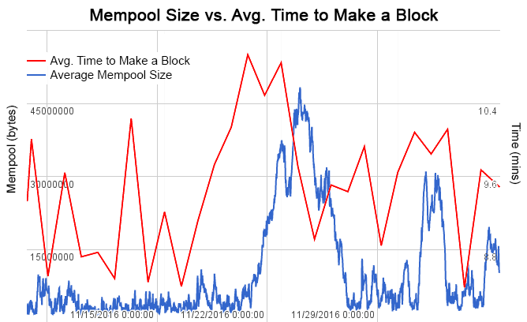
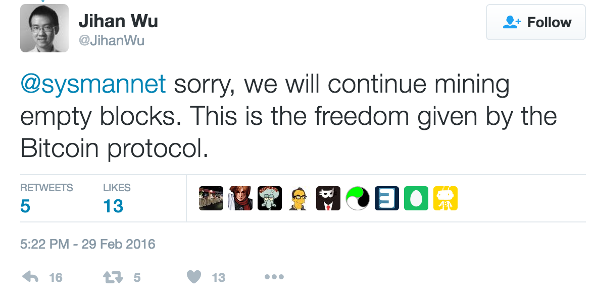

# Why Full Blocks are Dangerous

It is frequently stated that the reason for limiting the Bitcoin block size to one megabyte is for the health, strength, and decentralization of the Bitcoin network. Were the level of transaction activity on the network still at 2010 levels, this assertion may hold true, but under the present state of affairs the one megabyte block size limit in fact contributes to making the Bitcoin network more unstable, more unpredictable, and less resilient to the protections that decentralization is supposed to bring.

It has recently been noted that the world’s largest mining pool, Antpool, has been mining a disproportionately high number of empty or near-empty blocks. Under normal circumstances, some empty blocks are to be expected because when a miner finds a block before they are finished validating the transactions from the previous one, it is in their own best interest to broadcast the new block immediately, even with no transactions in it, so as to claim the new bitcoins rewarded for solving the block. To do otherwise is to voluntarily forfeit income.

Currently, [there is a front-page post](https://www.reddit.com/r/Bitcoin/comments/5inkjx/satoshi_consensus_carefully_limits_the_power_of/) on the heavily censored subreddit /r/bitcoin calling out Antpool for this behavior, with a call to action that “we must take a clear stand against it.” What actions “taking a stand” might entail are not made clear, but in a decentralized system like Bitcoin there are few ways to regulate such behavior that do not carry with them even graver consequences (for instance, changing Bitcoin’s proof-of-work algorithm to punish the errant Chinese miners, a proposal that has been gaining traction among Bitcoin Core and certain posters of /r/bitcoin.)

If the ultimate goal of decentralization is to minimize the level of control that any individual actor may exercise over the Bitcoin network as a whole, then Bitcoin is currently failing in this regard as a direct result of having blocks that are constantly full.

If the health and functionality of the Bitcoin network are dependent on every single miner behaving altruistically and at times irrationally (i.e., not broadcasting a block as soon as one is found), then Bitcoin is now incredibly vulnerable to the actions of a single person or entity who break rank and do not fall in line with the behavior asked of them by Bitcoin Core.

We have seen what happens when the 24-hour average block finding time deviates above the ten minute average: crippling backlogs that can take days to work through, delaying payments, frustrating and confusing users, and creating a support ticket nightmare for any company that utilizes Bitcoin as a payment method. Because of simple and expected variance in the random process of finding a block, an inevitable five or ten percent reduction in block finding times is enough to nearly paralyze the entire network. What happens if a single miner controlling five or ten percent of the network hashrate starts broadcasting empty blocks? The network becomes similarly paralyzed, through the actions *of a single entity.* This is not decentralization.

The goal of having a decentralized system is not to create a completely level playing field in which no entity has more power than any other. Believers of this vision are in good company with several mustachioed dictators of the twentieth century. Rather, the goal of a decentralized system is to prevent any one entity from having *so much power* that they can exercise an inordinate amount of control over the system. This is the very situation brought about by having consistently full blocks.

Jihan Wu, CEO of Antpool’s parent company Bitmain, posted [a tweet](https://twitter.com/JihanWu/status/704476839566135298) in February 2016 saying, “We will continue mining empty blocks. This is the freedom given by the Bitcoin protocol.” Does anyone dare disagree with this? The network allows this behavior, therefore it should be expected that eventually someone will exhibit this behavior. If the network can be crippled or even harmed by behavior allowed by its own rules, is the logical solution to attempt to limit the power of the individual actor (a futile task that can only be accomplished through top-down control), or instead to increase the robustness of the Bitcoin network such that an individual’s power cannot adversely affect the system?

Miners are not the only user-type who wield such disproportional power due to constantly full blocks. So-called “spam attacks” can be performed by any entity with a few hundred dollars to kick around, also creating network-paralyzing backlogs. The author rejects the “spam attack” line of thought — any transaction that is valid and is paying the fair market price to be included is by definition not spam — but the end result is the same. If the Bitcoin network is capable of being so easily disrupted by individual actors, then something is gravely wrong.

Again, the solution is not to attempt to limit the power of Bitcoin’s users. They are acting rationally within the established rules of the system, and there is little to no evidence that the empty blocks of miners or the increased transactional activity are done with ill-intent—and if they were, Bitcoin must be able to withstand such behavior regardless. To attempt to limit the abilities of Bitcoin users making use of the system in ways they are allowed to use it is antithetical to Bitcoin’s notion of financial freedom. The sensible solution, the *only* sensible solution, is to make the network more robust. The block size must be increased.

