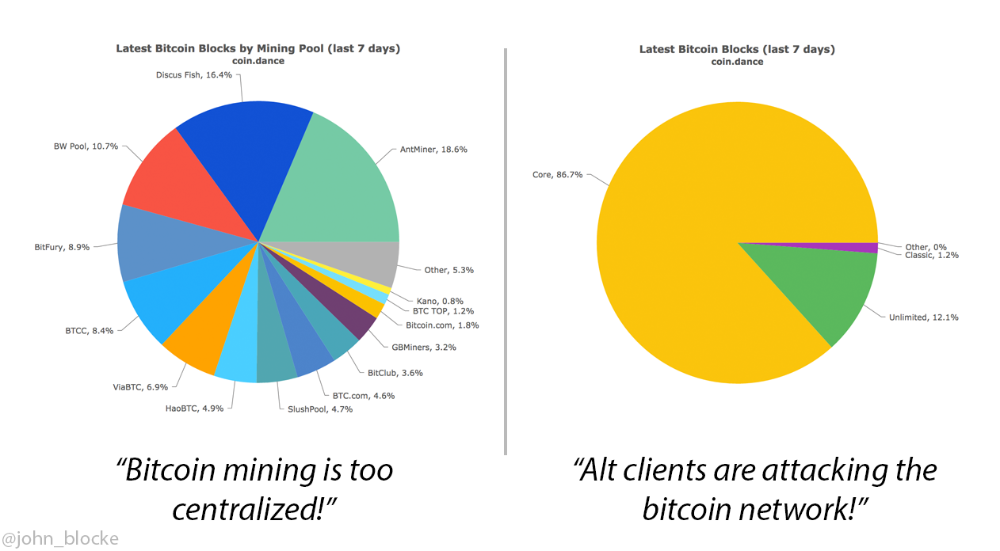
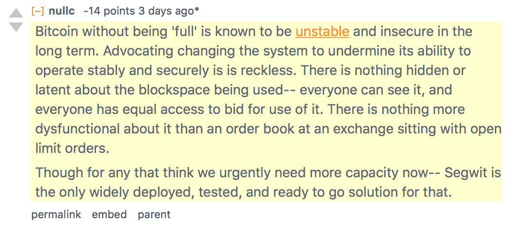

# The Fee Market Myth

> I don’t anticipate that fees will be needed anytime soon, but if it becomes too burdensome to run a node, it is possible to run a node that only processes transactions that include a transaction fee. The owner of the node would decide the minimum fee they’ll accept. Right now, such a node would get nothing, because nobody includes a fee, but if enough nodes did that, then users would get faster acceptance if they include a fee, or slower if they don’t. **The fee the market would settle on should be minimal**. If a node requires a higher fee, that node would be passing up all transactions with lower fees. It could do more volume and probably make more money by processing as many paying transactions as it can. **The transition is not controlled by some human in charge of the system though, just individuals reacting on their own to market forces.**

> *-Satoshi Nakamoto, [April 2009](https://bitcointalk.org/index.php?topic=149668.msg1596879#msg1596879 ) (Emphasis added)*

Contrary to Nakamoto’s vision, there are now humans attempting to be in charge of the system. They aim to keep Bitcoin’s block size limit below the actual level of demand. One of the primary assumptions made by this camp is that Bitcoin needs a “fee market” in which users outbid one another to compete for inclusion in the next block, allowing their transaction to be confirmed quicker than others who have paid less of a fee.

The rationale for the fee market goes like this: Bitcoin’s block reward decreases over time, and eventually no new bitcoins will be created, at which time Bitcoin mining will need to be subsidized entirely by users who pay transaction fees to the miners. Therefore, it is better to bring about the “fee market” early on, so that users become accustomed to the idea of bidding to make transactions. What is ignored in the discussion is that Bitcoin block rewards will persist for at least another century. It will be more than 100 years before this is actually necessary and the impetus to acclimate users to fee markets now is grossly premature at best and highly suspect at worst.

The reason for Bitcoin’s block reward, aside from being the mechanism by which new bitcoins are issued, is to act as a subsidy for miners during Bitcoin’s bootstrapping phase. The reward is cut in half every four years (approximately), meaning the subsidy is significant, in terms of BTC produced, in the beginning and gradually becomes less so. By the end of the current reward era sometime in 2020, 87.5% of all Bitcoins will have been issued. After another four years, the number rises to 93.75%.

This mechanism is such a fundamental part of Bitcoin that Satoshi Nakamoto even explained it in his [January 2009 post to The Cryptography Mailing List](http://satoshi.nakamotoinstitute.org/emails/cryptography/16/) announcing the release of Bitcoin v0.1:

> Total circulation will be 21,000,000 coins. It’ll be distributed to network nodes when they make blocks, with the amount cut in half every 4 years.

> first 4 years: 10,500,000 coins
next 4 years: 5,250,000 coins
next 4 years: 2,625,000 coins *(**JB**: we are here)
*next 4 years: 1,312,500 coins
etc…

> **When that runs out, the system can support transaction fees if needed.** It’s based on open market competition, and there will probably always be nodes willing to process transactions for free.

> *-Satoshi Nakamoto (Emphasis added)*

*It’s based on open market competition* — ponder that for a moment.

This *could* be interpreted as support for a fee market, and certainly already is by some who support restricting Bitcoin’s transactional capabilities below actual market demand. But this interpretation is refuted by the preceding line: *When [the block reward subsidy] runs out, the system can support transaction fees if needed.* Clearly Satoshi had no intention of forcing users into a competitive bidding process as long as block rewards could pay for the system to grow. Rather, transaction fees are available as an option to pay for Bitcoin’s security model (because nothing is free), *should the block reward become insufficient*.

It is true that higher transaction fees benefit miners. These fees currently account for around five percent of mining revenue, though most mining pools keep the transaction fees for themselves and do not share them with the hardware operators. The obvious implication of this is that Bitcoin mining is still profitable to the hardware operator, even when subtracting transaction fees and pool fees on top of that. As I mentioned in [a previous essay](https://medium.com/@johnblocke/bitcoin-economics-in-one-lesson-9c18fd0d89b3), however, the less profitable mining is, the less incentive there is for new entrants, and only those with the lowest marginal cost will be capable of competing. Only those operating on the greatest economies of scale, or those who can afford the newest and most expensive hardware, are able to compete. This substantially raises the barrier of entry and prevents small operations and older hardware from being viable. It is stunning that the proponents of capacity restriction, for whom “miner centralization” is claimed as a central concern, continually sidestep this glaring contradiction which undermines their entire platform.

At the time of this writing, the price of one Bitcoin hovers around $790. This means that the 12.5 BTC reward issued every ten minutes is worth $9,875, and the fees per block are worth around $493.75. The fees are a nice bonus (for the mining pools), but the real prize the miners are after is still the block reward.

Far easier than attempting to force the transition to reliance on fee income is to simply make Bitcoin more valuable, thereby increasing the value of the block reward. This may seem counterintuitive at first: controlling fees is certainly easier than controlling the free market trading price of Bitcoin. Phrased differently, it becomes more apparent. A modest twenty percent year-over-year growth in Bitcoin price is enough to account for the halving in block reward every four years. Anything above twenty percent is gravy, and not only encourages new entrants but supports the ongoing profitability of older hardware.

On the other hand, transaction fees would need to increase *1000%* by 2020, an order of magnitude greater than what the price must increase by in the same timespan, in order to make up for the halved block reward, assuming that other variables remain the same. This does nothing to encourage growth and decentralization of the mining industry, and also assumes that a smaller set of users will be comfortable with their transaction fees increasing by ten times what they are today. When viewed through this lens, it is far easier to imagine Bitcoin’s low fees and fast transaction times being enough to foster a 20% annual growth in price (while historically the annual rate of price increase and user growth is far greater than 20%).

Thanks to [Metcalfe’s Law](https://en.wikipedia.org/wiki/Metcalfe%27s_law), the utility of the Bitcoin network, and hence its price, should grow quadratically even as the number of users grows linearly. What happened to the dream of a $10,000 bitcoin? We already know that the price of Bitcoin is more than capable of doubling inside of a year, but now we are told that hoping for a price doubling every four years is far too aggressive.

Proponents of restricting the Bitcoin network’s capacity will say that the bidding process is non-problematic. They say, *“if you need your transaction to confirm sooner, just pay a higher fee.”* Perhaps this is not so great a problem today (though it is certainly still a problem), if we assume that a majority of users can enjoy Bitcoin’s fast confirmations as long as they pay an adequate fee. For the purposes of this argument, I will pull a number from thin air and assume that 80% of transactions are capable of confirming in the next block. If the number of transactions being made on the network doubles, then with a 1MB block size in place that now means that only 40% of transactions can confirm in the next block, with these users paying higher and higher fees for the privilege. What does this mean for the other 60% of transactions? Their fees will also rise, even if they only need their transaction to confirm in the next two or three, or ten, blocks. The end result is that fast confirmations become an exclusive resource, available only to an ever-shrinking percentage of users who can afford them. This argument also assumes that demand for Bitcoin will continue growing even as it becomes more expensive and less reliable — it won’t.

The final fallacy of the fee market myth that I would like to address is an incredibly simple one, and it is again stunning that small block proponents fail to understand it: *no matter what the cost of a transaction fee is, even if that cost is nil, it is the result of a fee market.*

If mining can be profitable on the basis of block reward alone, and miners adopt a minimal fee policy as a result, then this is still the result of free market pricing of transaction fees. To suggest that a “fee market” is not a natural part of Bitcoin, but instead something that must be artificially induced by protocol-level developers, is simply the product of an elementary ignorance of economics.

We are told that support for a block size increase is nothing more than the desire of “greedy Bitcoin miners” to collect more and more fees from the greater number of transactions a larger block size would enable. Yet, in the next breath we are told that fees must rise so that the miners can earn more money. Contradictions aside, the implication seems to be that miners cannot be trusted because they are greedy. Instead, their profitability must be externally regulated by a group of developers-cum-central-planners.

Bitcoin mining is not done for charity. The “greed” of the miners (better to call it profit-seeking) is precisely what has allowed Bitcoin’s network to become the most powerful computing system in the world, with [thousands of times more computational power than the world’s top 500 supercomputers combined](http://jasondrowley.com/2015/12/04/the-bitcoin-network-is-11000x-faster-than-the-top-500-supercomputers-combined/).

We should *want* the miners to be greedy. Bitcoin mining is only profitable so long as the network is healthy and in high demand. This is not a difficult concept to grasp. Miners (as a whole) will not harm the Bitcoin network, as to do so is to destroy their own profits. Bitcoin even has an inbuilt fault tolerance for malicious miners — as long as the simple majority of miners remain honest, then Bitcoin is safe. If a majority of miners are malicious, then Bitcoin is already broken. The best way to safeguard against any entity amassing a majority of hashpower is to ensure that the profit motive of mining is always present, especially for new entrants.

> The incentive may help encourage nodes to stay honest. If a greedy attacker is able to assemble more CPU power than all the honest nodes, he would have to choose between using it to defraud people by stealing back his payments, or using it to generate new coins. He ought to find it more profitable to play by the rules, such rules that favour him with more new coins than everyone else combined, than to undermine the system and the validity of his own wealth.

> *-The Bitcoin Whitepaper, Section 6, Incentive*

*Ceterum censeo blocksize esse increscendum.*

