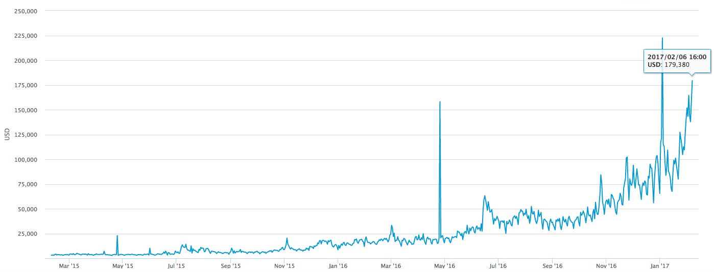

# **The Importance of Clear Definitions in Bitcoin’s Block Size Debate**

I have noticed an interesting phenomenon on the side of the small-blockers throughout the course of the scaling debate. I call it “narrative drift.” It is similar to the logical fallacy of “equivocating” or “moving the goalposts,” in which evidence presented in response to a specific claim is dismissed by the one side only to demand additional evidence for an altered claim. The problem with changing the rules of the game, mid-discussion, is that the meaning of the end result is changed, too, and becomes different than what was originally being argued in the first place. I wish to look at the extent to which any unseen motives can be revealed by focusing on the shifting rhetoric used by the small-blockers over the course of this debate.

Since 2010, the position of the “big blockers” has been quite consistent:

> As blocks become increasingly full, fees will rise, the network will become less reliable, and the experience of the average user will worsen. Therefore, the block size should be increased to prevent this from happening.

Not only has this position remained consistent, it has stayed incredibly straightforward and logically sound throughout the years. Now that blocks are actually full, it has been empirically demonstrated to be true. [Fees](https://blockchain.info/charts/transaction-fees-usd?timespan=2years) have increased by several hundred percent in the last year alone, [average confirmation times](https://blockchain.info/charts/avg-confirmation-time?timespan=2years) have ballooned, some days requiring several hours for a transaction to complete, and forums and company support desks are [mired in inquiries from users](https://www.reddit.com/r/Bitcoin/search?q=transaction+stuck&sort=new&restrict_sr=on&t=all) about why their transactions are not going through.

The same cannot be said of the arguments most frequently utilized by small-blockers. As rebuttals to their propositions are offered, new rhetorical devices are crafted to explain why the big-blockers are wrong. Contrasted with the arguments of the big blockers, these devices lack straightforwardness, logical soundness, and empirical verifiability. The primary purpose of these tactics seems to be to deflect and discredit any arguments given by “the other side” of the debate, rather than serving to support any consistent position on their end.

For instance, consider the original argument used by the small block camp to reject the idea of a block size increase:

> Raising the block size will harm decentralization. If blocks become bigger, the only people capable of running network nodes will be large corporate interests with access to data centers. Network resource load must be kept in check to keep bitcoin in the hands of the masses!

The obvious contradiction here is supposing that Bitcoin will become a hyper-valuable token used by financial institutions happy to pay high “settlement fees,” but that the network will mainly be powered by impoverished cypherpunks who can only afford the best hardware that ten years ago had to offer.

Although many [tests](http://gavintech.blogspot.com/2015/01/twenty-megabytes-testing-results.html) and even [academic studies](https://www.cryptocoinsnews.com/cornell-study-recommends-4mb-blocksize-bitcoin/) have demonstrated that outdated hardware and users on sub-par internet connections are more than capable of dealing with larger block sizes, these empirical results were never enough to satisfy the critics. Each empirical rebuttal presented was ignored and met with new demands for a different set of vaguely defined criteria. No matter what could be shown through data, it was never small enough, decentralized enough, or cheap enough.

Then, Segregated Witness was proposed:

> “We can’t increase the block size, but we can solve transaction malleability and enable second-layer scaling solutions. As soon as second-layer solutions are ready, the Bitcoin blockchain will be the domain of “high value settlement transactions,” and consumer users will transact on these “secondary layers.”

This argument presents a new set of contradictions: how are consumers supposed to transact on these secondary layers without touching the expensive Bitcoin blockchain first? How is the Bitcoin network meant to handle growth on secondary layers when it is already at maximum capacity processing only the transactions of its modest and nascent economy? The big blockers criticized Segwit, saying, as they have said all along, that what was needed was a block size increase.

When it became clear that the big blockers would not abide a mere malleability fix, but actually wanted bigger blocks (who knew?), Segregated Witness was rebranded: *“We can’t increase the actual block size, so how about this effective block size increase instead?”* The big blockers criticized this, saying, as they have said all along, that what was needed was a block size increase. Not an “effective” increase, but an actual increase in the block size.

So the small blockers reevaluated and shifted the arguments used once again. Today the argument of choice is to say that Segwit offers not an *effective* block size increase, but an *actual* block size increase. Somehow, without changing a single line of code, Segregated Witness has gone from being “not a block size increase” to “an effective block size increase” to “an actual block size increase.” And still the big blockers say, “no, we need to increase the block size.”

Now that they have acknowledged that larger blocks do not, in fact, harm decentralization, and as they attempt to persuade their critics that they, too, really just want bigger blocks, the new argument from small-blockers is that the real danger of raising the block size limit is “contentious forks” that must be avoided at all costs. Never mind that Segwit itself is a fork, and is also contentious. Never mind that a network fork, by definition, cannot happen without broad community support. Never mind that the only people making such forks “contentious” are the ones who vilify any popular support these proposals receive. And still, the message of the big blockers has remained consistent: We need to increase the block size.

This slippery hijacking of words and phrases is nothing short of an attempt at gaslighting critics into believing that the thing they’ve been saying they don’t want is actually what they wanted all along. The position of the big blockers has been clear for many years, and thankfully they have appeared to be largely impervious to these manipulation attempts while also keeping their message consistent.

One worrisome effect of the never ending moving of goalposts is that it subtly shifts the frame of the debate to one in which all arguments, from either side, begin to include as basic premises assumptions that were previously matters of contention. The constant repetition of false mantras like “*Segwit is a block size increase*” reframes the debate to a point where people begin to argue about whether Segwit’s “block size increase” proposal is better than another, rather than debating the urgency of a MAX_BLOCK_SIZE block size increase.

If you found the previous paragraph confusing to read, that is because there are apparently two different definitions of “block size increase” at play. Though, I must note that the definition of the phrase used by the big-blockers has remained unchanged from its original meaning.

To be clear:

1. Segregated Witness does not fit the criteria of a “block size increase” as understood in the conventional sense.

1. Trying to sell Segwit by mischaracterizing it as a “block size increase” denies the possibility of healthy discussion because it misappropriates a phrase that already has an established definition.

The vision put forth by the small block camp and the arguments used to defend this vision remain elusive. Their ever-changing stances and definitions do little to build support for their cause, while serving to distract from the clearly outlined, consistent proposals of their opponents. It seems that the definitions of various words and phrases as used by the small-blockers essentially boil down to: “Whatever we define them as.”

If one is not able to define the terms one uses in discussing their vision, how can anyone else be expected to rally behind them, not to speak of swaying their fiercest opponents? The vision promoted by the big block camp has remained remarkably consistent and clear throughout the years: the Bitcoin network works just fine, technologically speaking. It is high fees, long confirmation times, and a poor user experience that are harming the growth of the Bitcoin economy. The block size must be increased — and you know exactly what I mean when I say that.

