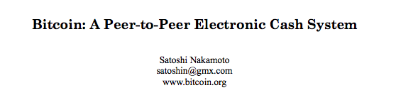
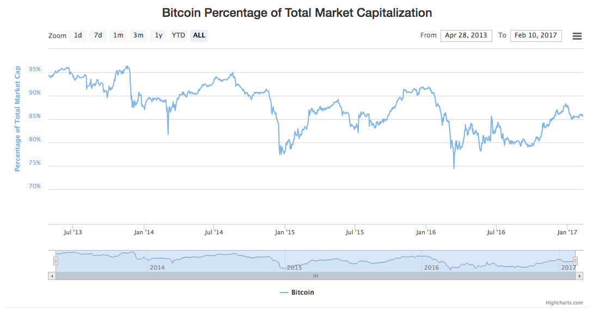

# **It’s Not the Censorship Resistance, Stupid**

> “At the core of Bitcoin’s value proposition is censorship resistance. Bitcoin has value because it can be used to complete transactions that are likely to be censored on other payment networks.”

> [*-Kyle Torpey, writing for Nasdaq, March 11, 2016*](http://www.nasdaq.com/article/bitcoin-privacy-confidential-transactions-feature-can-fix-some-of-coinjoins-problems-cm591903)

One of the more recent talking points being used by small-block proponents is that Bitcoin’s value is derived, first and foremost, from its “censorship resistance.” I will contend that while a natural resistance to third-party censorship is indeed one of Bitcoin’s selling points, its primary value proposition comes from the fact that Bitcoin is *a peer-to-peer electronic cash system.* This was spelled out clearly by Satoshi Nakamoto when he titled the Bitcoin whitepaper:

The frequent repetition of this “censorship resistance” talking point is disingenuous because:

**1.** It implies that Bitcoin’s lack of third party intermediaries (who would presumably be the ones doing the censoring) is somehow at risk.

**2.** It creates a false dichotomy where one is forced to choose between having an affordable and robust payments network or censorship resistance, as if the two were mutually exclusive.

**3.** It is hypocrisy of the highest order to champion “censorship resistance” while [using censorship as the modus operandi of your main public relations efforts](https://medium.com/@johnblocke/a-brief-and-incomplete-history-of-censorship-in-r-bitcoin-c85a290fe43), namely /r/bitcoin. If the value of Bitcoin comes from being able to complete transactions that are likely to be censored elsewhere, as Torpey writes, then [/r/btc](https://www.reddit.com/r/btc/) is more valuable than /r/bitcoin since users are able to hold opinions that are likely to be censored elsewhere. Yet the same people who love the “censorship resistance” argument seem to hate /r/btc.

**4.** Censorship-resistance is not some unique and mythical quality that Bitcoin has only managed to attain under the wise stewardship of Bitcoin Core.

By its very design, Bitcoin is already immune to the blocking of payments by third parties. This has been the case since the very beginning, is still the case today, and will continue to be the case after the block size is eventually raised.

The use of this talking point is both disingenuous and fallacious as it creates a false dichotomy, where users are ostensibly forced to choose between having an affordable and robust payments network, or censorship resistance. No such choice is necessary. Speakers who use this talking point are framing the debate in such a way that if you do not agree with their faulty reasoning, you thereby implicitly support “censorship.” Attempting to refute such persons is like fighting a hydra with a sword — each head lopped off begets two additional ones.

A great example of irony can be found here: the same group of people who rattle on about how important “censorship resistance” is are typically the same group of people who support the mass-censorship of Bitcoin’s largest discussion forums. It seems they believe Bitcoin’s censorship resistance can only be preserved through censoring viewpoints they deem as dangerous (or more likely, inconvenient).

Let us pause for a moment and consider this question:

*What is the value of censorship resistance?*

Presumably, the value comes from having a network in which all participants are on equal footing. If the bank wants to reverse your wire transfer, they can do so because the bank has significantly more power than the individual. If Bitcoin’s chief value proposition is that it is censorship resistant, then would this not imply that all participants should be capable of transacting in an open marketplace without granting disproportionately powerful players the ability to stop less powerful participants from transacting freely?

According to this line of thought: higher and higher transaction fees are simply “the price we must pay” to achieve the mythical property of “censorship resistance.” This comes at the cost of preventing market participants from transacting freely — that is, unless they are willing to outbid each other for inclusion in the next block of confirmed transactions. Bitcoin is thus transformed from an equitable peer-to-peer system, in which all participants are on equal footing, to an alternative pay-to-play system where those who are unable or unwilling to pay the increasingly greater fees required to transact are simply excluded from the network.

Because of the capacity limits imposed by an artificially restricted block size, this process is a zero-sum game: No matter how much money one is willing to pay for the ability to make a Bitcoin transaction, they are still at risk of being priced out by market participants willing to pay more than them. The situation brought about by always-full blocks is a situation in which some participants are always-excluded. This relegates Bitcoin to what is essentially an elitist system in which only the highest bidders are allowed to participate. Hearken back to the reversed bank-wire example from earlier. The bank is able to exclude an individual’s transaction because the bank is more powerful than the individual. In the case of always-full blocks, the participants with the most money are able to exclude the transactions of any individual who is not able to keep up with their game of transaction fee whack-a-mole.

*“But John Blocke,”* you say, *“surely this is what is meant by having a ‘fee-market!’”* In [a separate article](https://medium.com/@johnblocke/the-fee-market-myth-b9d189e45096), I explained that the “fee market” is another false narrative pushed by small-block proponents in an attempt to justify the very process of pay-to-play market exclusion described above. The truth is that no matter what the cost of a transaction fee, it is the result of free market forces. Another truth is that [a peer-to-peer system is most valuable when it has the greatest number of participants](https://en.wikipedia.org/wiki/Metcalfe's_law). How valuable would email be if the only other person you knew had an email address was your high school principal? How valuable would BitTorrent be if there were no other participants to seed the files that you want to download?

The problem is *not* that there is anything wrong with the free market pricing of transactions. The problem is that the supply of available transactions is being artificially restricted to a level far below what the free market is actually capable of providing. To impose such a situation is to act as economic central planners. The justifications given for doing so are all tenuous — I have yet to hear a good argument for why the block size (and thus the available supply of transactions) cannot be raised.

Furthermore, Bitcoin does not exist in a vacuum, and censorship-resistance is not some unique and mythical quality that only Bitcoin has managed to attain under the wise stewardship of Bitcoin Core. Censorship-resistance is a property that is inherent to *all* public blockchains, even those used for non-monetary purposes. This immutability is precisely why “blockchain” is such a hot word among herd investors.

As a consumer, my primary motivation in choosing a payment mechanism is not its “censorship resistance.” I am instead motivated by considerations such as:

* When I use this payment method, how many other people can I transact with?

* When I use this payment method, how great is the cost to me?

* When I use this payment method, how sure am I that my counterparty will receive the funds? (This falls under the umbrella of censorship resistance. Long confirmation times mean less certainty of transaction completion.)

People still use Western Union and still send bank wires because they allow consumers to tap into a network with a large number of participants. These services are expensive in part because of the overhead demanded by running a centralized payment service, and in part because *consumers have no other options.*

When Bitcoin was first invented, it presented an entirely new financial paradigm. One that did away with geographical restrictions on payments, one that did away with high-priced service charges for moving one’s own money around, and one that meant ultra-fast transactions *on top of* being borderless and cheap. Today we are instead told that high fees and long waits are simply the requisite “cost of censorship resistance.” Small block proponents seem to think that as long as Bitcoin is “slightly better” than legacy financial systems (and they don’t even define ‘better’ in terms of speed or cost, but in terms of censorship resistance) that it is good enough.

I reject this line of thinking. Bitcoin *was once* *radically better*, and there is no good reason why it should not continue to be radically better than legacy systems.

Censorship resistance is not magic, it is a fundamental part of any blockchain. Even the most volatile, unknown, and disused altcoin is still “censorship resistant.” In a *peer-to-peer electronic cash* system, the most important features will be its network of participants and the cost to the end user; so long as it’s peer-to-peer, it’s already censorship resistant. If Bitcoin is unable to compete and maintain its lead on market share, the network of participants will simply migrate to another network that offers them an even better value proposition.

*Ceterum censeo blocksize esse increscendum.*

