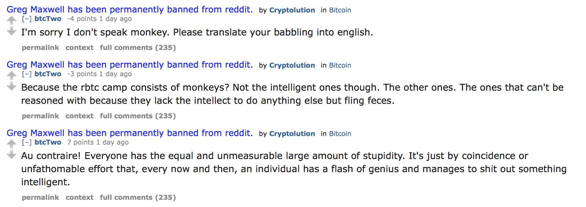

# /r/Bitcoin Censorship, Revisited

***Note:** This post is meant as a follow-up to my original article, [A (brief and incomplete) history of censorship on /r/Bitcoin](https://medium.com/@johnblocke/a-brief-and-incomplete-history-of-censorship-in-r-bitcoin-c85a290fe43). As the /r/bitcoin moderators will frequently alter the content of threads, the entire thread being referenced in this article [has been archived here](https://archive.is/alZgO). You can view the thread with [censored comments highlighted here](https://snew.github.io/r/Bitcoin/comments/5w9e8t/viabtc_aka_bitcoin_accelerator_is_telling_people/).*

> What “censorship”? This sub is subjected to a constant stream of spam by get-rich-quick outfits like UnlimitedCoin, ClassicCoin, etc…

> The mods here are extremely tolerant, even when it’s blatantly obvious that that cesspool /btc is brigading again.

> This forum is tolerant of such spam, disinformation and propaganda, almost to a fault.

> Personally, I’d delete every thread promoting some altcoin project trying to steal another’s resources. Such shady crap is discouraged with extreme prejudice in all Open Source, not just cryptocurrency.

> -/u/Terminal-Psychosis, [February 26, 2017](https://www.reddit.com/r/Bitcoin/comments/5w9e8t/viabtc_aka_bitcoin_accelerator_is_telling_people/de8hv8f/)

Terminal psychosis indeed. I must be uncharacteristically blunt here:

***Anyone who denies that /r/Bitcoin is heavily censored is either lying to themselves, or lying to you.***

Yesterday, a thread discussing [an anti-censorship message posted by ViaBTC](https://www.viabtc.com/tools/txaccelerator/) was upvoted and somehow managed to remain the top post on /r/Bitcoin for the day without being deleted. Those less familiar with the issues at hand, or less capable of critical thought, see such a post and think that surely the message must be exaggerated: *the message claims strict censorship on /r/Bitcoin, and yet here we are talking about /r/Bitcoin censorship in /r/Bitcoin!*

In fact, toleration of such dissent in limited quantities is a classic tool used by authoritarian regimes to lead the people to believe, falsely, that they are not so repressed as is claimed.

Authoritarian regimes know that those under their control require some form of decompression, a way to “blow-off steam.” Rather than silencing all dissent, which creates the opportunity for an external pressure valve to appear, it is better that the authorities themselves manufacture such a means of release so as to be able to control and monitor this dissent. Allowing occasional outlets for dissent serves two main purposes: creating the illusion of freedom and serving as evidence of said freedom. These fabricated outlets for criticism paradoxically serve to strengthen the regime by providing a controlled, albeit artificial, means of release for the very angst that must be kept in check.

The censorship of /r/Bitcoin is frequently dismissed when a person will casually claim that viewing the censorship in a negative light is incorrect, and makes the suggestion that if one does not like it, they are free to discuss such subject matters on uncensored platforms. This sort of casual dismissal still serves the interests of those doing the censoring:

> *To Herman and Chomsky, this is a red herring, and they conversely see such small news outlets as perfect additions to the systems — to relieve the public pressure for dissent and at the same time to marginalize it. They assert:*

> “The beauty of the system, however, is that such dissent and inconvenient information are kept within bounds and at the margins, so that while their presence shows that the system is not monolithic, they are not large enough to interfere unduly with the domination of the official agenda.”** (Herman & Chomsky [1988] 2002, xii)* (Cooley 590)*

Recently, many individuals, including some prominent Bitcoin figures, have made false claims that there is no longer censorship on /r/Bitcoin, or that what happens is not censorship but moderation. /r/Bitcoin moderator /u/eragmus offered such a defense in the thread yesterday when [he wrote](https://archive.is/o/alZgO/https://www.reddit.com/r/Bitcoin/comments/5w9e8t/viabtc_aka_bitcoin_accelerator_is_telling_people/de8h2yv/):

> r/bitcoin is under daily attack from sockpuppets and sybils (many of whom come from r/btc and happy spread propaganda there in an unfettered fashion, since the mods there are paid to help promote Roger’s agenda), and so mods must take certain extra precautions and measures to keep the subreddit useable and useful by its primary community. In such a situation, it is inevitable that there will be mistakes made, but it is not equivalent to ‘censorship’.

One need only do some superficial research of their own to reveal just how blatantly false and misleading these claims are. When the thread is run through the censorship-reversal tool hosted at [snew.github.io](https://snew.github.io/r/Bitcoin/comments/5w9e8t/viabtc_aka_bitcoin_accelerator_is_telling_people/), we can see that 146 out of 459 total comments were removed, or more than 30% of the total discussion.

Most of the comments are automatically removed through the strict filtering of [certain words not permitted to be used on /r/Bitcoin](https://www.reddit.com/r/btc/comments/5vr7ij/partial_list_of_words_that_automod_removes_from/). User beer__warrior had his comment manually removed for truthfully stating that the moderators had changed the subreddit’s default sort order to ‘Controversial’ such that the more unpopular opinions would appear at the top. Combined with /r/Bitcoin’s policy of hiding comment scores for 12 hours after a post is made, this deceives users, who are used to the highest upvoted comments being displayed at the top, into believing that what the community supports are actually *the views least supported by the community.*

One user, frank01945, [makes the absurd claim](https://reddit.com/r/Bitcoin/comments/5w9e8t/_/de8khr9) that *“what we would see [without censorship] is that the sub is spared a lot of stuff that would make it a less useful sub if we all had to wade through it. Again, ask yourself why this is the more popular sub. You can’t separate the answer from the moderation.”*

Naturally, most of the posts attempting to respond to this user were deleted by the strict word filtering on the subreddit. To address this user’s points: /r/Bitcoin is popular due to having the most obvious name for a Bitcoin subreddit and the fact that it predates /r/btc as a Bitcoin discussion forum by 6 years. He then makes the claim that the reason the subreddit is more popular than /r/btc is because of the “moderation” on the subreddit.

I would also like to address this user’s other point that the purpose of the censorship is to “spare” the subreddit from “a lot of stuff that would make it a less useful sub if we all had to wade through it.”

This frequently repeated talking point attempts to conceal the real purpose of the censorship: to manipulate and steer discussion in a particular direction. Simply comparing the comments that are permitted to stay with those that are deleted, we can see that “moderating for content” is undoubtedly and without question the case.

In this example, user btcTwo compares proponents of on-chain scaling with 9/11 conspiracy theorists and the Westboro Baptist Church in a textbook example of logical fallacy. He also ironically claims that “some peoples reasoning skills are simply not on par.” On this point, he is correct.

Two perfectly reasonable replies to his post were manually removed by the /r/Bitcoin moderators. Neither of the posts contained trolling, insults, profanity or were off-topic. A third response was deleted by the word filter.

Elsewhere in the thread, /u/btcTwo, a four-day old account, [wrote](https://reddit.com/r/Bitcoin/comments/5w9e8t/_/de8gtdf):

*“Blockstream was founded by some of the most accomplished developers contributing to Bitcoins reference client. Anyone with a slither of common sense could see how the combined expertise of these people, who were responsible for birthing a paradigm shift in finance, would be worth investing in.”*

It is highly suspect that there is such a frequent trend of brand-new user accounts being used to post the same tired and debunked talking points to /r/Bitcoin, while simultaneously enjoying preferential treatment from the moderators there. In four days, /u/btcTwo has made twenty-one comments across both /r/Bitcoin and /r/btc, every single one of which is pushing a certain agenda or refers to /r/btc posters as “dumb fucks” and “monkeys.” This does not seem like the behavior of a genuine user, but I will save my analysis of this trend for another article.

To highlight the absurdity here: /u/btcTwo makes a brand new account and claims that the purpose of /r/Bitcoin censorship is to enhance the quality of discussion, while going on to make quality posts such as these:

Another Orwellian example of the denial of objective reality being pushed by the /r/Bitcoin moderators is the following comment by /u/Miz4r_, in which he says that “he sees no evidence” that serious discussion is not permitted, that he is “hearing people complaining about censorship but [has never seen it himself],” and makes a request for the specific points related to Segwit that are not permitted to be discussed. It appears that many users attempted to answer his question, but the public will never know what those comments were trying to say, because they were all removed by the word filter.

User klondike_barz’s post making some salient rebuttals to /u/Miz4r_ were again manually removed by the /r/Bitcoin moderators. /u/klondike_barz did also say that what is happening is “not pure censorship,” but as this article should be making abundantly clear, what happens on /r/Bitcoin can be construed as nothing *but* pure censorship.

In yet another example, user cpgilliard78 says, “I find it ironic that that sub complains about censorship. They are clearly projecting.” Most replies to this post were censored, naturally, while a reply claiming that “anyone without malicious intent or dumb ignorance knows /r/btc and BU are an attack on Bitcoin” was permitted to remain.

More of the “high quality discussion” being promoted by the “moderation” of /r/Bitcoin includes gems of comments like these:

* “They’ve gone full Retard” -/u/glockbtc

* “That shit sub has no real news, education, or good topics” -/u/glockbtc

* “wtf is this, high school? Cause they act like it is. Boo hoo unsubscribe from a subreddit we don’t like. All the BU supporters would have to do to improve credibility is stop acting like angsty teenagers.” -/u/zoopz

* “viabtc are a joke and just like the rest of the BU shills they don’t understand there’s no real support outwith their echo chamber of fakeness. They have so few ways to attack Bitcoin, their latest tactic is to tell people to unsub from a reddit sub? lol talk about scraping the bottom of the barrel. Oh no how will bitcoin ever survive if 5 people unsub from [r/bitcoin](https://snew.github.io/r/bitcoin), the world will crumble arghhhhhhhhhh” -/u/UKcoin

* “two my two bitcoins, I prefer /r/Bitcoin” -/u/zastels

* “Bitcoin finally is going strong worldwide. This is the time to strike and make it a possible option to counter FIAT. To benefit all users we need a sollution NOW. Even if SegWit is not the best choice, it is the only fully programmed and tested option to implement NOW. All parties agree that we need bigger blogs. Lets build it after SegWit.” -/u/3thR

* “they can tell whatever. the users will decide which Bitcoin chain is going to win, and I’d bet it won’t be a possible BU Fork.” -/u/btsfav

* “ViaBTC signals BU. I think it says all…” -/u/btc_is_gold

* “How about you and Ver take a step back and realize most of the community does NOT agree with you. I have seen the arguments from both sides of the debate, I’ve read everything I need to know about BU and SegWit, and I choose Core. Most of the bitcoin economy chooses Core/SegWit. BU is a fucking danger to bitcoin, [r/btc](https://snew.github.io/r/btc) is a shithole full of lies and people who are trying to undermine bitcoin. /u/viabtc … go fuck yourself” -/u/YRuafraid

User /u/hitchslappy, responding to a claim that /r/Bitcoin maintains a word filter with forbidden words, asks for proof and a list of those words. The comments that [actually deliver on his request](https://www.reddit.com/r/btc/comments/5vr7ij/partial_list_of_words_that_automod_removes_from/) are once again manually removed, while a comment claiming “Bet they don’t,” made hours after the others, is allowed to stay.

There are more instances of posts asking for proof of claims being made that are manually removed by the /r/Bitcoin moderators:

There are so many more examples of censorship in this thread, but I think my point has been made clear. If this is the level of censorship going on in a *single thread* posted to /r/Bitcoin, it is easy to extrapolate and understand the depth and the motives of the large scale policy of censorship that began on August 16th, 2015, when /r/Bitcoin head moderator /u/Theymos [announced his new censorship policy](https://www.reddit.com/r/Bitcoin/comments/3h9cq4/its_time_for_a_break_about_the_recent_mess/) and wrote:

> If 90% of /r/Bitcoin users find these policies to be intolerable, then I want these 90% of /r/Bitcoin users to leave. Both /r/Bitcoin and these people will be happier for it. I do not want these people to make threads breaking the rules, demanding change, asking for upvotes, making personal attacks against moderators, etc. Without some real argument, you’re not going to convince anyone with any brains — you’re just wasting your time and ours. The temporary rules against blocksize and moderation discussion are in part designed to encourage people who should leave /r/Bitcoin to actually do so so that /r/Bitcoin can get back to the business of discussing Bitcoin news in peace.

To repeat the point I made at the beginning of the article: ***Anyone who denies that /r/Bitcoin is heavily censored is either lying to themselves, or lying to you.***

It is incredibly sad to see how a community founded on ideals of liberty and censorship resistance has fallen victim, en masse, to such obvious social engineering. Many prominent figures in the Bitcoin industry continue to deny that there is censorship on /r/Bitcoin (and by extension bitcoin.org and bitcointalk.org), or defend it as necessary moderation. Individuals such as Andreas Antonopolous, Adam Back and Gregory Maxwell, all of whom have been vocal proponents of the freedom that Bitcoin offers, have been conspicuously silent in their failure to condemn this censorship on a grand scale. I am mentioning these individuals by name with the hope that some of them will finally be able to bring themselves to do what is right and use their positions of responsibility as Bitcoin thought leaders to speak out against such blatant injustice.

Ignoring the damage being done by the censorship helps to perpetuate the deep rift that has torn the once-united Bitcoin community apart. Failure to speak out against such damaging behavior should not be viewed as a neutral position: I assert that failure to speak out, now that the scope of it is widely known, is being actively complicit with the lies and censorship.

Especially striking is that members of the organizations the censorship policy is actively designed to benefit, namely Bitcoin Core and Blockstream, not only fail to speak out but *actively refuse* to speak out against it*.* Repeating the platitude “censorship is bad” is not resistance, it is lip service. Bitcoin Core’s only official statement on the topic to date, [available here](https://bitcoincore.org/en/2016/01/28/clarification/), *does not even mention the words “censorship” or “/r/bitcoin”* and refers users to instead use the bitcoin-dev mailing list and Bitcoin Core slack channel, both of which also participate in censorship.

Whether or not there is actual collusion between these organizations and Theymos, there is the strong appearance of such, which only makes the refusals to denounce the censorship even more questionable. For something that continually brings a large public relations black-eye to them, it is surprising that Bitcoin Core and Blockstream actively refuse to distance themselves from it and instead prefer to continue letting it work to their advantage.

>> *“The only thing necessary for the triumph of evil is for good men to do nothing.” -Edmund Burke*

*Ceterum censeo blocksize esse increscendum.*

1. Aaron Cooley (2010) Failed States in Education: Chomsky on Dissent, Propaganda, and Reclaiming Democracy in the Media Spectacle, Educational Studies: A Journal of the American Educational Studies Association, 46:6, 579–605, DOI: 10.1080/00131946.2010.524132

