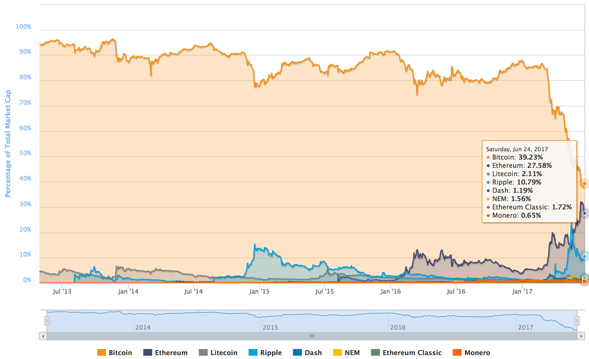

# **Bring on the Chain Split**

In [a previous essay](https://medium.com/@johnblocke/there-will-be-no-bitcoin-split-564f1d60a657), I examined the unlikelihood of a Bitcoin chain split. At the time, hashrate signaling for larger blocks was increasing daily and the prospect of a miner supermajority hard fork appeared likely.

The situation has since changed. The two warring factions have reached an impasse, one side favoring increasing the capacity of the current network and the other preferring to move Bitcoin transactions to “second-layer” networks. Miner signaling for bigger blocks has held steady just short of the >51% necessary to perform a winning hard fork, while Segwit support has increased slightly but remains farther away from activation than a block size increase. Both sides have significant miner support, but neither has enough to activate their preferred scaling solution. The situation is worsened by a large contingent of “undecided” miners. For a while it was believed that these miners were in the process of deciding which side they would support, but as the conflict drags on it is apparent that the undecided camps are simply content with the status quo — one that has seen Bitcoin’s market share drop precipitously over the last several months.

Recently, Segwit2x, a sort of Frankenstein compromise contender being developed by Jeff Garzik, has garnered significant traction in the community, including among those previously undecided miners. Segwit2x’s main selling point is the hope of providing *some* kind of resolution, or at least relief, to years of tiresome debate, but it leaves much to be desired.

Bitcoin blogger Ryan Selkis [wrote in a recent blog post](https://medium.com/@twobitidiot/bitcoins-constitutional-crisis-why-i-support-the-uasf-5b0ab325d8b6):

*That compromise has now enlisted miners representing 80% of the network’s hash rate, and seems likely to take effect. Even in the nuclear scenario of a permanent split between the UASF and SegWit2x camps, though, it looks like a patch now exists that would prevent a blockchain split, something everyone would like to avoid.*

Ironically, Selkis’s article was about why he supports a User Activated Soft Fork (UASF), which plans to force a blockchain split on August 1st. The talking point that “everyone would like to avoid a blockchain split” has been repeated so many times it is now accepted by many at face value without much thought given to whether such a split might be beneficial or even necessary. Everyone would like to avoid an appendectomy, but one’s attitude changes quickly when they find themselves with a ruptured appendix.

Selkis does not seem to believe that the UASF will cause a blockchain split, citing its “overwhelming support,” oblivious to the fact that virtually all support for the UASF is coming from a handful of heavily-censored communities where many opinions are silenced by administrator censorship. Last November [I wrote](https://medium.com/@johnblocke/echo-chambers-6dd50b427a67): *“The danger of isolating yourself in an echo chamber is that by purposely limiting what information is available to you, you remove your ability to make informed decisions.”* Selkis’s blog post demonstrates this point well.

Like an appendectomy, a chain split may be uncomfortable, perhaps painful, and will almost certainly create short-term confusion while the markets work on valuing the respective tokens. But when one’s appendix ruptures, you don’t pop a few high-strength painkillers and call it a day, you treat the problem at its source. I fear that Segwit2x may be no better than a painkiller. The Bitcoin network will find some temporary relief from its painful congestion problem, but by not performing emergency surgery the two warring factions remain joined at the hip, now having swallowed a bit of what each considers poisonous to their ideal vision of Bitcoin. Like some earlier scaling proposals, this one kicks the can down the road, but instead of building towards a long term scaling solution Segwit2x merely prolongs the internal conflict eating away at Bitcoin from the inside out.

In business and in life, finding compromise is a healthy and useful skill to possess. When it comes to the question we face now, however, finding compromise with the other side only serves to compromise the qualities of Bitcoin that each side values most, with the end result being the two factions engaged in bitter civil war remain stuck with the other and with what each considers to be a sub-optimal version of Bitcoin. Each side is so desperate to avoid the temporary discomfort of surgery that they would rather waste away slowly, succumbing to their condition.

Those who believe a chain split must be avoided at all costs seem more concerned with how markets might react to the news than with the long-term viability of the project. For months these same people would refer to “the disastrous Ethereum fork” as proof-positive of why Bitcoin must never fork. When the price of both ETH and ETC increased by several hundred percent relative to both pre- and immediately post-fork prices, they stopped using this line of argument, but nevertheless continued espousing the idea that network forks are “disastrous.”

Like Mr. Selkis, I support the UASF. Unlike Mr. Selkis, I also support Bitmain’s [proposed “UAHF” contingency](https://blog.bitmain.com/en/uahf-contingency-plan-uasf-bip148/) to the UASF. Splitting Bitcoin’s blockchain on August 1st will decisively end Bitcoin’s civil war (that has now dragged on for longer than the American Civil War did), and will allow each faction to achieve their ideal version of what Bitcoin should be. Like surgery, there will be a recovery period following the split.

Assuming each side of the split ends up with half of the network hashrate, and neither side changes mining difficulty or the proof-of-work function, it will take one month for each new network to return to normal operation. Because each new network will now possess its ideal version of Bitcoin, both will be equipped to weather the recovery period just fine. To the small-blockers, with their ideal Bitcoin being a *digital gold* where high fees and slow confirmation times are less problematic than keeping blocks small and activating second layer networks, the recovery period is not problematic. Big-blockers, with their ideal Bitcoin being fast and affordable, will have to endure a month of twenty-minute average confirmation times, but with blocks now large enough to handle all transactions on the network there will be no congestion and fees will subside.

Where does that leave you, the confused spectator? If you want to play it safe, you don’t have to do anything. Make sure your coins are in a wallet that gives you control of the private keys, and after a split you will have your bitcoins on both chains. You can take a wait-and-see approach to find out which side of the split the market values more (this would have proven quite lucrative for anyone who held on to both ETH and ETC after the Ethereum fork), or if you feel strongly one way or the other you can vote with your wallet and sell your coins on one chain to buy more coins on the other. If your confidence in Bitcoin is so shaken by a fork or even the prospect of one, you are free to sell your coins at any time. No one said the ride to the moon wouldn’t be bumpy.

Exchanges and other Bitcoin-handling businesses would be wise to avoid prematurely declaring either side of the split to be “the real Bitcoin.” Doing so is tantamount to making declarations on behalf of the free market — a fool’s errand — and runs the grave risk of choosing incorrectly. The wrong choice could mean “the death of Bitcoin,” at least as far as the public is concerned.

Better to give each side of the fork a unique identifier and wait for a clear winner to emerge. Ethereum had Vitalik and the Foundation to settle the naming rights; Bitcoin has no such luxury. Your customers are not toddlers, even if they may act like it from time to time, and spending five minutes learning the difference between BTC-A and BTC-B will not be the end of the world to them. When the dust settles, the Bitcoin ecosystem will be more robust and everyone will be better off for it. Bitcoin has always been an experiment in free market absolutism, and such a scheme requires all parties to gracefully accept the decision of the market.

Adding more choice and competition into the market free-for-all that is cryptocurrency does not weaken Bitcoin but makes it stronger and more resistant to takeover attempts. Both sides are convinced that the other is out to destroy Bitcoin, intentionally or otherwise, so it makes little sense to drag these “hostile elements” along with something they don’t want. If the two visions of Bitcoin are so harmful to one another, little is gained by forcing both sides to remain together. To quote comedian Louis CK: “[No good marriage has ever ended in divorce.](https://youtu.be/SoRKaq8VhOU?t=47)”

