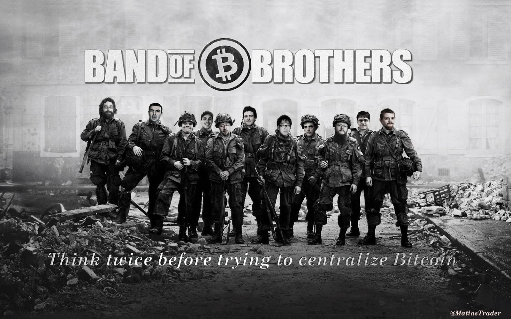
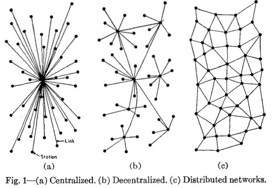
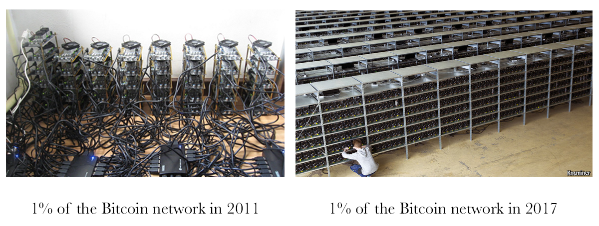
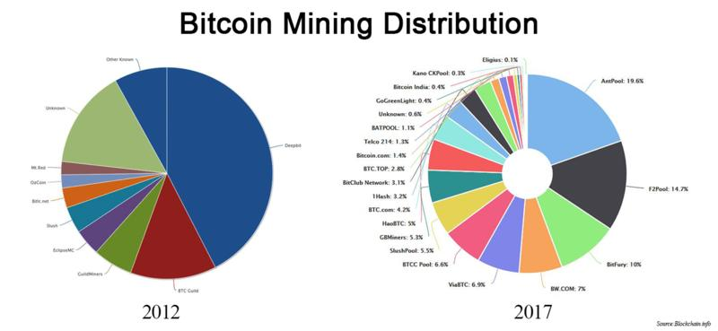
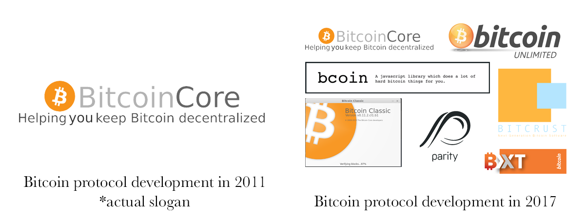

# Decentralization Fetishism is Hindering Bitcoin’s Progress

The word “decentralization” gets bandied about so often in Bitcoin scaling debates that its actual meaning seems to have been forgotten. Although decentralization is an important property of Bitcoin, many people have come to fetishize the word, imbuing it with all sorts of mythical properties and treating “more decentralization” as the panacea that will solve any problem Bitcoin comes to face. It is used as a dog-whistle to shut down productive arguments: simply accuse your opponent of trying to “centralize Bitcoin” and all rationality is thrown out the window as hordes of angry trolls bear down upon them.

In a previous essay, I argued [the need for clearly defined terms in the block size debate](https://medium.com/@johnblocke/the-importance-of-clear-definitions-in-bitcoins-block-size-debate-f8ce550d0919). A succinct definition of *decentralization*, the most frequently used justification for a restricted block size, is long overdue.

Before offering my own definition of the term, I shall explore the common ways the term is misused. When used by proponents of a restricted block size, the concept of “decentralization” is generally understood to mean:

> The more inexpensive node operation is, the more nodes there will be on the network. Therefore, above all other factors, node costs should be kept as low as possible, and then Bitcoin will have achieved maximum decentralization.

This is an incredibly one-dimensional view of how the network runs and a naive understanding of what gives value to Bitcoin.

At the most basic level, this view tends to conflate the concept of “decentralization” with the concept of “distributedness.” While a distributed computing network can be very robust indeed, the way Bitcoin works in practice more closely resembles a *decentralized* network than it does a *distributed* one. This is fundamentally an advantage for Bitcoin, because it allows network members to participate **at all levels.**

If the bar for participating in the Bitcoin network is set at “running a node,” then we start off having already excluded all possible participants who lack the funds, access to hardware, sufficient free time, technical know-how, or the inclination to spend their time, money, and effort figuring out how to set up a node. A high barrier to entry hinders adoption.

Fortunately, this is not how Bitcoin actually works. Levels of participation vary from multi-million dollar server farms to printed out private keys, and everything in between. The network is made stronger by allowing every user to participate at the level where his inclination and his ability meet. Participants specializing and becoming really good at what they do pulls Bitcoin towards becoming the best version of itself it can be.

This view of decentralization also makes the faulty assumption that the best and only way for the network to procure more nodes is to minimize the cost of node operation. It does not consider the possibility that if Bitcoin had five times as many users, it might also have five times as many nodes. Even if the overall percentage of node operation decreased, and five times greater users only yielded twice the number of nodes, the end result would still be more Bitcoin nodes than exist now.

New users are not drawn to using Bitcoin because node operation is cheap. They are drawn to Bitcoin because it either provides utility or quenches a thirst for speculation, and it is only after this initial attraction that some of these new users decide to also operate nodes. Because fast and affordable transactions do not diminish the ability to speculate, but slow and expensive transactions *do* diminish Bitcoin’s utility, the only logical choice is to maximize utility so as to absorb as much demand as possible. It should be noted that node operation is almost exclusively the behavior of utilitarian, rather than speculative, users, and that acquiring more utilitarian users enhances the speculative use-case as well. It makes no sense to throttle one use-case at the expense of another.

The simplistic view of decentralization also falsely assumes that Bitcoin’s value is derived from its degree of decentralization. “Make Bitcoin more decentralized,” this argument says, “and it will become more valuable.” This does not hold up to scrutiny, as it presumes that a Bitcoin with one thousand users each operating his own node will be more valuable than a Bitcoin with one billion users but a node operation rate of only one percent. The empirical evidence suggests the opposite: 2009-era Bitcoin, in which most users were also full nodes, was significantly less valuable than 2017-era Bitcoin with millions of users and a node operation rate of ~1%.

I propose using a much more operationally descriptive definition of the word *decentralized*: lacking a central point of control. Under this definition, it makes no great difference if it becomes more expensive to compete in mining over time, or if the cost of node operation increases either. The key element is that Bitcoin lacks central points of oversight, planning, and control (and thus is less susceptible to catastrophic failure).

According to this metric, Bitcoin is more decentralized today than ever before. When MtGox handled 70% of all Bitcoin trading volume, its failure sent shockwaves through the community and caused significant market turmoil. Today there are likely hundreds of exchanges and the market weathers exchange failures easily.

One persistent myth is that mining is becoming more centralized over time, and that this poses a threat to Bitcoin. This myth is fueled by photos of large mining operations and the presence of a company with a majority market share of mining hardware sold. The myth ignores that these large mining farms represent increasingly smaller percentages of the network, and that obtaining mining hardware is easier and buyers less prone to scams than ever before. Mining continues to become more and more decentralized geographically, with large scale mining operations springing up in dozens of countries around the world.

To classify something as “centralized” or “decentralized” is a binary proposition. Regardless of the number of datacenters their system is spread across, PayPal will always be a centralized system, because the PayPal corporation itself is a single point of failure. Bitcoin, by its very design, can only ever be a decentralized system. There can be varying degrees of decentralization, but it is incorrect to say that any particular proposal runs the risk of turning Bitcoin into a centralized system. It is more accurate to speak of either “more decentralized” or “less decentralized,” but even so, Bitcoin has by all possible metrics become more decentralized over time.

The idea of “decentralization” has become fetishized such that more always equals better and less always spells oblivion.

Engineering is an endeavor in which trade-offs must always be considered. If bringing financial sovereignty to billions of people involves a lower percentage of node-operating users, then that is an acceptable trade-off. If there could only ever be ten thousand nodes, it would still be better to serve a billion people rather than only a million.

Lastly, when we consider central points of failure, there is one glaring instance of centralization remaining in Bitcoin — although this too becomes more decentralized every day. I am speaking, of course, about Bitcoin’s protocol development.

The existence of a single monolithic development team (today it’s Bitcoin Core, but it could be anyone) does, in fact, create a single point of failure. It doesn’t matter how many different contributors there are, or how open to outsiders the development process is; having a single group that releases “official” software binaries and expects the whole network to run them poses a major threat to Bitcoin. It doesn’t matter what the intentions of the group are, or how great their code is, the single point of failure is there. You may trust PayPal not to abuse your personal information, but if they suffer a massive data breach you’ll face the consequences regardless.

Just as MtGox gave way to hundreds of new exchanges, and as the number of mining pools has increased from a few to a few dozen, and as Bitcoin mining shifts away from China and becomes increasingly global, we must also embrace the current proliferation of choice in protocol software. To say that Bitcoin should be decentralized in all other regards while championing dependence on a single team of developers is patently absurd. Rather than viewing the market’s non-adoption of Segwit as a failure of the system, it should be viewed as the system working as intended. The daily battles may be frustrating, but it would be far worse if such a massive change to the Bitcoin codebase could be pushed through without debate.

Decentralization fetishism considers the notion of “decentralization” as something separate from Bitcoin and as a goal in itself. Rather than *the goal of Bitcoin is to be money,* it supposes that *the goal of Bitcoin is to be decentralized.* But the goal of Bitcoin has always been to become money, and decentralization is a means to this end — it removes central points of failure. Since the entire value of decentralization in Bitcoin relates to preventing a central point of failure, it is more a question of “yes/no” and less so “how much?” More important than maximizing the number of nodes on the network, we should be safeguarding against centralized points of failure, and the only non-authoritarian way to accomplish this is by encouraging competition.

*Ceterum censeo blocksize esse increscendum.*

