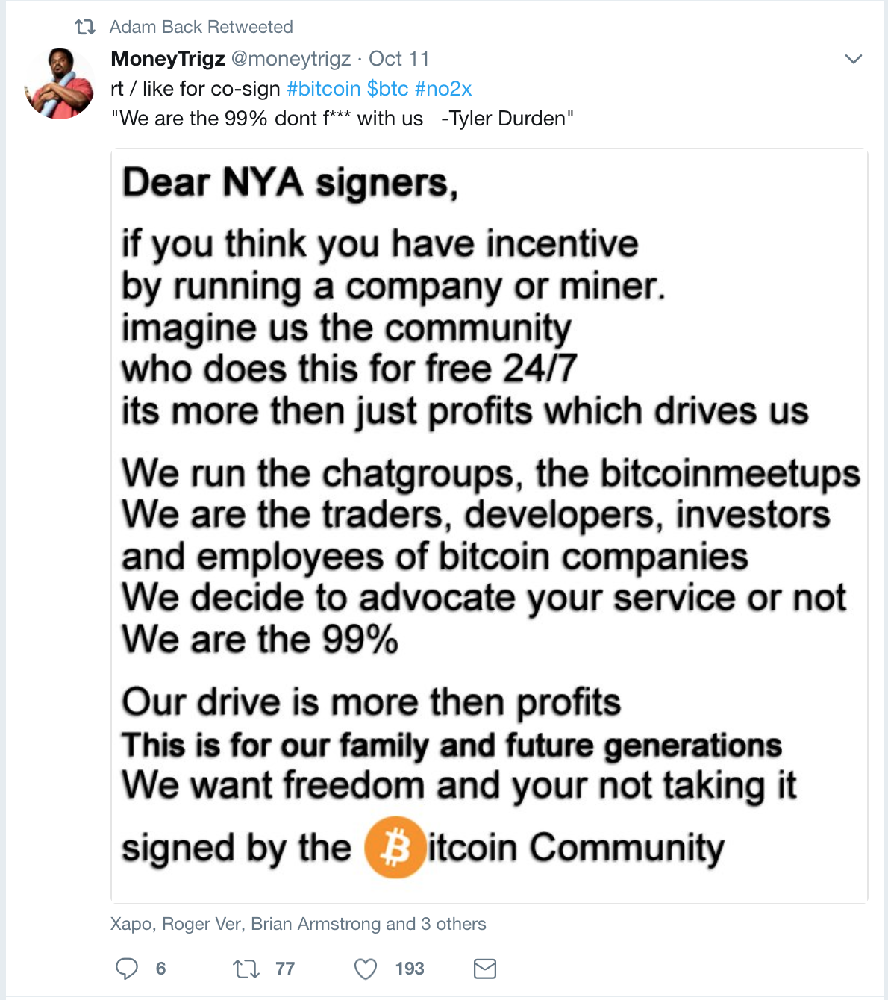
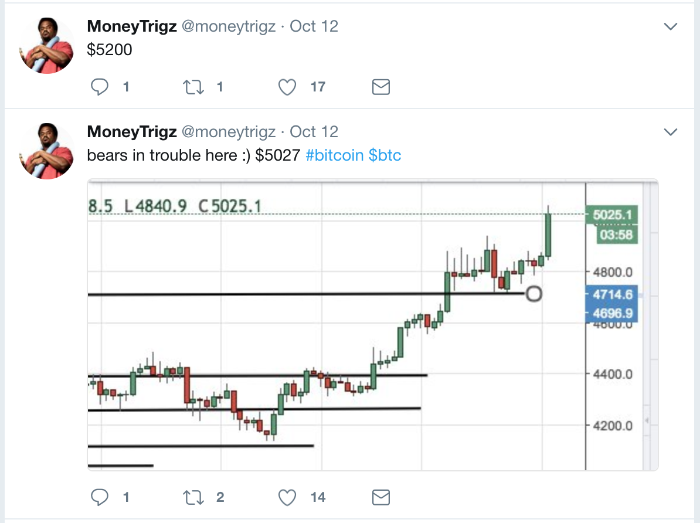
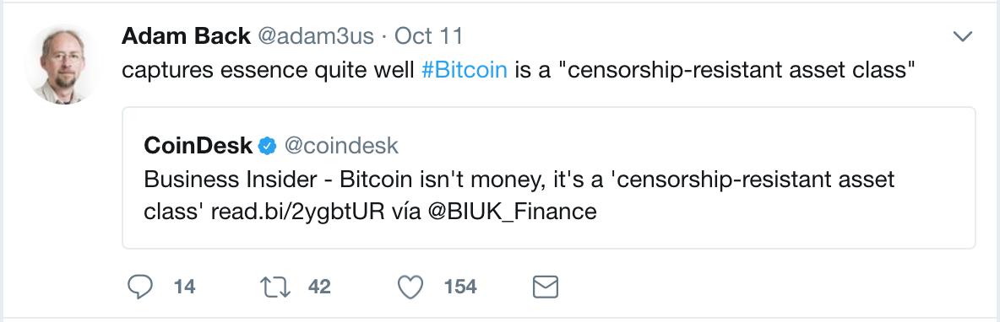
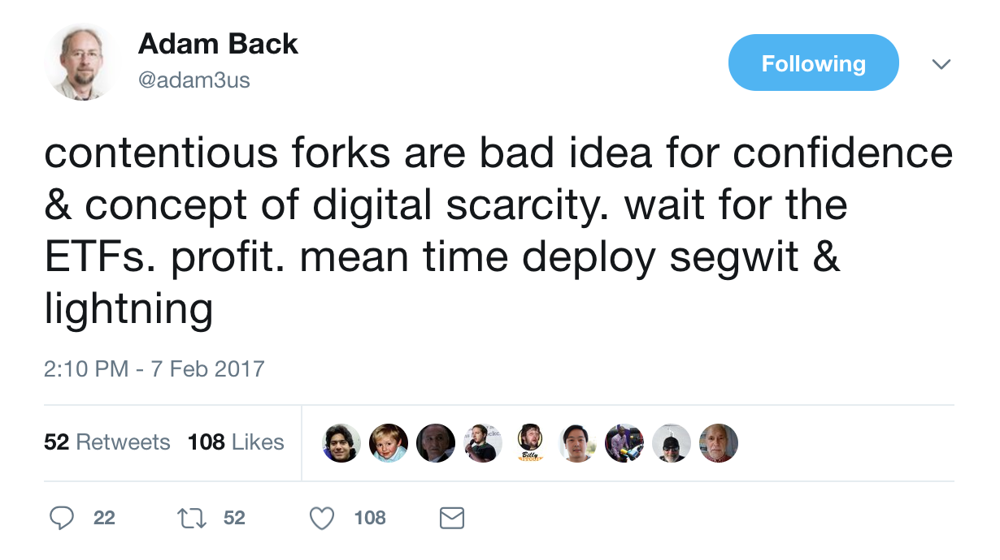
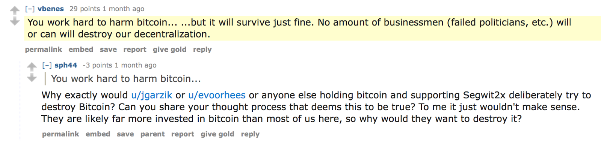
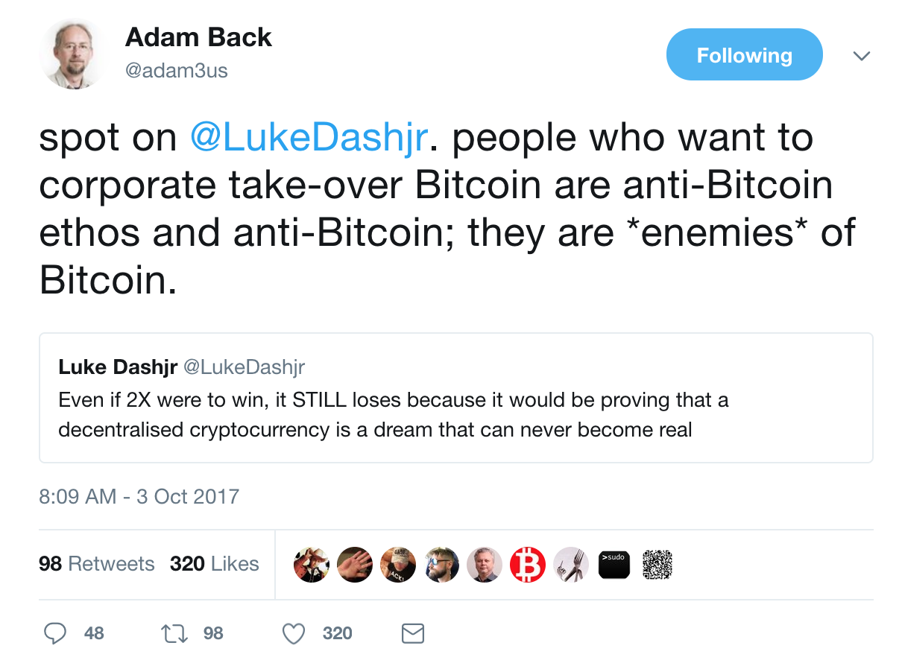

# Profit is not a Dirty Word

Finding themselves unable to attack Bitcoin Cash or Segwit2x on technical merit, opponents of a Bitcoin capacity increase have ramped up their smear campaigns and coordinated brigading of anyone with a difference of opinion. Recent efforts of [the troll army](http://telegra.ph/Inside-the-Dragons-Den-Bitcoin-Cores-Troll-Army-04-07) aim to portray Bitcoin Cash as nothing but a play by “greedy miners in search of greater profits.”

The troll army uses the word “profit” as a [weasel word](https://en.wikipedia.org/wiki/Weasel_word) to trigger an emotional response among the easily-manipulated. Those susceptible to this technique have already been conditioned by years of propaganda (not only in the Bitcoin world) to equate the word “profit” with corporate villainy and inhumanity.

I would remind people that Bitcoin’s security model is built on the assumption of miners being rational, profit-driven entities. What the ardent supporters of Bitcoin Core fail to understand is that Bitcoin is secured by economic incentives, not fancy code and good intentions. The vast majority of human behavior is inherently profit driven, and Bitcoin leverages this fact to its advantage.

Moreover, a glaring contradiction exists among the people pushing this “profit is bad ” rhetoric. Bitcoin Cash supporters (and block size increase proponents in general) tend to argue from the position that Bitcoin should be something useful for anyone in the world, wealthy or not. Proponents of the Bitcoin Core vision of Bitcoin, on the other hand, want Bitcoin to function as a settlement layer for banks and the wealthy, who use it to save money, to increase their profits. They tend to be inordinately concerned with price movements and use arguments like *“hard forks are bad because they would hurt the price of Bitcoin!”* despite empirical evidence having demonstrated the opposite on multiple occasions.

Perhaps the small block proponents, who openly advocate for a speculative token version of Bitcoin, devoid of utility, that they can buy, hold, and “wait for the price to moon” (i.e., earn profits) lack self-awareness? Do they fail to recognize the contradiction?

None of this is meant to suggest that the big blockers are not motivated by profit. While many are drawn to Bitcoin by political or philosophical reasons, they also understand that a widely-used Bitcoin is a successful, and thus profitable, Bitcoin. The small blockers seem ready to cut the nose off to spite the face, foregoing a sustainable and demand-driven foundation for Bitcoin in favor of encouraging short term FOMO and bubble mentalities. They fail to realize that this model is nothing but a house of cards waiting to collapse once investors discover their token lacks any utility upon which to speculate.

Previously, speculators saw Bitcoin as a good long-term investment because they were anticipating the disruption of more and more areas of global commerce (i.e., the creation of new utility). The new model of Bitcoin speculation disregards all notion of utility and relies on the hope that the price will continue to increase from more speculators jumping on board because… moon, or something. This is called a [speculative bubble](http://www.investopedia.com/terms/s/speculativebubble.asp).

It is profit-seeking behavior that has allowed Bitcoin to thrive after nearly a decade of operation. Profit-seeking is responsible for the creation of the Bitcoin exchange ecosystem, payment processors, the mining network, merchants accepting Bitcoin, massive user adoption, physical goods like hardware wallets, and everything else that makes Bitcoin a worthwhile use of one’s time and money. All of these things were bootstrapped and continue to grow because of market participants trying to make money.

Bitcoin is trustless. It is designed such that we need not rely on the honesty of other participants, but only assume their rational desire for profit will be greater than the irrational desire to cause havoc and destroy the system. This has been considered since the very beginning of Bitcoin, [when Satoshi wrote](http://bitcoin.com/bitcoin.pdf):

>> *If a greedy attacker is able to assemble more CPU power than all the honest nodes, he would have to choose between using it to defraud people by stealing back his payments, or using it to generate new coins. He ought to find it more profitable to play by the rules, such rules that favour him with more new coins than everyone else combined, than to undermine the system and the validity of his own wealth.*

The profit motive and desire to avoid the destruction of one’s own wealth is the glue that holds the Bitcoin system together.

The prevailing assumption of these “profit is bad” hypocrites is that the success of business must be in direct conflict with what is beneficial for the masses. What the Bitcoin Core loyalists and apologists have never been able to explain is what these businesses, whose own success depends on the success of Bitcoin, stand to gain from undermining the very system that keeps them afloat. In its more extreme forms, their argument suggests that the “big blockers” (a term recently expanded to include even moderates supporting a one-time capacity increase to 2MB) are nothing but “clueless businessmen” ready to steamroll all that is good in the wanton pursuit of more money. They conveniently ignore that most of the people they deride have been staunch advocates of Bitcoin for years, have deep understandings of the system, and frequently provide clear arguments to explain their reasons for supporting Bitcoin.

On the other hand, we have one of the main leaders of the small block movement [unable to articulate](https://vid.me/66PC1) why he likes Bitcoin beyond it being “interesting,” while also being the co-founder of — *gasp!* — a for-profit corporation with tens of millions of dollars in investment!

The Blockstream corporation present themselves as holier-than-thou “cypherpunks” who don’t care about making money. Yet, they took $76 million in venture funding from some of the biggest financial institutions in the world and refuse to publicly disclose their business model. Blockstream management puts on a ridiculous charade that their “enemies” (to use their own words) are evil profit seekers, while they are virtuous freedom fighters unconcerned with money and dedicated only to the greater good.

The corporations *investing* tens of millions of dollars in Blockstream certainly aren’t doing it for charity.

# The Small Blocker False Dichotomy

“Profit” and “providing something good” are not mutually exclusive concepts. Be wary of the group of VC-backed company founders accusing others of being “greedy profit-seekers” while simultaneously claiming their own actions are done out of benevolence.

The narrative presented by the small blockers is a false dichotomy. There is no group of evil corporate robber barons trying to take over Bitcoin, thwarted only by the tireless efforts of another corporation that doesn’t care about money or investor returns. Both sides have business interests they must protect, but only one side pretends to have no such motives¹. Only one side depends on censorship, lies, and character assassinations to maintain their position. One side has virtually every major Bitcoin business in agreement on a way forward, while the other is a handful of bullies with an army of anonymous astroturfers patrolling Twitter and Reddit to shout down dissent. Which of these two sides more closely resembles “a corporate takeover?”

¹ Strangely, the companies favoring a capacity increase are mostly consumer-facing, while Blockstream’s products are targeted only at other businesses. Which side is more in-tune with the users?

