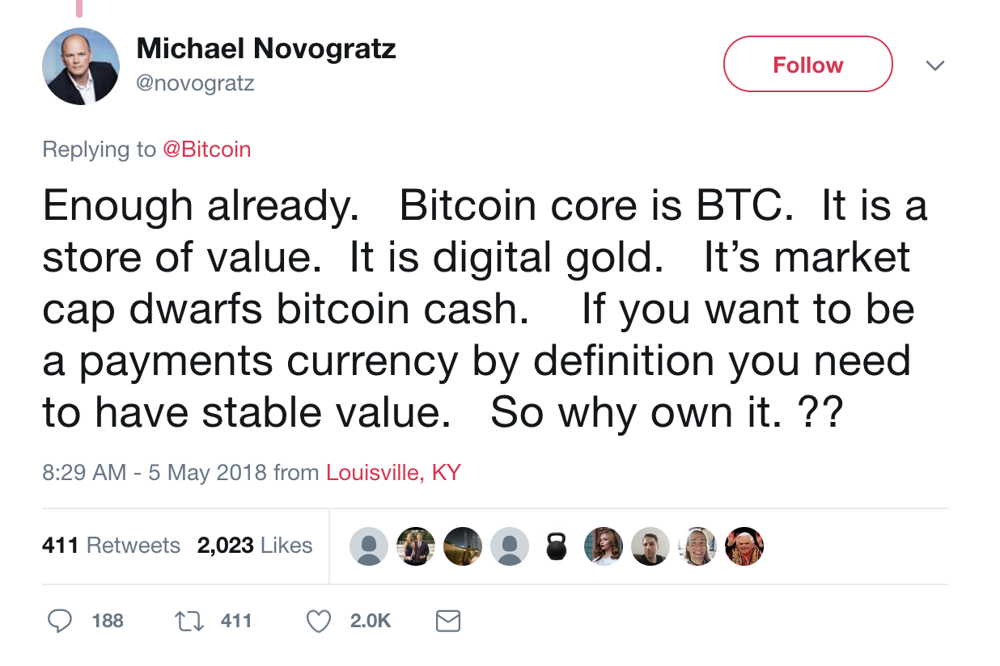
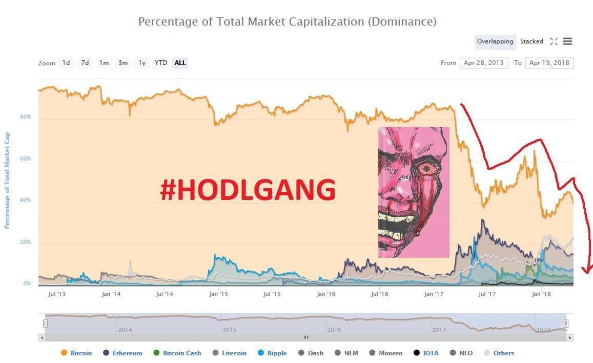

# **Bitcoin is not a Store of Value — Yet**

*This article can also be [read on Yours.org](https://www.yours.org/content/bitcoin-is-not-a-store-of-value%E2%80%94yet-f7f6bfd8ac92)*

The latest thought meme being echoed from Wall Street to Silicon Valley is that Bitcoin is merely a “store of value,” an alternate asset class to be held as part of a well-balanced portfolio.

This sentiment was recently expressed in a Tweet by billionaire hedge fund manager Mike Novogratz, when he said:

It’s unclear when, exactly, this meme began, but I do not recall people referring to Bitcoin as a “store of value” before BTC stopped being useful for payments more than a year ago. The phrase emerged as a justification made by the Bitcoin Core development team to explain away their transformation of Bitcoin Core (BTC) from a functional peer-to-peer currency to what it is today: a clunky, expensive, and often unreliable protocol that has been intentionally crippled by its maintainers, and whose utility (and therefore value) primarily rely on its position as the *de facto* base-pair for altcoins on exchanges.

That’s not to say that Bitcoin itself is broken — the peer-to-peer electronic cash system invented by Satoshi Nakamoto continues to live on as a distinct blockchain, under a different name and ticker symbol: Bitcoin Cash (BCH). This version of Bitcoin was the result of a years-long feud that culminated in the community and currency splitting on August 1st, 2017.

Anything that can wildly fluctuate from $1,600 to $19,000 and back to $9000 inside the course of a year is decidedly *not* a good store of value. Bitcoin’s previous twelve months were a volatile ride, profitable for many, but a good year for “storing value” it was not. The people who bought their first BTC at $19,000 certainly haven’t found it to be a good store of value. Even those who bought at $1,900 learned that BTC is more of a speculative investment than something which can predictably preserve the same amount of value that was initially put in.

Wikipedia’s basic definition of a [store of value](https://en.wikipedia.org/wiki/Store_of_value) is *“the function of an asset that can be saved, retrieved and exchanged at a later time, and **be predictably useful when retrieved**. More generally, a store of value is anything that retains purchasing power into the future* [emphasis added].*”* The utility of Bitcoin Core, as we learned in December 2017, is anything but predictable.

It is true that price stability contributes to making something a good store of value. More primary than price stability, however, are utility and widespread acceptance, which beget value (and not the other way around). This is because of the simple truth that value must be created before it can be stored and in order to create value something must be desirable. To be desirable, the thing in question must be useful, or at least be perceived as such. In winter, a pelt of fur provides utility because it is understood that the pelt can be made into many useful things now or later. A stack of pelts is a store of value, not because the price is X but because it is a safe bet that someone else wants those pelts and someone else will want them in the future. This utility and the accepted fact that good pelts make good clothing create demand which helps to set a price. Without utility and desirability, how else can something derive, much less “store” value? We may as well be speculating on Beanie Babies or tulip bulbs again.

The Wikipedia entry goes on to say:

>> *The point of any store of value is risk management due to a stable demand for the underlying asset.*

The “stable demand” part is crucial and primary. As Bitcoin Core’s utility as anything but a speculative asset and trading pair was slowly eroded away, so too was any stability on the demand side of the equation. If it was still possible to use the Bitcoin Core currency for all of the things it used to be able to do, there would always be a component of underlying utility to support demand, regardless of where the short term whimsies of the market would take it.

Wikipedia again:

>> *Money is one of the best stores of value because of its [liquidity](https://en.wikipedia.org/wiki/Market_liquidity), that is, it can easily be exchanged for other goods and services.*

Until network congestion and rising fee pressure completely degraded the ability of the Bitcoin Core currency to be exchanged for goods and services, the liquidity and acceptance of the currency had been consistently rising year over year. Every year brought bigger and bigger merchants accepting Bitcoin as payment, an order of magnitude more users, and a bevy of applications that made use of Bitcoin’s unique properties of being borderless, instant, permissionless, and cheap to use. Post-peak block size, much of that has been lost.

Merchants have switched to alternative cryptocurrencies, or scrapped the idea of accepting crypto payments altogether. The growth of new user adoption hasn’t slowed down, but Bitcoin is now viewed by newcomers and even some professionals as a failed experiment, “blockchain 1.0” or “first gen crypto.” Even more unfortunate is the fact that Bitcoin Core has lost the vast majority of its market share to a sea of spurious token projects. The entrepreneurs and innovators who once built on top of Bitcoin now prefer building their own blockchains from scratch to dealing with the toxic development culture fostered by Bitcoin Core. Even the transaction volumes of Bitcoin Core have begun to plummet, reaching levels not seen since 2015.

All of the above should have any sane fundamentals-first investor running for the hills, and yet we still have seemingly smart guys like Novogratz buying into the “Bitcoin is digital gold” myth. That the myth is repeated so frequently and by so many does not make it become true.

Cryptocurrencies are tools. To understand the primacy of utility over price consider that these tools have two parts: a “cryptographic” element and a “currency” element. Remove the former and you have something, still. Remove the latter and you’re left with nothing more than a math problem. The unique properties of cryptocurrencies also make it possible to trade and speculate with them, but does it make sense to speculate on the adoption and future growth of a currency that provides little utility and which has consciously imposed a very low hard-limit on the number of transactions it can be used for?

History is full of examples of dominant entities squandering their first-mover advantage and losing out to more innovative competitors. To arbitrarily declare BTC the premier form of “digital gold” and act as though this position can never be threatened is naive, foolish, and suggests Novogratz may be listening to the wrong people or is blinded by his own financial stake in BTC.

