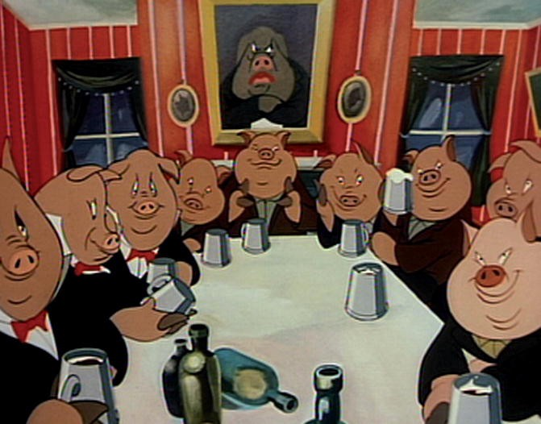

# Bitcoin Farm: An Allegory

This article is inspired by Derek Magill’s excellent post, [‘Animal Farm’ and Bitcoin Core](https://derekmagill.com/2018/03/27/bitcoin-farm/), and will take a closer look at the similarities between George Orwell’s allegorical tale of an animal uprising and the hijacking of the Bitcoin (BTC) project at the hands of Bitcoin Core. In brief:

> The leaders of* Animal Farm* maintain thought control by obscuring the facts with smokescreens, rewriting history, creating conspiracy theories about pending attacks, faking victims, slander, scapegoating, murdering opposition, outrageous public works projects to keep the animals busy, and through a large group of useful idiots — sheep — that spread their message unthinkingly and distract dissenters. By the end of the book, *Animal Farm* has been renamed *Manor Farm* and the ruling pigs are walking on two legs like the humans they overthrew. All pretenses of the original egalitarian utopianism are gone and the animals are weak, starving and downtrodden.

*Animal Farm* begins with a wise old boar, Old Major, sharing a revelation he had in a dream, in which he identifies the cause of the animals’ suffering and gives them a common enemy to unite against.

>> Only get rid of Man, and the produce of our labour would be our own. Almost overnight we could become rich and free. What then must we do? Why, work night and day, body and soul, for the overthrow of the human race! That is my message to you, comrades: Rebellion!

In the Bitcoin version of this story, the utopian idea that inspires people to take part is the vision of a world free from central bank manipulation of currency, in which all participants can be free from predatory consumer banking practices and gain equal access to the global financial system.

The animals of Manor Farm quickly carry out their rebellion, driving farmer Jones off his own property and seizing control of the land. Their first act upon taking control is to change the name of the farm to Animal Farm and to establish a list of seven commandments, which are changed subtly throughout the book to suit the needs of the pigs, who appoint themselves the administrators of the farm.

Because some of the animals, the sheep in particular, are unable to memorize the seven commandments, the rules are simplified to a mantra which is easily repeated by the sheep: FOUR LEGS GOOD, TWO LEGS BAD. Whenever the smarter animals ask questions about the policies created by the pigs, they are quickly drowned out by the sheep bleating this mantra.

The pigs soon begin to take more and more liberties for themselves. When the farm experiences a windfall harvest of apples, the animals assume that the harvest will be shared equally among all, but the pigs declare that the apple harvest is to be reserved for the exclusive use of the pigs. To calm the disquiet of the rest of the animals, Squealer the pig explains:

>> “You do not imagine, I hope, that we pigs are doing this in a spirit of selfishness and privilege? Many of us actually dislike milk and apples. I dislike them myself. Our sole object in taking these things is to preserve our health. Milk and apples (this has been proved by Science, comrades) contain substances absolutely necessary to the well-being of a pig. We pigs are brainworkers. The whole management and organisation of this farm depend on us. Day and night we are watching over your welfare. It is for YOUR sake that we drink that milk and eat those apples. Do you know what would happen if we pigs failed in our duty? Jones would come back! Yes, Jones would come back! Surely, comrades,” cried Squealer almost pleadingly, skipping from side to side and whisking his tail, “surely there is no one among you who wants to see Jones come back?”

Squealer comes to act a propaganda minister of sorts, explaining away the excesses of the ruling class, providing plausible-sounding explanations for even the most contradictory of their behaviors, and gaslighting the entire farm into believing that whatever the current agenda of the pigs is, that it was always part of the plan, no matter how at odds that agenda is with the original spirit of the revolution.

We see many examples of this sort of behavior coming from Bitcoin Core. The goal of Bitcoin is to overthrow the banking system, they say, even as they change Bitcoin (BTC) from being a peer-to-peer electronic cash system into a multi-layered settlement network that closely resembles modern banking. “The block size must not be increased, comrades, lest we lose the decentralized nature of our beloved system! But fear not, Segwit *is* a block size increase!”

Another feature of the pigs’ oratory is the omnipresent threat of attack from outside forces. Whether it’s their old master Jones, or the neighboring farmers, or the purged pig Snowball (more on him later), the rest of the animals are told it’s in their best interest to leave all decisions to the pigs so as to prevent attacks on the farm. The Bitcoin Core ideology depends on a constant state of siege mentality. Whether it’s the banks, or Bitcoin Cash, former Bitcoin developers, or even Bitcoin businesses such as Coinbase and Bitpay, the BTC network is *always* under some kind of “attack,” and the denizens of Bitcoin Farm are told that the censorship and boycotts against Bitcoin companies handed down from the leadership are necessary and are for the protection of the system.

One day, Jones and some of his farmer friends actually do mount an attack on Animal Farm. They are repelled by the animals, but one of the pig leaders, Snowball, is hit by buckshot pellets on his back as he spearheads a rush against the invading farmers.

Snowball and Napoleon, the other pig leader, can never agree on anything. Snowball contrives a large public works project, declaring that the animals should work to build a windmill to supply the farm with electricity and make life significantly easier for all of the animals. Napoleon literally urinates all over Snowball’s design for the windmill.

>> Snowball did not deny that to build it would be a difficult business. Stone would have to be carried and built up into walls, then the sails would have to be made and after that there would be need for dynamos and cables. (How these were to be procured, Snowball did not say.) But he maintained that it could all be done in a year. And thereafter, he declared, so much labour would be saved that the animals would only need to work three days a week.

>> In glowing sentences he painted a picture of Animal Farm as it might be when sordid labour was lifted from the animals’ backs. His imagination had now run far beyond chaff-cutters and turnip-slicers. Electricity, he said, could operate threshing machines, ploughs, harrows, rollers, and reapers and binders, besides supplying every stall with its own electric light, hot and cold water, and an electric heater.

Animal Farm has a windmill, Bitcoin Farm has a Lightning Network. How exactly the routing problem will be solved, or how the hub-and-spoke model won’t lead to third parties operating hubs requiring KYC, is never fully explained, yet the sheep of Bitcoin Farm know that one day (always 18 months away) the Lightning Network will usher in a new day for Bitcoin, enabling instant and free transactions for the animals of Bitcoin Farm.

When the day comes to vote on the project, Napoleon sits quietly and doesn’t bother to argue with Snowball. When Snowball finishes giving a rousing speech, Napoleon gives a signal and a pack of vicious dogs, who he had stolen away as puppies for “education,” enter the barn. At Napoleon’s command, the dogs drive Snowball from the farm.

Although Snowball is never seen on the farm again, he becomes a scapegoat and the invisible source of all the troubles the farm begins to encounter.

>> Suddenly, early in the spring, an alarming thing was discovered. Snowball was secretly frequenting the farm by night! The animals were so disturbed that they could hardly sleep in their stalls. Every night, it was said, he came creeping in under cover of darkness and performed all kinds of mischief. He stole the corn, he upset the milk-pails, he broke the eggs, he trampled the seedbeds, he gnawed the bark off the fruit trees. Whenever anything went wrong it became usual to attribute it to Snowball. If a window was broken or a drain was blocked up, someone was certain to say that Snowball had come in the night and done it, and when the key of the store-shed was lost, the whole farm was convinced that Snowball had thrown it down the well. Curiously enough, they went on believing this even after the mislaid key was found under a sack of meal. The cows declared unanimously that Snowball crept into their stalls and milked them in their sleep. The rats, which had been troublesome that winter, were also said to be in league with Snowball.

On Bitcoin Farm, all troubles are similarly attributed to enemies, even when there is no evidence to support the allegations. The favorite villain is Roger Ver, but depending on the moment it can also be Jihan Wu or the evil companies who signed the New York Agreement. When the BTC network is congested and fees rise, it’s not because Bitcoin Core failed to scale the network amid growing popularity for cryptocurrencies, it’s because Roger Ver has been sneaking around the farm at night spamming the network to drive up fees! When Bitpay added Bitcoin Cash support, it wasn’t because BTC became useless for payments, it’s because they were bribed by Roger and Jihan! When Segwit failed to see significant adoption, it couldn’t possibly be because Segwit is not much of an optimization at all, obviously it’s just the evil corporations who don’t want to see Bitcoin succeed!

After turning Snowball into a *persona non grata*, Napoleon declares that the windmill shall be built anyways, and that it was his idea all along. The propaganda minister Squealer explains that Snowball had actually stolen the plans from Napoleon, and Napoleon played along tactically so as to eventually drive the traitor Snowball away from the farm.

>> The needs of the windmill must override everything else, he said. He was therefore making arrangements to sell a stack of hay and part of the current year’s wheat crop, and later on, if more money were needed, it would have to be made up by the sale of eggs, for which there was always a market in Willingdon. The hens, said Napoleon, should welcome this sacrifice as their own special contribution towards the building of the windmill.

On Bitcoin Farm, the animals are told that they must put up with the temporary hardship of high fees and network congestion, and must work hard to get the Lightning Network up and running. Once the Lightning Network is built, they say, we can put hardship behind us for good.

>> Once again the animals were conscious of a vague uneasiness. Never to have any dealings with human beings, never to engage in trade, never to make use of money — had not these been among the earliest resolutions passed at that first triumphant Meeting after Jones was expelled? All the animals remembered passing such resolutions: or at least they thought that they remembered it.

Some of the animals of Bitcoin Farm have questioned, too. Wasn’t Bitcoin always supposed to have low fees? Wasn’t Bitcoin supposed to enable anyone to be their own bank?

This video was published in 2011, and for years was on the front page of Bitcoin.org

>> Afterwards Squealer made a round of the farm and set the animals’ minds at rest. He assured them that the resolution against engaging in trade and using money had never been passed, or even suggested. It was pure imagination, probably traceable in the beginning to lies circulated by Snowball.

No, those are just the lies of Roger Ver. One day, when the Lightning Network is finally complete, the animals of the world will finally have fast and cheap payments, but if you remember Bitcoin as being a fast and cheap payment network in the beginning, that’s simply because no one was using it. The design of the system has always been this way, comrades.

>> A few animals still felt faintly doubtful, but Squealer asked them shrewdly, “Are you certain that this is not something that you have dreamed, comrades? Have you any record of such a resolution? Is it written down anywhere?” And since it was certainly true that nothing of the kind existed in writing, the animals were satisfied that they had been mistaken.

Bizarrely, there are plenty of written records to show that Bitcoin was never supposed to function the way it now functions under Bitcoin Core, but the [massive censorship campaigns](https://medium.com/@johnblocke/a-brief-and-incomplete-history-of-censorship-in-r-bitcoin-c85a290fe43) of Bitcoin Core have helped keep these facts hidden from the animals of Bitcoin Farm.

>> Meanwhile life was hard. The winter was as cold as the last one had been, and food was even shorter. Once again all rations were reduced, except those of the pigs and the dogs. A too rigid equality in rations, Squealer explained, would have been contrary to the principles of Animalism. In any case he had no difficulty in proving to the other animals that they were NOT in reality short of food, whatever the appearances might be. For the time being, certainly, it had been found necessary to make a readjustment of rations (Squealer always spoke of it as a “readjustment,” never as a “reduction”), but in comparison with the days of Jones, the improvement was enormous. Reading out the figures in a shrill, rapid voice, he proved to them in detail that they had more oats, more hay, more turnips than they had had in Jones’s day, that they worked shorter hours, that their drinking water was of better quality, that they lived longer, that a larger proportion of their young ones survived infancy, and that they had more straw in their stalls and suffered less from fleas.

Another defining feature of Bitcoin Farm is the twisting of figures and statistics to craft the illusion that things have never gotten worse, but are constantly getting better under the stewardship of Bitcoin Core.

* “Fees aren’t high! You’re just measuring them wrong: you should be looking at satoshis per byte, not how many dollars it costs to send a transaction!”

* “It’s not true that fewer people are transacting on the network, just look at the total USD value being transacted each day!”

* “It’s not true that transaction numbers are dropping, comrades, it’s just that with improved efficiency techniques such as transaction batching, there aren’t as many unique transactions on the network!” *(Note: This particular talking point is easily disproved, as both [transaction numbers](https://blockchain.info/charts/n-transactions?timespan=all&daysAverageString=7) and [total number of outputs](https://outputs.today/) are in steep decline)*

Over time, Napoleon and Squealer rewrite history to the point that Snowball was never a leader of Animal Farm, but was in fact always an enemy.

>> On the same day it was given out that fresh documents had been discovered which revealed further details about Snowball’s complicity with Jones. It now appeared that Snowball had not, as the animals had previously imagined, merely attempted to lose the Battle of the Cowshed by means of a stratagem, but had been openly fighting on Jones’s side. In fact, it was he who had actually been the leader of the human forces, and had charged into battle with the words “Long live Humanity!” on his lips. The wounds on Snowball’s back, which a few of the animals still remembered to have seen, had been inflicted by Napoleon’s teeth.

On Bitcoin Farm, the party line is that people and companies like Roger Ver, Jihan Wu, Mike Hearn, Gavin Andresen, Bitpay and Coinbase were never proponents of Bitcoin! No, they were always enemies out to sabotage the system from within!

Eventually, the much-promised windmill is completed. But rather than improve the lives of the animals, it is used by the ruling-class pigs to generate a profit for themselves.

>> The windmill had been successfully completed at last, and the farm possessed a threshing machine and a hay elevator of its own, and various new buildings had been added to it. Whymper had bought himself a dogcart. The windmill, however, had not after all been used for generating electrical power. It was used for milling corn, and brought in a handsome money profit. The animals were hard at work building yet another windmill; when that one was finished, so it was said, the dynamos would be installed. But the luxuries of which Snowball had once taught the animals to dream, the stalls with electric light and hot and cold water, and the three-day week, were no longer talked about. Napoleon had denounced such ideas as contrary to the spirit of Animalism. The truest happiness, he said, lay in working hard and living frugally.

Let this be a dark foreshadowing of the eventual outcome of the Lightning Network. It is true that the Lightning Network may eventually be completed, but will it really make Bitcoin useful for the masses? How will the average person use the Lightning Network when the fees on the base layer are still extremely high? How will Lightning handle its [many unresolved UX problems](https://medium.com/crypto-punks/lightning-network-ux-centralization-b517037b92ec), such as the inability to receive payments on a mobile wallet, [or the fact that it takes a minimum of two hours to open a channel](https://blog.lightning.engineering/posts/2018/05/02/lightning-ux.html)?

The denizens of Animal Farm originally staged their rebellion to free themselves from human bondage and to provide a more equitable life for all animals. In the final passages, the pigs abandon all pretense of ever being anti-human, and begin walking on two legs, wearing human clothing, and cavorting with the human owners of the neighboring farms. In the final scene of *Animal Farm,* the rest of the animals peer through a window of the farmhouse and are unable to distinguish the pigs from the humans they are drinking and conducting business with. It turns out that the new leaders are exactly the same as the old leaders.

The denizens of Bitcoin Farm originally believed they were part of a new system that would do away with predatory banking and democratize finance for all humans. Now we live in a time where the “cypherpunk” leaders of Bitcoin Core openly take investment money from banks and label Bitcoin-funded companies as enemies, the products produced by Blockstream are only available to large financial institutions, and all the while they string everyone along and say that the end goal of it all is to build a new financial system that will do away with the legacy banking system.

It makes one wonder: If fast and cheap transactions are desirable (thus the need for Lightning Network), why reject them as an inherent part of the Bitcoin system? If block size increases are bad, then why is Segwit billed as a blocksize increase (and a less efficient one than the solution adopted by Bitcoin Cash, at that)? If Bitcoin is meant to do away with middlemen and rent-seekers, why move most transactions to a network that depends on hubs (also known as banks) and requires paying third-party watchtowers to keep one’s funds safe? Why reserve the Bitcoin network for “more important” transactions (high-value settlements) and push the average person onto a separate banking network?

>> ALL TRANSACTIONS ARE EQUAL, BUT SOME TRANSACTIONS ARE MORE EQUAL THAN OTHERS

Read *Animal Farm* in full [here](https://ebooks.adelaide.edu.au/o/orwell/george/o79a/complete.html), or watch the 1954 animated video [here](https://www.youtube.com/watch?v=1Ibe-BgqwNg).

### More where this came from

This story is published in [Noteworthy](http://blog.usejournal.com), where thousands come every day to learn about the people & ideas shaping the products we love.

Follow our publication to see more stories featured by the [Journal](https://usejournal.com/?/utm_source=usejournal.com&utm_medium=blog&utm_campaign=guest_post) team.

