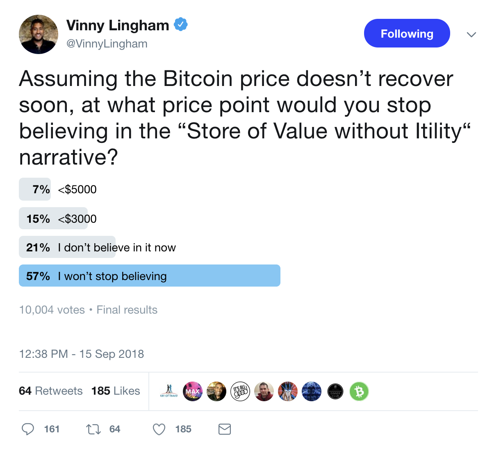
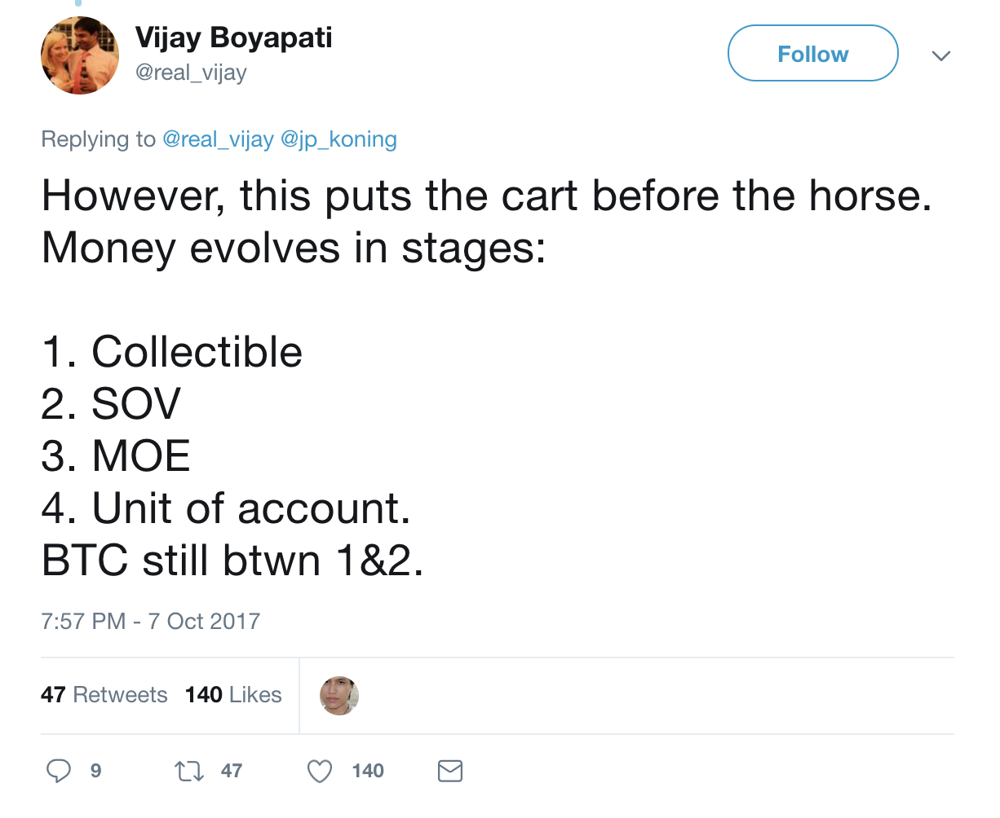

# What Makes Bitcoin a Store of Value?

A cup is not being useful when it sits in the cupboard, only when you drink from it. A bicycle is not useful when it sits in the garage, but when you ride it. We can say that a bicycle or a cup are useful items, even when not currently in use, but it is the ability to make use of them when needed that grants them this label of utility.

Likewise, a broken cup or a bicycle damaged beyond repair ceases to be useful and becomes junk. This is because value comes from utility and not the other way around. A thing that loses its intended functionality loses its value. The broken cup may still find itself useful to the artist, but broken items tend to lose all worth and can generally be had for free… many people even pay someone else to collect their junk from them!¹

>> [Discover and review best Bitcoin softwares](https://coincodecap.com)

What does this have to do with Bitcoin? The prevailing narrative pushed onto newcomers and shared as gospel by “Bitcoin experts” like Samson Mow, Tone Vays, and Seinfeld Ammous, is that Bitcoin’s originally intended utility as a decentralized payments network is no longer relevant. This thinking has stifled Bitcoin adoption and given rise to a very new anti-payments line of thinking which parrots a few common memes:

* *The whitepaper is old. Things have changed since then.* (Newton’s theories are old and things have changed since then too. Scientific breakthroughs don’t become less valid with age.)

* *The whitepaper is not the Bible. Satoshi is not God.* (Strawman. People cite the whitepaper because of the elegant solutions it presents, not because they believe its author infallible or divine.)

* *Satoshi had no way of knowing how the system would evolve and didn’t really know what Bitcoin would become in the future.* (Satoshi was not a clairvoyant, but in all his writings he clearly envisioned Bitcoin as a money and payments system. He never talked about Bitcoin as a “store of value.” He also noted that Bitcoin, as a payment network, [could scale larger than Visa](https://satoshi.nakamotoinstitute.org/emails/cryptography/2/) and that mining would naturally move to specialized server farms. He clearly had some long-term vision for the system.)

* *We don’t need to store every coffee payment on the blockchain. The blockchain is the ‘settlement layer’ and consumers will use Lightning Network to transact.*²** (Cryptocurrency is here already; if BTC can’t compete it will be left in the dust by its competitors that actually *can* handle coffee payments. And the fact that they work towards Lightning Network at all is proof they think payments are useful and necessary.)

* *Bitcoin isn’t supposed to be useful for payments, because it is primarily a store of value like gold, obviously. Visa and MasterCard are better for payments, you can even get 3% cash-back!* (Earth’s 2 billion unbanked who can’t use PayPal or credit cards might find Bitcoin useful for payments and as a way to access international markets. The fact that self-professed “Bitcoin Maximalists” can often be found promoting centralized credit card companies is laughable.)

This article is about the “store of value” myth and how those who promote it are blind to the gaps in their logic. Gold is considered useful as a store of value because people know with certainty that when the time comes to *actually use it*, *e.g.,* to sell it or trade it (or smelt it or forge it), that there will be someone else to buy it with little enough fuss. Gold is useful as a store of value because it is universally regarded as something that has value. Gold has value, and it can be an asset, but it is not money.

Bitcoin is different. It was invented, described, and marketed as a new form of *money.* Its only function was to serve the needs of its users by being a better way to transmit value from one person to another. It was (and is) revolutionary because it marked the first time in human history people could transmit any amount of value across any distance or any border without the involvement of intermediaries and regulators. For the first time in human history, a person could send fifty cents from Tokyo to Tanzania as quickly and easily as they drop spare change in the hat of a street musician. In other words, Bitcoin is a [*peer-to-peer electronic cash system](http://bitcoin.com/bitcoin.pdf).*

Cash is regarded as something of high utility. It can be used at virtually any store, or traded to virtually any person you come across in day-to-day life. There are few people who would walk past a hundred dollar note on the ground without stopping to pick it up. Cash is hyper-useful because, like Bitcoin, and unlike previous attempts at electronic money, it can be given to *any* person, in any amount, without any oversight or permission required. Bitcoin’s pseudonymous inventor Satoshi Nakamoto bridged the gap between cash and electronic money by creating the world’s first form of electronic money that had all the same monetary properties as cash. But it was superior to cash, because it did not have many of the negative physical properties that can work against cash. It can’t be torn, burned, counterfeited, eaten by rats, and it does not weigh anything or occupy any space. Carrying $100,000 in cash through an airport is risky, but with Bitcoin one can memorize a mnemonic phrase and walk around with $100,000 *in their brain* and no one can stop them.

More revolutionary still, Bitcoin also had many of the properties that make gold valuable while shedding the properties that make it inconvenient. Bitcoin takes the best attributes of both cash and gold and boils them down to their purest essence.

Like the cup in the cupboard and the bicycle in the garage, cash in the wallet or under the mattress is only “useful” insofar as it can be reliably useful *at the time one wishes to use it.* A trillion-dollar Zimbabwe note held by an American is regarded as a novelty, not counted as cash-on-hand. Even a strong foreign currency held in cash will be regarded as less useful than the prevailing local currency, because it won’t be as widely accepted and one often has to carry it to a bank or a money-changer to convert it to a more useful form of paper.

In late 2017, the Bitcoin (BTC) network became broken. Digital currency had become so popular, yet the Bitcoin Core (BTC) developers refused to scale the system to handle the influx of new users and demand. Average transaction fees skyrocketed to more than $50 per transaction and the average wait time for confirmation grew from ten minutes to days. At that point, it became cheaper and faster to revert to legacy payments systems, for instance to send an international bank wire, than it was to use BTC. The entire value proposition on which Bitcoin was originally predicated was destroyed. This is the same time that the “store of value” myth began in earnest.

The “store of value” myth pushed by Bitcoin Core developers and their dogmatic supporters holds that Bitcoin was never meant to be money, and that payments are only a secondary use case to the primary utility of “storing value.” This is like believing that cups are primarily useful to artists and that drinking from them is a secondary function, or that transportation is a secondary function to a bicycle’s value as scrap metal.

In late 2017, one could not reliably use Bitcoin (BTC) for payments. The fees and confirmation times were too cumbersome for the vast majority of use cases, [a fact that was celebrated by the Bitcoin Core team](https://lists.linuxfoundation.org/pipermail/bitcoin-dev/2017-December/015455.html). Not only was the payment functionality completely deprecated, it wasn’t even useful for “storing value” because it couldn’t be reliably moved to an exchange to sell it when needed. Compounding the embarrassment of the “store of value” crowd is that the people who were buying BTC at $20,000 (because they were told it’s a “good store of value”) have seen their BTC plunge in value by more than 70% since then.

I’ve heard the counter-arguments: *The fees were high because Roger and Jihan were spamming the network! Segwit and batching have solved the problem, Bitcoin is useful again!* These bogeyman-invoking claims are demonstrably false. Segwit has failed to ever see more than a pitiful 40% adoption rate (even with 100% adoption, it would only provide a 40% throughput increase), and most transactions are not batched. The primary use case of transaction batching is for exchanges processing withdrawals to many users at once, which also erodes privacy. Most use cases couldn’t make use of batching if they wanted to… do you pay for your morning coffee, tank of gas, lunch, and post-work drinks once per day, all at the same time? The only reason that BTC appears to be (slightly) useful again is because usage of the coin has dropped off precipitously, to about 50% of 2017 daily transaction volumes. Even so, average transaction fees remain high enough to rule out most casual use cases such as sub-$100 payments and microtransactions.³

The only remaining utility of BTC is for its use as a speculative plaything. One can easily stomach a $1 transaction fee if the only thing they use BTC for is occasionally sending to or from an exchange. But $1 transaction fees mean that no one can use it for buying a coffee with, or gambling small amounts online, or as money in countries plagued by hyperinflation.

BTC may be broken, but *Bitcoin*, the revolutionary peer-to-peer electronic cash system invented by Satoshi Nakamoto, is not dead. In August 2017, a group of long-time bitcoiners fed up with the stubbornness of the Bitcoin Core developers took the advice of the BTC crowd and “forked off,” creating a parallel network that continues to function as a useful form of money: Bitcoin Cash (BCH).

Bitcoin’s value (and its ability to store value) are inseparable from its usefulness as a form of money and its ability to grow and be adopted by more and more people around the world.

¹ The BTC crowd argues that people [paying $50 fees is proof of its value](https://cointelegraph.com/news/bitcoin-users-would-pay-up-to-100-fees-adam-back-bruce-fenton), that people will “pay more for something that has value.” Paying someone to haul away junk doesn’t mean you value the junk, it means you want to get rid of it. Paying a $50 fee to send Bitcoin merely means it’s worth at least $50 to use the remainder of the money; it does make any statement as to whether the person sending that money still regards Bitcoin as valuable or not. I paid $50 fees many times because I *had to do so* to access whatever value remained. I wasn’t happy about it.

² In 18 months™

³ Another common rationalization is that money must develop in stages, being a store of value first and only becoming useful in commerce later. This is complete hogwash, unsubstantiated by any evidence or serious economic scholarship.

### **Also, Read**

* The B[est Crypto Trading Bots](https://medium.com/coinmonks/crypto-trading-bot-c2ffce8acb2a)

* The Best Bitcoin [Hardware wallets](https://medium.com/coinmonks/the-best-cryptocurrency-hardware-wallets-of-2020-e28b1c124069?source=friends_link&sk=324dd9ff8556ab578d71e7ad7658ad7c)

* The Best [Crypto Tax Software](https://medium.com/coinmonks/best-crypto-tax-tool-for-my-money-72d4b430816b)

* [Best Crypto Trading Platforms](https://medium.com/coinmonks/the-best-crypto-trading-platforms-in-2020-the-definitive-guide-updated-c72f8b874555)

* [Best Wallet for Uniswap](https://medium.com/coinmonks/best-wallets-to-use-uniswap-e91a6385d9e8)

* [Bitsgap review](https://blog.coincodecap.com/bitsgap-review) — A Crypto Trading Bot That Makes Easy Money

* [Quadency Review](https://blog.coincodecap.com/quadency-review-a-crypto-trading-automation-platform)- A Crypto Trading Bot Made For Professionals

* The Idiots Guide to [Margin Trading on Bitmex](https://medium.com/coinmonks/the-idiots-guide-to-margin-trading-on-bitmex-dbbd7742c6fc?source=friends_link&sk=7bfa99d2a181142510c8442c8ddb0786)

* The Definitive Guide to [Crypto Swing Trading](https://medium.com/coinmonks/the-definitive-guide-to-crypto-swing-trading-7e4af6496d4d?source=friends_link&sk=70448050bd9323b42f63bfc0bb1e60d1)

* [Bitmex Advanced Margin Trading Guide](https://medium.com/coinmonks/bitmex-advanced-margin-trading-guide-2270c195ce25?source=friends_link&sk=1d986cca731f5084b9a2db4a4bc4a7ad)

>> [Get Best Software Deals Directly In Your Inbox](https://coincodecap.com?utm_source=coinmonks)

